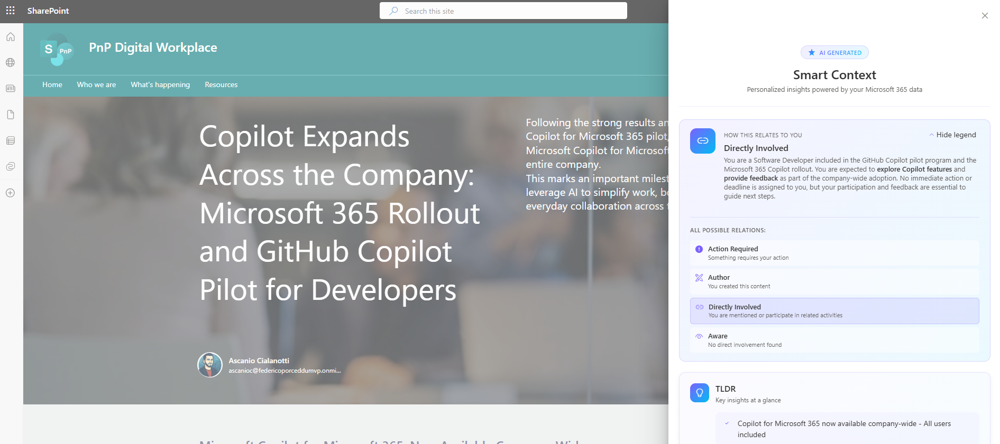
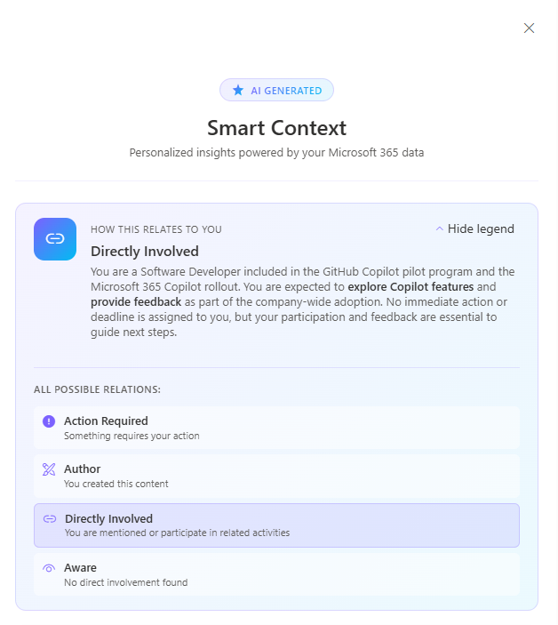
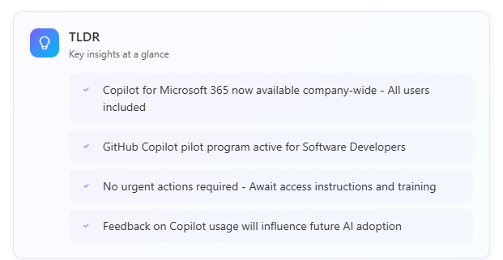
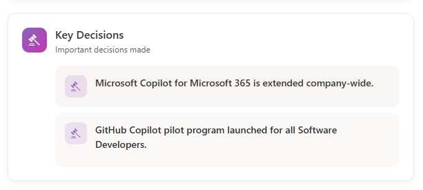
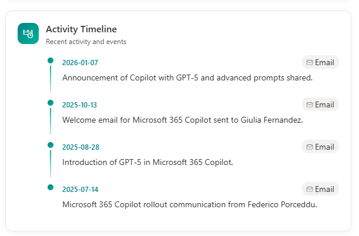
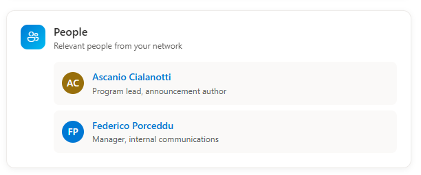

# Smart Context - AI-Powered Page Insights

## Summary

Get instant, personalized insights on any SharePoint page. This Application Customizer leverages the Microsoft Graph Copilot API to analyze page content alongside your emails, chats, meetings, and files — surfacing key people, pending actions, decisions, and context that matter to **you**.

### Generated Sections

| Section | Description |
|---------|-------------|
| **My Role** | How this page relates to you |
| **Pending Actions** | Items that may need your attention |
| **TLDR** | Key insights at a glance |
| **Key Decisions** | Important decisions made |
| **Activity Timeline** | Recent activity and events |
| **People** | Relevant people from your network |
| **References** | Sources and related content |

> 🤖 **Built with GitHub Copilot** — This solution was developed using a "vibe coding" approach with GitHub Copilot to accelerate development and focus on the meaningful aspects of the demo. The code has been reviewed and refined to ensure quality.















## Compatibility

| :warning: Important |
|:---------------------------|
| Every SPFx version is optimally compatible with specific versions of Node.js. In order to be able to build this sample, you need to ensure that the version of Node on your workstation matches one of the versions listed in this section. This sample will not work on a different version of Node.|
| Refer to <https://aka.ms/spfx-matrix> for more information on SPFx compatibility. |

This sample is optimally compatible with the following environment configuration:


-Incompatible-red.svg "SharePoint Server 2016 Feature Pack 2 requires SPFx 1.1")

-yellow.svg "Requires permissions to be granted before this solution can work on the hosted workbench")


## Applies to

- [SharePoint Framework](https://docs.microsoft.com/sharepoint/dev/spfx/sharepoint-framework-overview)
- [Microsoft 365 tenant](https://docs.microsoft.com/sharepoint/dev/spfx/set-up-your-developer-tenant)

> Get your own free development tenant by subscribing to [Microsoft 365 developer program](http://aka.ms/m365devprogram)

## Contributors

- [Federico Porceddu](https://github.com/fredupstair)

## Version history

| Version | Date | Comments |
|---------|------|----------|
| 1.0 | January 25, 2026 | Initial release |

## Prerequisites

- Microsoft 365 tenant with **Copilot for Microsoft 365** licenses
- The following Microsoft Graph API permissions must be approved:

| Permission | Type |
|------------|------|
| `Sites.Read.All` | Delegated |
| `Mail.Read` | Delegated |
| `People.Read.All` | Delegated |
| `OnlineMeetingTranscript.Read.All` | Delegated |
| `Chat.Read` | Delegated |
| `ChannelMessage.Read.All` | Delegated |
| `ExternalItem.Read.All` | Delegated |

## Minimal Path to Awesome

- Clone this repository (or [download this solution as a .ZIP file](https://pnp.github.io/download-partial/?url=https://github.com/pnp/sp-dev-fx-extensions/tree/main/samples/react-application-smart-context) then unzip it)
- Ensure that you are at the solution folder
- In the command-line run:
  - `npm install`
  - `heft build`
- To debug:
  - `heft start`
- To deploy:
  - Bundle and package the solution: `heft build --production`
  - Upload the `.sppkg` file to your SharePoint App Catalog
  - Approve the API permissions in the SharePoint Admin Center

## Features

This extension illustrates the following concepts:

- Using the **Microsoft Graph Copilot API** to create AI-powered conversations
  - ⚠️ **Beta API**: This API is currently in beta and subject to changes. Always verify the latest documentation.
  - 📋 **Known Limitations**: Review the [known limitations](https://learn.microsoft.com/en-us/microsoft-365-copilot/extensibility/api/ai-services/chat/overview#known-limitations) before implementation.
  - 📜 **Terms of Use**: Always verify the [terms and conditions](https://learn.microsoft.com/en-us/legal/m365-copilot-apis/terms-of-use?context=%2Fmicrosoft-365-copilot%2Fextensibility%2Fcontext) for API usage.
- **Prompt engineering for structured output** — using advanced prompts to instruct Copilot to return JSON schemas that power custom interfaces
- Passing **page context as resources** to Copilot for contextual analysis
- Processing and displaying **Copilot source citations** with attribution
- Creating a **floating side tab** trigger button with FluentUI
- Implementing a **responsive panel** with animated loading states
- Separating API logic into a dedicated **service layer** (`CopilotService`)
- Using **SCSS Modules** with Fluent Design System variables
- Building SPFx solutions with the **Heft toolchain**

📖 For a deeper dive into the architecture, see the [Architecture Documentation](docs/architecture.md).

## Debug URL for testing

Here's a debug URL for testing around this sample:

```text
?debugManifestsFile=https://localhost:4321/temp/build/manifests.js&noredir=true&loadSPFX=true&customActions={"48cf64ba-259f-4964-be91-efd229cd49c6":{"location":"ClientSideExtension.ApplicationCustomizer","properties":{"testMessage":"Test+message"}}}
```

## Disclaimer

**THIS CODE IS PROVIDED *AS IS* WITHOUT WARRANTY OF ANY KIND, EITHER EXPRESS OR IMPLIED, INCLUDING ANY IMPLIED WARRANTIES OF FITNESS FOR A PARTICULAR PURPOSE, MERCHANTABILITY, OR NON-INFRINGEMENT.**

## Help

We do not support samples, but this community is always willing to help, and we want to improve these samples. We use GitHub to track issues, which makes it easy for community members to volunteer their time and help resolve issues.

You can try looking at [issues related to this sample](https://github.com/pnp/sp-dev-fx-extensions/issues?q=label%3Areact-application-smart-context) to see if anybody else is having the same issues.

You can also try looking at [discussions related to this sample](https://github.com/pnp/sp-dev-fx-extensions/discussions?discussions_q=label%3Areact-application-smart-context) and see what the community is saying.

If you encounter any issues while using this sample, [create a new issue](https://github.com/pnp/sp-dev-fx-extensions/issues/new?assignees=&labels=Needs%3A+Triage+%3Amag%3A%2Ctype%3Abug-suspected&template=bug-report.yml&sample=react-application-smart-context&authors=@fredupstair&title=react-application-smart-context%20-%20).

For questions regarding this sample, [create a new question](https://github.com/pnp/sp-dev-fx-extensions/issues/new?assignees=&labels=Needs%3A+Triage+%3Amag%3A%2Ctype%3Abug-suspected&template=question.yml&sample=react-application-smart-context&authors=@fredupstair&title=react-application-smart-context%20-%20).

Finally, if you have an idea for improvement, [make a suggestion](https://github.com/pnp/sp-dev-fx-extensions/issues/new?assignees=&labels=Needs%3A+Triage+%3Amag%3A%2Ctype%3Abug-suspected&template=suggestion.yml&sample=react-application-smart-context&authors=@fredupstair&title=react-application-smart-context%20-%20).

## References

- [Getting started with SharePoint Framework](https://docs.microsoft.com/sharepoint/dev/spfx/set-up-your-developer-tenant)
- [Building for Microsoft Teams](https://docs.microsoft.com/sharepoint/dev/spfx/build-for-teams-overview)
- [Use Microsoft Graph in your solution](https://docs.microsoft.com/sharepoint/dev/spfx/web-parts/get-started/using-microsoft-graph-apis)
- [Publish SharePoint Framework applications to the Marketplace](https://docs.microsoft.com/sharepoint/dev/spfx/publish-to-marketplace-overview)
- [Microsoft 365 Patterns and Practices](https://aka.ms/m365pnp)
- [Microsoft Graph Copilot API](https://learn.microsoft.com/graph/api/resources/copilot-api-overview)
- [Heft Documentation](https://heft.rushstack.io/)

