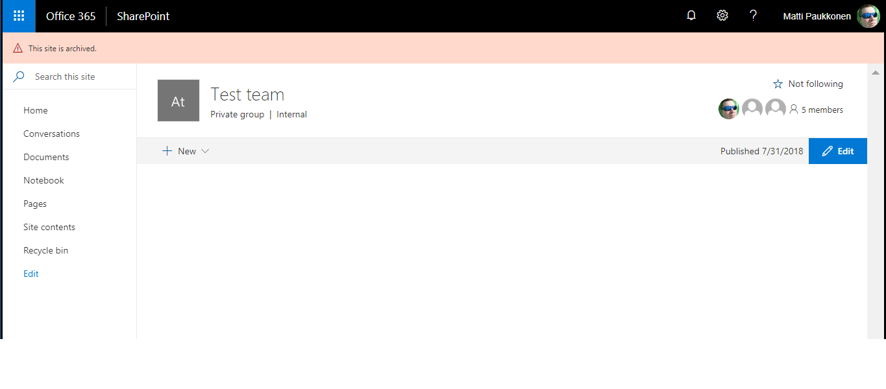
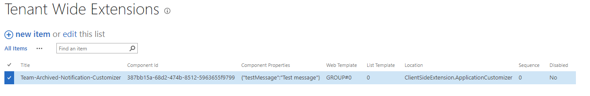
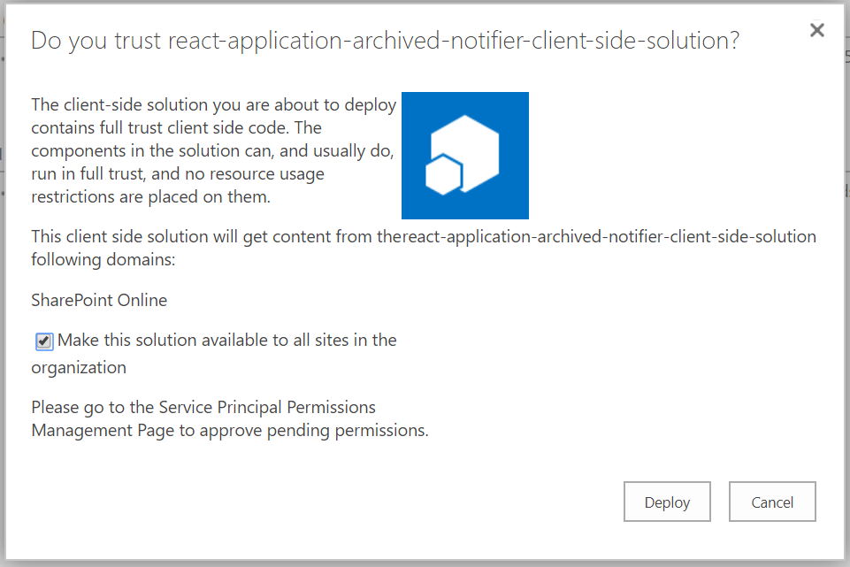

# SPFx Application Customizer for displaying notification if a team is set as archived

## Summary
This sample demonstrates how to check is current team linked to team site set as archived from Microsoft Graph API. If team is archived, notification is diplayed to end-user on header placeholder. 



## Used SharePoint Framework Version 


## Applies to

* [SharePoint Framework](https://dev.office.com/sharepoint)
* [Microsoft Graph](https://developer.microsoft.com/en-us/graph)


## Prerequisites
 
> Office 365 Developer tenant on Targeted Release mode.
> Modern team site with Teams functionality added.

## Solution

Solution|Author(s)
--------|---------
react-application-archived-notifier | Matti Paukkonen

## Version history

Version|Date|Comments
-------|----|--------
1.0|July 8, 2018|Initial release
1.1|September 6, 2018|Updated SPfx 1.6.0 support and tenant wide deployment
1.2|January 2, 2019|Updated SPFx 1.7.1 support, Teams Graph API v1.0 endpoint and handling of MSGraphClient.

## Disclaimer
**THIS CODE IS PROVIDED *AS IS* WITHOUT WARRANTY OF ANY KIND, EITHER EXPRESS OR IMPLIED, INCLUDING ANY IMPLIED WARRANTIES OF FITNESS FOR A PARTICULAR PURPOSE, MERCHANTABILITY, OR NON-INFRINGEMENT.**

---

## Minimal Path to Awesome

- Clone this repository
- in the command line run:
  - `npm install`
  - `gulp serve --nobrowser`
- Open a modern team site which has Teams activated
- Set team as archived on Microsoft Teams
- append following query string parameters to the home page URL
```
?loadSPFX=true&debugManifestsFile=https://localhost:4321/temp/manifests.js&customActions={"387bb15a-68d2-474b-8512-5963655f9799":{"location":"ClientSideExtension.ApplicationCustomizer","properties":{"testMessage":"Hello as property!"}}}
```

## Features
This is sample is a SharePoint Framework application customizer extensions built using React and Office UI Fabric React. This customizer renders notification, if team linked to site is set as archived. Team archived status is fetched from Microsoft Graph Teams beta API.
Description of the extension with possible additional details than in short summary.

This extension illustrates the following concepts:

- Consuming Microsoft Graph to get archived status of a Team
- Using React to display notification bar on header
- Deploying extension automatically with tenant wide deployment to all group-connected modern team sites (GROUP#0)

You can disable automatic deployment by commenting out features section on package-solution.json or disabling extension on Tenant Wide Extension list on App Catalog.



## Debug URL for testing
Here's a debug URL for testing around this sample.

```
?loadSPFX=true&debugManifestsFile=https://localhost:4321/temp/manifests.js&customActions={"387bb15a-68d2-474b-8512-5963655f9799":{"location":"ClientSideExtension.ApplicationCustomizer","properties":{"testMessage":"Hello as property!"}}}
```

## To deploy
- In the command line navigate to samples/react-application-team-archived-notification and run: 
  - gulp bundle --ship
  - gulp package-solution --ship
- Drag react-application-archived-notification.sppkg onto the App for SharePoint library to tenant's app catalog.
- Check tenant wide deployment option

- Navigate to SharePoint admin center preview (https://innofrontier-admin.sharepoint.com/_layouts/15/online/AdminHome.aspx#/webApiPermissionManagement)  and approve Microsoft Graph permissions (Group.Read.All).
- Extension is deployed automatically on all group-connected modern team sites (WebTemplate GROUP#0).


