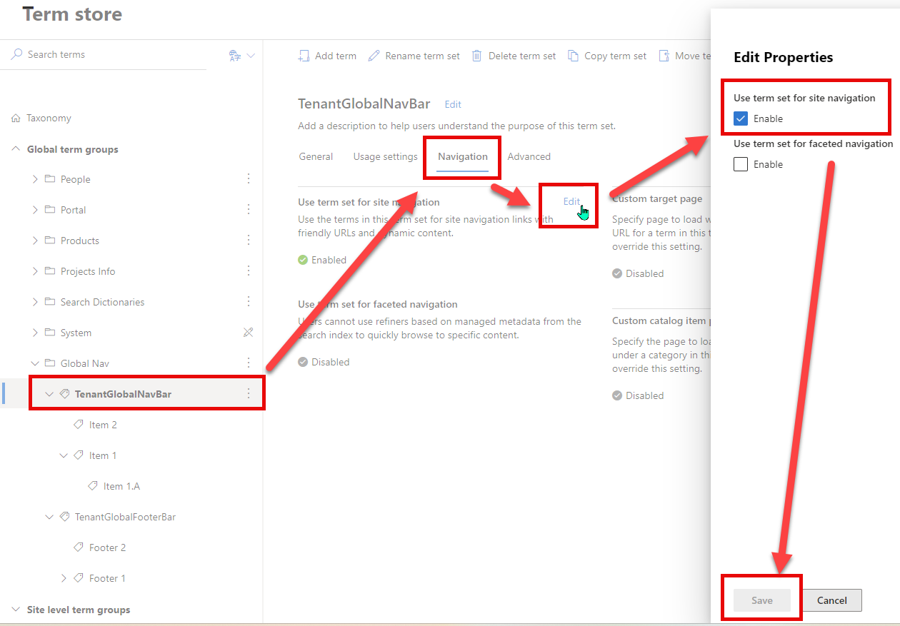

# Tenant Global NavBar Application Customizer

## Summary

Sample SharePoint Framework application customizer showing how to create a tenant global NavBar and Footer NavBar for modern sites, reading menu items from the Term Store.


## Used SharePoint Framework Version


## Applies to

* [SharePoint Framework Extensions Developer](https://dev.office.com/sharepoint/docs/spfx/extensions/overview-extensions)
* [Office 365 developer tenant](http://dev.office.com/sharepoint/docs/spfx/set-up-your-developer-tenant)

## Solution

| Solution                                      | Author(s)                                                                                       |
| --------------------------------------------- | ----------------------------------------------------------------------------------------------- |
| react-application-tenant-global-navbar        | Paolo Pialorsi (MCM, MVP,[PiaSys.com](https://piasys.com), [@PaoloPia](https://twitter.com/PaoloPia)) |
| react-application-tenant-global-navbar@v1.1.0 | Thomas Daly (MVP, [@\_tomdaly\_](https://www.twitter.com/_tomdaly_))                              |

## Version history

| Version | Date               | Comments                       |
| ------- | ------------------ | ------------------------------ |
| 1.0.0   | September 28, 2017 | Initial release                |
| 1.1.0   | October 2, 2024    | Upgrade SPFx v1.2.0 to v1.20.0 |

## Disclaimer

**THIS CODE IS PROVIDED *AS IS* WITHOUT WARRANTY OF ANY KIND, EITHER EXPRESS OR IMPLIED, INCLUDING ANY IMPLIED WARRANTIES OF FITNESS FOR A PARTICULAR PURPOSE, MERCHANTABILITY, OR NON-INFRINGEMENT.**

---

## Prerequisites

* Office 365 Developer tenant with a modern site collection and a document library

## Minimal Path to Awesome

* clone this repo
* in the command line run
  * `npm i`
  * `gulp serve --nobrowser`
* open a modern site
* go to the "Term Store Management" page of the site settings and create a new Term Group, or at least a new Term Set for the top NavBar and/or a new Term Set for the bottom NavBar.
  * Call the Term Sets with whatever name you like (for example, you can call the top NavBar Term Set "TenantGlobalNavBar" and the bottom NavBar Term Set "TenantGlobalFooterBar")
  * Configure the Term Sets for site managed navigation
  * Configure the navigation settings accordingly to your needs
* append the following query string parameters to the home page URL

```text
?loadSPFX=true&debugManifestsFile=https://localhost:4321/temp/manifests.js&customActions={"b1efedb9-b371-4f5c-a90f-3742d1842cf3":{"location":"ClientSideExtension.ApplicationCustomizer","properties":{"TopMenuTermSet":"TenantGlobalNavBar","BottomMenuTermSet":"TenantGlobalFooterBar"}}}
```

## Term Sets Setup

1) Create term set for Global Nav Bar named 'TenantGlobalNavBar' & Global Footer Bar named 'TenantGlobalFooterBar'
   ***These are the default term set names configured into the application customizer settings***

   
2) Enable for Site Navigation

   
3) Configure Term Urls

   Menu items with sub items will not be clickable even if you configure a link url

   
4) Adding Icons

   You can add a custom property to include an icon

   
5) Sort Order

You can control the sort order by setting the property on the Term Set


## Deployment

In order to deploy the sample solution in a real environment, or at least in order to skip using the debug mode, you need to execute the following steps:

* publish the solution on any hosting environment or CDN and update the _cdnBasePath_ property in the write-manifests.json file with the base URL of your hosting environment
* bundle and package the solution by executing the following commands in the command line:

  * `gulp bundle --ship`
  * `gulp package-solution --ship`
* upload the content of the ./temp/deploy subfolder of the sample root folder into the target hosting environment
* add to the "Apps for SharePoint" library of the AppCatalog in your tenant the spfx-tenant-global-navbar.sppkg file that you will find under the ./sharepoint/solution subfolder of the sample root folder
* the sample is tenant-wide available, so you don't need to install it to every single target site, you simply need to bind the application customizer to the target site. In order to do that, you can use the PowerShell script [TenantGlobalNavBarProvisionCustomizer.ps1](./TenantGlobalNavBarProvisionCustomizer.ps1)

  **NOTE** as of Sept 9th, 2024 to run the PnP PowerShell Cmdlets you must [register an Entra ID Application](https://pnp.github.io/powershell/articles/registerapplication.html) to use to run the cmdlets

## Features

This project contains sample SharePoint Framework application customizer extension built using React and Office UI Fabric React. The application customizer renders a top navbar and a footer navbar, with hierarchical navigation nodes that are read from the taxonomy based managed navigation.

This sample illustrates the following concepts on top of the SharePoint Framework:

* using Fluent UI React to build SharePoint Framework application customizers that seamlessly integrate with SharePoint
* using React to build SharePoint Framework application customizers
* logging information to console using a custom SharePoint Framework log handler
* consuming the SharePoint Online taxonomy service using REST requests against the _client.svc/ProcessQuery_ service of CSOM


