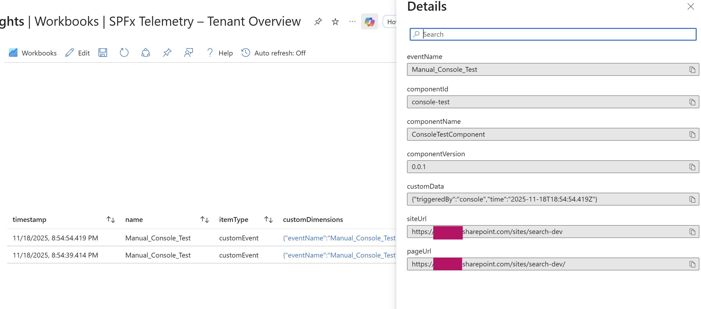
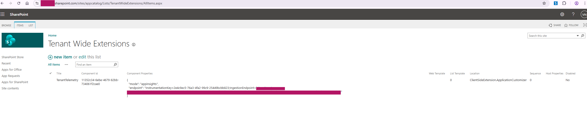
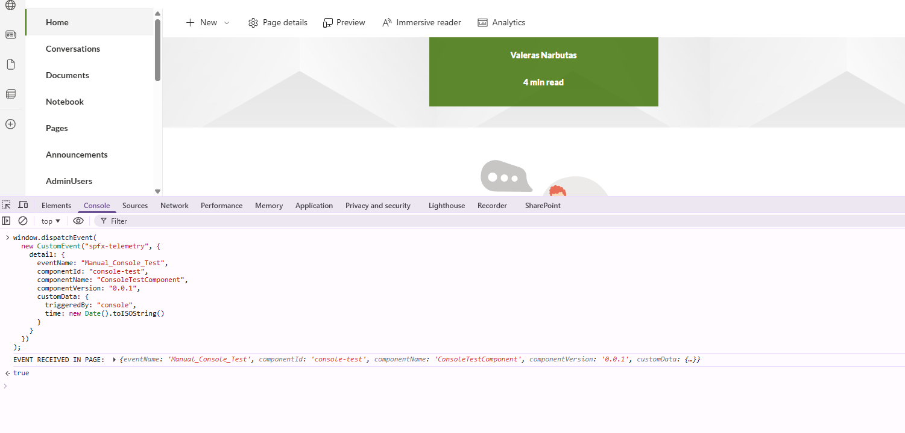

# Tenant Telemetry Application Customizer

A lightweight tenant-wide Application Customizer that automatically collects telemetry events from any SPFx Web Part or extension across the entire tenant.
This solution enables organizations to track:

* Which sites use which custom SPFx components
* Component versions
* Page usage
* Custom events from web parts
* User interactions
* Performance / feature adoption

The telemetry is sent either directly to **Azure Application Insights** or to a custom **Azure Function** endpoint depending on your configuration.



---

## Summary

This SPFx Application Customizer listens for telemetry events via the browser’s `CustomEvent` API:

```ts
window.dispatchEvent(new CustomEvent("spfx-telemetry", { detail: { ... } }));
```

The extension enriches the payload with site and page context and then forwards it through one of two configurable channels:

### **Telemetry modes**

| Mode          | Description                                                                                                             |
| ------------- | ----------------------------------------------------------------------------------------------------------------------- |
| `appinsights` | Sends events directly to Azure Application Insights using a Connection String                                           |
| `function`    | Sends events to a custom Azure Function (HTTP POST) for further processing (Event Grid, Log Analytics, Cosmos DB, etc.) |

### **This sample includes**

✔ Application Customizer
✔ TelemetryService (AppInsights + Function modes)
✔ WebPart integration example
✔ Console test commands
✔ Deployment instructions (tenant-wide)
✔ App Insights Log queries

---

## Compatibility


---

## Applies to

* [SharePoint Framework](https://learn.microsoft.com/sharepoint/dev/spfx/sharepoint-framework-overview)
* [Microsoft 365 tenant](https://learn.microsoft.com/sharepoint/dev/spfx/set-up-your-developer-tenant)

---

## Contributors

* [Valeras Narbutas](https://github.com/ValerasNarbutas)

---

## Version history

| Version | Date       | Comments        |
| ------- | ---------- | --------------- |
| 1.0     | November 18, 2025 | Initial release |

---

## Prerequisites

* Azure Application Insights **or** Azure Function endpoint
* Tenant App Catalog
* Modern SharePoint pages

---

# Minimal Path to Awesome

### 1. Clone the repo

```bash
npm install
gulp build
gulp bundle --ship
gulp package-solution --ship
```

### 2. Upload the `.sppkg` to the Tenant App Catalog

```
/sites/appcatalog/Apps for SharePoint
```

Check:

✔ **Make this solution available to all sites**
✔ Deploy

### 3. Register the Application Customizer in Tenant Wide Extensions

Open:

```
/sites/appcatalog/Lists/TenantWideExtensions
```

Create a **new item** with:

| Field       | Value                                       |
| ----------- | ------------------------------------------- |
| Title       | TenantTelemetry                             |
| ComponentId | `11352c34-6ebe-4679-82bb-734061f2cae0`      |
| Location    | `ClientSideExtension.ApplicationCustomizer` |
| Sequence    | `1`                                         |

### 4. Add configuration (App Insights mode)

```json
{
  "mode": "appinsights",
  "endpoint": "InstrumentationKey=XXXX;IngestionEndpoint=YYYY"
}
```

### (Optional) Azure Function mode

```json
{
  "mode": "function",
  "endpoint": "https://yourfunction.azurewebsites.net/api/telemetry"
}
```

Save → telemetry starts flowing across the entire tenant.



---

# How to Use in Your Web Parts

Your web part (or another extension) simply dispatches an event:

```ts
window.dispatchEvent(
  new CustomEvent("spfx-telemetry", {
    detail: {
      eventName: "MyWebPart_Rendered",
      componentId: this.context.manifest.id,
      componentName: this.context.manifest.alias,
      componentVersion: this.context.manifest.version,
      customData: {
        action: "render",
        filterValue: this.properties.category
      }
    }
  })
);
```

That’s all.
No dependency imports. No service initialization.
The Application Customizer handles all communication.

---

# How to Test Via Console

Open any modern SharePoint page, then run:

```js
window.dispatchEvent(
  new CustomEvent("spfx-telemetry", {
    detail: {
      eventName: "Console_Test_Event",
      componentId: "console",
      componentName: "Console",
      componentVersion: "0.0.1",
      customData: { message: "Hello from console!" }
    }
  })
);
```



The Application Customizer logs the event and pushes telemetry.

---

# How to Verify in Application Insights

Go to **Logs** and run:

```kusto
customEvents
| where name == "Console_Test_Event"
| order by timestamp desc
```

Or view *all* events:

```kusto
customEvents
| extend siteUrl = tostring(customDimensions.siteUrl)
| extend componentName = tostring(customDimensions.componentName)
| project timestamp, name, siteUrl, componentName, customDimensions
| top 50 by timestamp desc
```

---

# How to Test Azure Function Mode

If using Azure Function mode, telemetry is sent via:

```http
POST https://yourfunction.azurewebsites.net/api/telemetry
Content-Type: application/json
Body: { ...payload }
```

### Check your Function:

#### 1. Azure Portal → Function App → Function → **Monitor**

You should see requests.

#### 2. Azure Portal → Function → **Logs**

You should see the JSON payload:

```json
{
  "eventName": "Console_Test_Event",
  "siteUrl": "https://tenant.sharepoint.com/sites/...",
  "pageUrl": "https://tenant.sharepoint.com/sites/.../SitePages/Page.aspx",
  "componentId": "...",
  "componentVersion": "...",
  "customData": {
    "message": "Hello from console!"
  }
}
```

#### 3. Your function can forward to:

* Event Grid
* Log Analytics
* Cosmos DB
* Azure Storage

---

# Debug URL

To test the extension locally:

```
?loadSPFX=true
&debugManifestsFile=https://localhost:4321/temp/manifests.js
&customActions={"11352c34-6ebe-4679-82bb-734061f2cae0":{"location":"ClientSideExtension.ApplicationCustomizer","properties":{"mode":"appinsights","endpoint":"InstrumentationKey=X;IngestionEndpoint=Y"}}}
```

(Update `ComponentId` and endpoint as needed.)

---

# Features

This sample demonstrates:

* A **tenant-wide telemetry** system for SPFx
* A **runtime-configurable backend** (App Insights or Azure Function)
* A simple, framework-agnostic **telemetry event protocol** using CustomEvent
* A lightweight **Application Customizer listener**
* Web part instrumentation without dependencies
* Support for:
  ✔ Site-level context
  ✔ Page URL
  ✔ Component identity and version
  ✔ Custom event data

---

# Disclaimer

**THIS CODE IS PROVIDED *AS IS* WITHOUT WARRANTY OF ANY KIND.**


