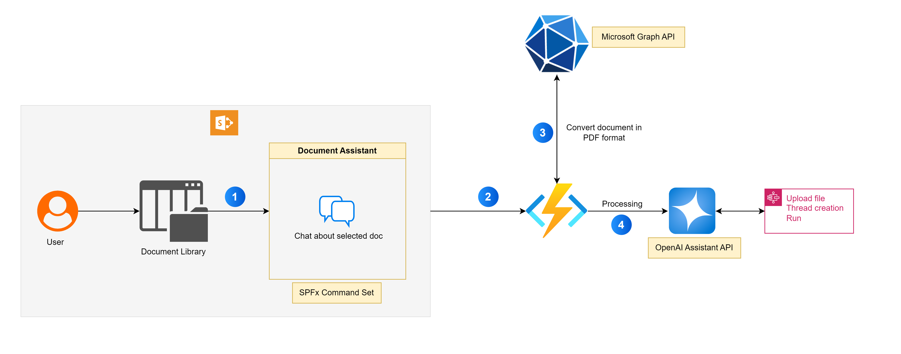

# AI Document Assistant

## Summary

The AI Document Assistant is a SharePoint Framework (SPFx) Command Set extension designed to enhance document interactions in SharePoint Online. This intelligent assistant leverages the OpenAI Assistant API to allow users to ask questions about selected documents directly within a chat interface.

The app integrates seamlessly with Azure Functions to handle backend processing, enabling advanced document search and analysis through Microsoft Graph API and OpenAI's Assistant API.

## Architecture

**Frontend**: SPFx Command Set extension with React-based chat UI.

**Backend**: Azure Function as an API endpoint to handle interactions with Microsoft Graph and OpenAI Assistant APIs.

**Graph API**:  Converting the selected documents into PDF format and proving file stream to Assistant API

**AI Services**: OpenAI Assistant API for answering questions based on the selected document.

## DEMO

## Used SharePoint Framework Version

## Applies to

- [SharePoint Framework](https://aka.ms/spfx)
- [Microsoft 365 tenant](https://docs.microsoft.com/en-us/sharepoint/dev/spfx/set-up-your-developer-tenant)

> Get your own free development tenant by subscribing to [Microsoft 365 developer program](http://aka.ms/o365devprogram)

## Contributors

- [Ejaz Hussain](https://github.com/ejazhussain)

## Version history

Version|Date|Comments
-------|----|--------
1.0|Jan 05, 2025|Initial release

## Disclaimer

`THIS CODE IS PROVIDED *AS IS* WITHOUT WARRANTY OF ANY KIND, EITHER EXPRESS OR IMPLIED, INCLUDING ANY IMPLIED WARRANTIES OF FITNESS FOR A PARTICULAR PURPOSE, MERCHANTABILITY, OR NON-INFRINGEMENT.`

## Prerequisites

1. **Visual Studio Installation**:
   - Download and install Visual Studio from [here](https://visualstudio.microsoft.com/).

2. **Office 365 Developer Tenant**:
   - Ensure you have an Office 365 Developer tenant with a modern site collection.

3. **Entra ID App Registration**:
   - Register an Entra ID application.
   - Assign the Graph API permissions: `Files.Read.All` as application permissions.
   - Retrieve the `ClientId`, `ClientSecret`, and `TenantID`.

4. **OpenAI API Key**:
   - Obtain an API key from OpenAI.

5. **Configuration**:
   - Populate the `ClientId`, `ClientSecret`, `TenantID`, and `OpenAI` Key values into the `local.settings.json` file in your Azure Function.

6. **Run Azure Function**:
   - Open the Azure Function project `under API folder` in Visual Studio
   - Publish the Azure Function to the Azure environment or debug locally using Visual Studio. Copy the Azure Function link.
   - Navigate to the constants file in SPFx command set solution under `src\extensions\documentAssistant\constants\constants.ts` and update the `AZURE_FUNCTION_BASE_URL` with the Azure Function link copied above.

## Minimal Path to Awesome

1. **Clone the Repository**:
   - Clone this repository to your local machine.

2. **Navigate to Solution Folder**:
   - Ensure you are in the solution folder of the cloned repository.

3. **Complete Prerequisites**:
   - Make sure all prerequisites are completed as listed in the prerequisites section.

4. **Start Azure Function**:
   - Ensure the Azure Function is up and running.

5. **Install Dependencies**:
   - Navigate to the Document Assistant Commandset project
   - Run `npm install` to install all necessary dependencies.

6. **Bundle the Solution**:
   - Execute `gulp bundle --ship` to bundle the solution.

7. **Package the Solution**:
   - Run `gulp package-solution --ship` to package the solution.

8. **Deploy to App Catalog**:
   - Deploy the generated package to the SharePoint app catalog.

9. **Add the App to a Site**:
   - Add the app to any SharePoint site where you want to use it.

10. **Use the AI Document Assistant**:
    - Navigate to any document library, select a document, and click on the `AI Document Assistant` command to ask questions about the selected document.

## Key Features

- **Interactive Chat Interface**: Engage with the assistant to ask questions about selected documents.

- **AI-Powered Answers**: Utilizes OpenAI's Assistant AI to deliver accurate and context-aware responses.

- **Azure Function Backend**: Secure and scalable backend support using Azure Functions for processing requests.

- **Graph API Integration**: Access document stored in SharePoint libraries using Microsoft Graph API.

- **Multi-format Support**: Handles various file formats to extract and interpret information effectively.

- **Code and Data Interpretation**: Leverages AI to interpret code snippets and perform data analysis within the documents.

## References

- [Getting started with SharePoint Framework](https://docs.microsoft.com/en-us/sharepoint/dev/spfx/set-up-your-developer-tenant)
- [OpenAI Platform Assistants Overview](https://platform.openai.com/docs/assistants/overview)