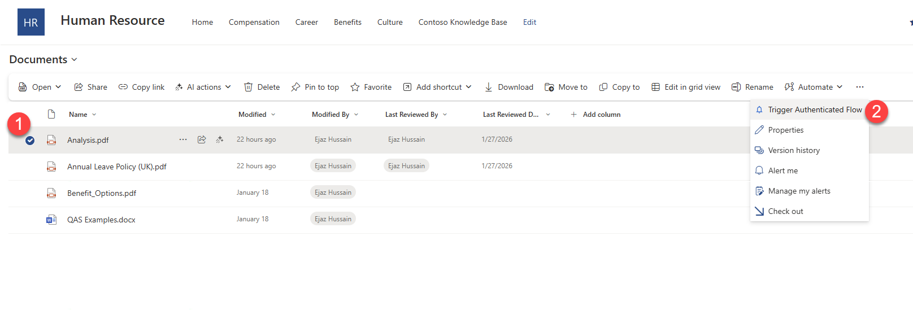
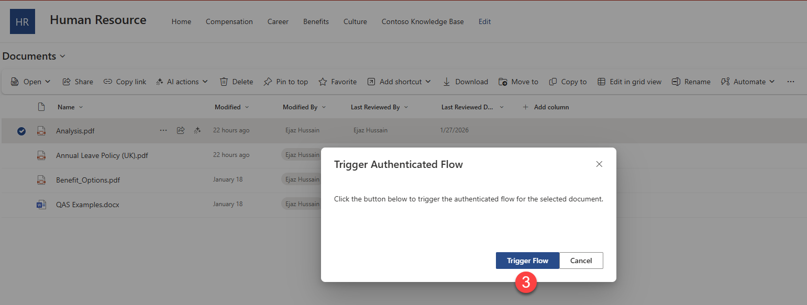
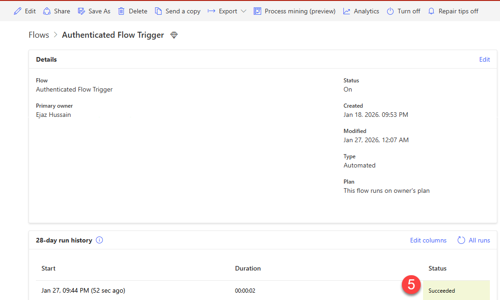
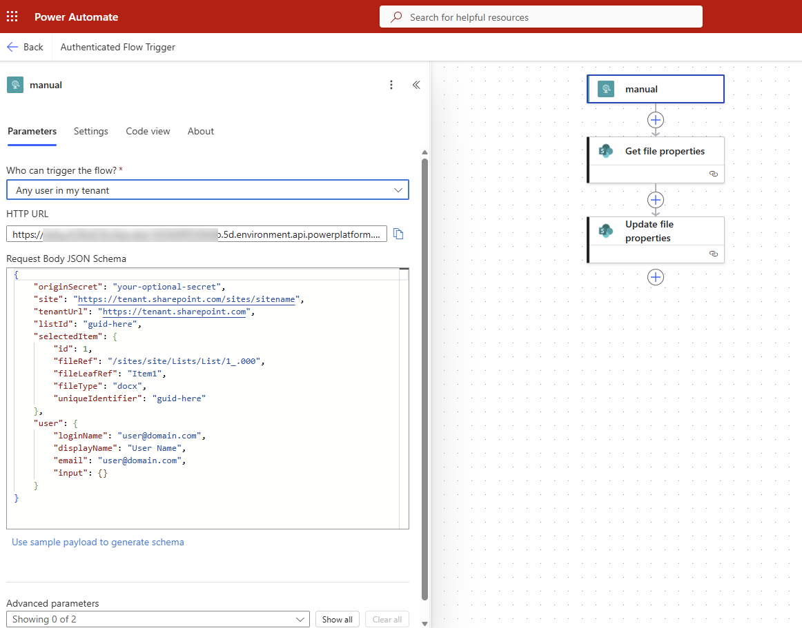

# Authenticated Power Automate Flow Trigger - SPFx CommandSet Extension

## Summary

This sample demonstrates how to trigger an authenticated Power Automate flow from a SharePoint document library using an SPFx ListView CommandSet extension. The extension uses the `AadHttpClient` to make authenticated HTTP requests to Power Automate flows configured with the "When an HTTP request is received" trigger and "Any user in my tenant" authentication.

When a user selects a document in the library, the command becomes available. Clicking it opens a dialog that triggers the flow, passing contextual information about the selected document, current user, and site.






## Compatibility

| :warning: Important |
|:---------------------------|
| Every SPFx version is optimally compatible with specific versions of Node.js. In order to be able to build this sample, you need to ensure that the version of Node on your workstation matches one of the versions listed in this section. This sample will not work on a different version of Node.|
|Refer to <https://aka.ms/spfx-matrix> for more information on SPFx compatibility. |

This sample is optimally compatible with the following environment configuration:


-Incompatible-red.svg "SharePoint Server 2016 Feature Pack 2 requires SPFx 1.1")


## Applies to

- [SharePoint Framework](https://aka.ms/spfx)
- [Microsoft 365 tenant](https://docs.microsoft.com/sharepoint/dev/spfx/set-up-your-developer-tenant)
- [Power Automate](https://make.powerautomate.com/)

> Get your own free development tenant by subscribing to [Microsoft 365 developer program](http://aka.ms/o365devprogram)

## Contributors

- [Ejaz Hussain](https://github.com/ejazhussain)

## Version history

| Version | Date             | Comments        |
| ------- | ---------------- | --------------- |
| 1.0     | January 26, 2026 | Initial release |

## Features

This sample illustrates the following concepts:

- **Authenticated Flow Trigger** - Securely trigger Power Automate flows using OAuth authentication with `AadHttpClient`
- **ListView CommandSet Extension** - Add custom commands to SharePoint document library command bars
- **Context-Aware Requests** - Pass document metadata, user information, and site context to the flow
- **Fluent UI Dialog** - Display a modern dialog with loading states and result feedback
- **SPFx API Permissions** - Request and use Microsoft Flow Service permissions in SPFx

### Request Body Schema

The extension sends the following payload to your Power Automate flow:

```json
{
  "originSecret": "your-optional-secret",
  "site": "https://tenant.sharepoint.com/sites/sitename",
  "tenantUrl": "https://tenant.sharepoint.com",
  "listId": "guid-here",
  "selectedItem": {
    "id": 1,
    "fileRef": "/sites/site/Lists/List/1_.000",
    "fileLeafRef": "Item1",
    "fileType": "docx",
    "uniqueIdentifier": "guid-here"
  },
  "user": {
    "loginName": "user@domain.com",
    "displayName": "User Name",
    "email": "user@domain.com",
    "input": {}
  }
}
```

## Prerequisites

### 1. Power Automate Flow Setup

You need to create a Power Automate flow with the following configuration:

1. **Create a new Instant cloud flow** in [Power Automate](https://make.powerautomate.com/)

2. **Add the "When an HTTP request is received" trigger** as the first step

3. **Configure the trigger authentication**:
   - Click on the trigger to expand settings
   - Under **Who can trigger the flow?**, select **Any user in my tenant**

   > This setting ensures only authenticated users within your Microsoft 365 tenant can trigger the flow.

4. **Configure the Request Body JSON Schema**:
   - Click "Use sample payload to generate schema"
   - Paste the following sample payload:

   ```json
   {
     "originSecret": "your-optional-secret",
     "site": "https://tenant.sharepoint.com/sites/sitename",
     "tenantUrl": "https://tenant.sharepoint.com",
     "listId": "guid-here",
     "selectedItem": {
       "id": 1,
       "fileRef": "/sites/site/Lists/List/1_.000",
       "fileLeafRef": "Item1",
       "fileType": "docx",
       "uniqueIdentifier": "guid-here"
     },
     "user": {
       "loginName": "user@domain.com",
       "displayName": "User Name",
       "email": "user@domain.com",
       "input": {}
     }
   }
   ```
   

5. **Add your flow logic** - Add any actions needed after the trigger (e.g., "Get file properties" from SharePoint)

6. **Save the flow** and copy the **HTTP URL** from the trigger - you'll need this for the SPFx configuration

### 2. SPFx API Permissions

This solution requires API permissions to call the Microsoft Flow Service. The permission is defined in `config/package-solution.json`:

```json
{
  "webApiPermissionRequests": [
    {
      "resource": "Microsoft Flow Service",
      "scope": "user_impersonation"
    }
  ]
}
```

After deploying the solution package, a SharePoint or Global administrator must approve this API permission request in the SharePoint Admin Center:

1. Go to **SharePoint Admin Center** > **Advanced** > **API access**
2. Find the pending request for "Microsoft Flow Service" with scope "user_impersonation"
3. **Approve** the request

### 3. Node.js

- Node.js v22.17.0 or compatible version (see [SPFx compatibility matrix](https://aka.ms/spfx-matrix))

## Minimal Path to Awesome

### Step 1: Clone and Install

```bash
git clone https://github.com/pnp/sp-dev-fx-webparts.git
cd sp-dev-fx-webparts/samples/commandset-authenticated-flow-trigger
npm install
```

### Step 2: Configure Your Flow URL

1. Open `src/constants/FlowConfig.ts`
2. Update the `flowUrl` with your Power Automate flow HTTP URL:

```typescript
export const FlowConfig = {
  flowUrl: "YOUR_POWER_AUTOMATE_HTTP_URL_HERE",

  // Optional: Update the secret for additional validation in your Flow
  originSecret: "your-secret-here",

  // ... other settings
};
```

### Step 3: Build the Solution

```bash
# Build for production
npm run build
```

This creates the solution package at `sharepoint/solution/o365c-commandset-authenticated-flow-trigger.sppkg`

### Step 4: Deploy to SharePoint

1. Upload the `.sppkg` file to your **App Catalog**
2. When prompted, trust the solution and make it available to all sites (or specific sites)
3. **Important**: The deployment will create an API permission request

### Step 5: Approve API Permissions

1. Go to **SharePoint Admin Center** > **Advanced** > **API access**
2. Find and **Approve** the pending request for "Microsoft Flow Service"

### Step 6: Add to a Site

1. Navigate to a SharePoint site with a document library
2. Go to **Site contents** > **New** > **App**
3. Add the **O365C- CommandSet Authenticated Flow Trigger** app

### Step 7: Test the Extension

1. Navigate to a document library on the site
2. Select a single document
3. Click the **"Trigger Authenticated Flow"** command in the command bar
4. The dialog will appear - click "Trigger Flow" to execute

## Development

### Local Testing with Heft

For local development and testing:

```bash
# Start the development server
npm run start
```

Then append the following query parameters to your document library URL:

```
?loadSPFX=true&debugManifestsFile=https://localhost:4321/temp/manifests.js&customActions={"750c7714-6a06-4351-86a9-652e2aa5f6e2":{"location":"ClientSideExtension.ListViewCommandSet.CommandBar"}}
```

### Project Structure

```
commandset-authenticated-flow-trigger/
├── config/
│   ├── package-solution.json    # Solution config with API permissions
│   └── serve.json               # Local serve configuration
├── src/
│   ├── constants/
│   │   └── FlowConfig.ts        # Flow URL and settings
│   ├── extensions/
│   │   └── authenticatedFlowTrigger/
│   │       ├── AuthenticatedFlowTriggerCommandSet.ts
│   │       ├── AuthenticatedFlowTriggerCommandSet.manifest.json
│   │       └── components/
│   │           └── FlowTriggerDialog.tsx
│   ├── models/
│   │   ├── IFlowRequestBody.ts
│   │   ├── ISelectedItem.ts
│   │   └── IUser.ts
│   └── services/
│       └── FlowService.ts       # AadHttpClient flow service
└── package.json
```

## How It Works

### Authentication Flow

1. **SPFx initializes the AadHttpClient** using the `aadHttpClientFactory` with the audience `https://service.flow.microsoft.com/`
2. When the user triggers the command, the extension **builds a request payload** with document and user context
3. The **AadHttpClient makes an authenticated POST request** to the Power Automate HTTP trigger URL
4. Power Automate **validates the OAuth token** against the "Any user in my tenant" configuration
5. If valid, the **flow executes** with the provided payload

### Key Code Components

**FlowService.ts** - Handles authenticated HTTP calls:
```typescript
FlowService.aadHttpClient = await aadHttpClientFactory.getClient(
  "https://service.flow.microsoft.com/"
);
```

**package-solution.json** - Declares required permissions:
```json
{
  "webApiPermissionRequests": [
    {
      "resource": "Microsoft Flow Service",
      "scope": "user_impersonation"
    }
  ]
}
```

## Troubleshooting

### Common Issues

| Issue | Solution |
|-------|----------|
| 401 Unauthorized | Ensure API permissions are approved in SharePoint Admin Center |
| 403 Forbidden | Verify the flow is configured with "Any user in my tenant" and the user is in the correct tenant |
| Command not visible | Ensure you have exactly one item selected in the document library |
| AADSTS65002 Error | This is a known issue - ensure permissions are correctly configured and approved |

### Verifying API Permissions

1. Go to **SharePoint Admin Center** > **Advanced** > **API access**
2. Verify "Microsoft Flow Service" with "user_impersonation" shows as **Approved**

## References

- [Add OAuth authentication for HTTP request triggers - Power Automate](https://learn.microsoft.com/en-us/power-automate/oauth-authentication)
- [Connect to Entra ID-secured APIs in SharePoint Framework solutions](https://learn.microsoft.com/en-us/sharepoint/dev/spfx/use-aadhttpclient)
- [Build your first ListView Command Set extension](https://docs.microsoft.com/en-us/sharepoint/dev/spfx/extensions/get-started/building-simple-cmdset-with-dialog-api)
- [Using OAuth authentication for HTTP request triggers in Power Automate](https://forwardforever.com/using-oauth-authentication-for-http-request-triggers-in-power-automate/)
- [Securing HTTP Triggered Power Automate Flows using OAuth](https://platinumdogs.wordpress.com/2023/12/22/securing-http-triggered-power-automate-flows-using-oauth/)
- [Heft Documentation](https://heft.rushstack.io/)
- [Microsoft 365 Patterns and Practices](https://aka.ms/m365pnp)

## Help

We do not support samples, but this community is always willing to help, and we want to improve these samples. We use GitHub to track issues, which makes it easy for community members to volunteer their time and help resolve issues.

If you're having issues building the solution, please run [spfx doctor](https://pnp.github.io/cli-microsoft365/cmd/spfx/spfx-doctor/) from within the solution folder to diagnose incompatibility issues with your environment.

You can try looking at [issues related to this sample](https://github.com/pnp/sp-dev-fx-webparts/issues?q=label%3A%22sample%3A%20commandset-authenticated-flow-trigger%22) to see if anybody else is having the same issues.

You can also try looking at [discussions related to this sample](https://github.com/pnp/sp-dev-fx-webparts/discussions?discussions_q=commandset-authenticated-flow-trigger) and see what the community is saying.

## Disclaimer

**THIS CODE IS PROVIDED _AS IS_ WITHOUT WARRANTY OF ANY KIND, EITHER EXPRESS OR IMPLIED, INCLUDING ANY IMPLIED WARRANTIES OF FITNESS FOR A PARTICULAR PURPOSE, MERCHANTABILITY, OR NON-INFRINGEMENT.**


