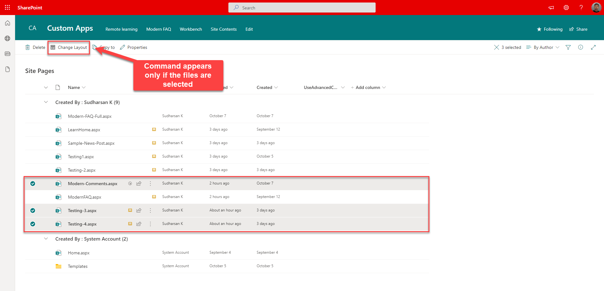
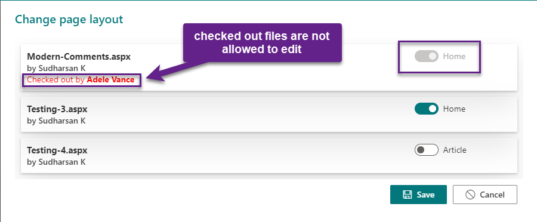

# Change Page Layout Command Extension

## Summary

Listview command extension that is available only for the **Site Pages** library to change the layout type. If the page is **Article**, it can be changed to **Home** which will remove the page title placeholder and vice versa.

## Compatibility

 
 

-Incompatible-red.svg "SharePoint Server 2016 Feature Pack 2 requires SPFx 1.1")

## Applies to

* [SharePoint Online](https://docs.microsoft.com/sharepoint/dev/spfx/sharepoint-framework-overview)

- Get your own free development tenant by subscribing to [Microsoft 365 developer program](http://aka.ms/o365devprogram)
- [How to join Microsoft 365 Developer Program](https://youtu.be/jjGo3FVNqR4) 

## Solution

Solution|Author(s)
--------|---------
react-command-change-page-layouttype | [Sudharsan K.](https://github.com/sudharsank) ([@sudharsank](https://twitter.com/sudharsank))

## Version history

Version|Date|Comments
-------|----|--------
1.0.0.0|October 25, 2021|Initial release

## Minimal Path to Awesome

- Clone this repository
- Ensure that you are at the solution folder
- in the command-line run:
  - `npm install`
  - `gulp serve`

## Features

Very simple list command extension to change the modern page layout type. The main feature is to remove the Page Title placeholder for the modern page which can be done by changing the layout from **Article** to **Home**

- Provides an option to change the layout from **Article** to **Home** or from **Home** to **Article**
- Bulk updates is possible
- Provides warning message if the page is in the checked out state.

## References

- [Getting started with SharePoint Framework](https://docs.microsoft.com/en-us/sharepoint/dev/spfx/set-up-your-developer-tenant)
- [Building for Microsoft teams](https://docs.microsoft.com/en-us/sharepoint/dev/spfx/build-for-teams-overview)
- [Use Microsoft Graph in your solution](https://docs.microsoft.com/en-us/sharepoint/dev/spfx/web-parts/get-started/using-microsoft-graph-apis)
- [Publish SharePoint Framework applications to the Marketplace](https://docs.microsoft.com/en-us/sharepoint/dev/spfx/publish-to-marketplace-overview)
- [Microsoft 365 Patterns and Practices](https://aka.ms/m365pnp) - Guidance, tooling, samples and open-source controls for your Microsoft 365 development

## Disclaimer
**THIS CODE IS PROVIDED *AS IS* WITHOUT WARRANTY OF ANY KIND, EITHER EXPRESS OR IMPLIED, INCLUDING ANY IMPLIED WARRANTIES OF FITNESS FOR A PARTICULAR PURPOSE, MERCHANTABILITY, OR NON-INFRINGEMENT.**

## Help

We do not support samples, but we this community is always willing to help, and we want to improve these samples. We use GitHub to track issues, which makes it easy for  community members to volunteer their time and help resolve issues.

You can try looking at [issues related to this sample](https://github.com/pnp/sp-dev-fx-extensions/issues?q=label%3Areact-command-change-page-layouttype) to see if anybody else is having the same issues.

You can also try looking at [discussions related to this sample](https://github.com/pnp/sp-dev-fx-extensions/discussions?discussions_q=label%3Areact-command-change-page-layouttype) and see what the community is saying.

If you encounter any issues while using this sample, [create a new issue](https://github.com/pnp/sp-dev-fx-extensions/issues/new?assignees=&labels=Needs%3A+Triage+%3Amag%3A%2Ctype%3Abug-suspected&template=bug-report.yml&sample=react-command-change-page-layouttype&authors=@sudharsank&title=react-command-change-page-layouttype%20-%20).

For questions regarding this sample, [create a new question](https://github.com/pnp/sp-dev-fx-extensions/issues/new?assignees=&labels=Needs%3A+Triage+%3Amag%3A%2Ctype%3Abug-suspected&template=question.yml&sample=react-command-change-page-layouttype&authors=@sudharsank&title=react-command-change-page-layouttype%20-%20).

Finally, if you have an idea for improvement, [make a suggestion](https://github.com/pnp/sp-dev-fx-extensions/issues/new?assignees=&labels=Needs%3A+Triage+%3Amag%3A%2Ctype%3Abug-suspected&template=suggestion.yml&sample=react-command-change-page-layouttype&authors=@sudharsank&title=react-command-change-page-layouttype%20-%20).

