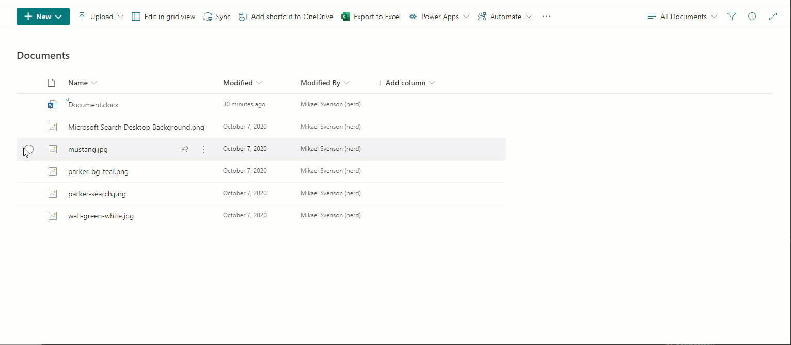
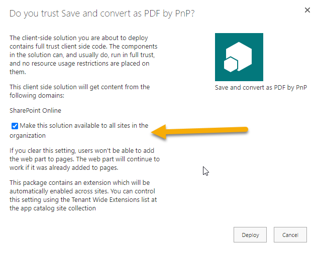

# Save and convert as PDF by PnP

## Summary

A global list customizer which adds functionality to all document libraries in SharePoint Online to convert one or more documents in-place to PDF, or download one or more documents as a PDF. When selecting multiple documents for download they will be downloaded as a zip file. The converter uses built in API's of converting to PDF.



## Compatibility


## Applies to

* [SharePoint Framework Extensions](https://docs.microsoft.com/en-us/sharepoint/dev/spfx/extensions/overview-extensions)

## Solution

| Solution            | Author(s)                                                         |
| ------------------- | ----------------------------------------------------------------- |
| pnp-ext-pdf-convert | Mikael Svenson ([@mikaelsvenson](https://twitter.com/mikaelsvenson)) |
| pnp-ext-pdf-convert | Nicolas Kheirallah ([@NicolasKheirallah](https://twitter.com/NicolasKheirallah)) |
## Version history

| Version | Date              | Comments                                                                                                                                            |
| ------- | ----------------- | --------------------------------------------------------------------------------------------------------------------------------------------------- |
| 1.0     | 2019              | Initial release by Puzzlepart                                                                                                                       |
| 1.1     | February 23, 2021 | Moved and re-branded to PnP                                                                                                                         |
| 1.2     | October 30, 2022  | Upgrade SPFx to version 1.12.1                                                                                                                      |
| 1.3     | October 21, 2024  | Upgrade SPFx to version 1.20.1, rewrite it from scratch using Graph API and using the built in converter in Graph, moved to Fluent UI, Node 18.x and alot more |

## Disclaimer

**THIS CODE IS PROVIDED *AS IS* WITHOUT WARRANTY OF ANY KIND, EITHER EXPRESS OR IMPLIED, INCLUDING ANY IMPLIED WARRANTIES OF FITNESS FOR A PARTICULAR PURPOSE, MERCHANTABILITY, OR NON-INFRINGEMENT.**

## Installing the solution

- Upload and Deploy the file [pnp-ext-pdf-convert.sppkg](./pnp-ext-pdf-convert.sppkg) to your tenant app catalog. 
  * If created the tenant app catalog can be reached via `https://<tenant>-admin.sharepoint.com/_layouts/15/online/ManageAppCatalog.aspx`.
  * You need to be a SharePoint Administrator to upload this solution.
- Navigate to a document library and select one or more files and you should see the PDF options in the document ribbon.

_Note: It may take a little while before it shows the first time after install._

## Supported file formats

csv, doc, docx, odp, ods, odt, pot, potm, potx, pps, ppsx, ppsxm, ppt, pptm, pptx, rtf, xls, xlsx, html

## Debug URL for testing

Here's a debug URL for testing around this sample.

```
?loadSPFX=true&debugManifestsFile=https://localhost:4321/temp/manifests.js&loadSPFX=true&customActions={"ea401ac9-3abc-4e27-b93b-09c9a0587ee9":{"location":"ClientSideExtension.ListViewCommandSet.CommandBar","properties":{}}}
```


