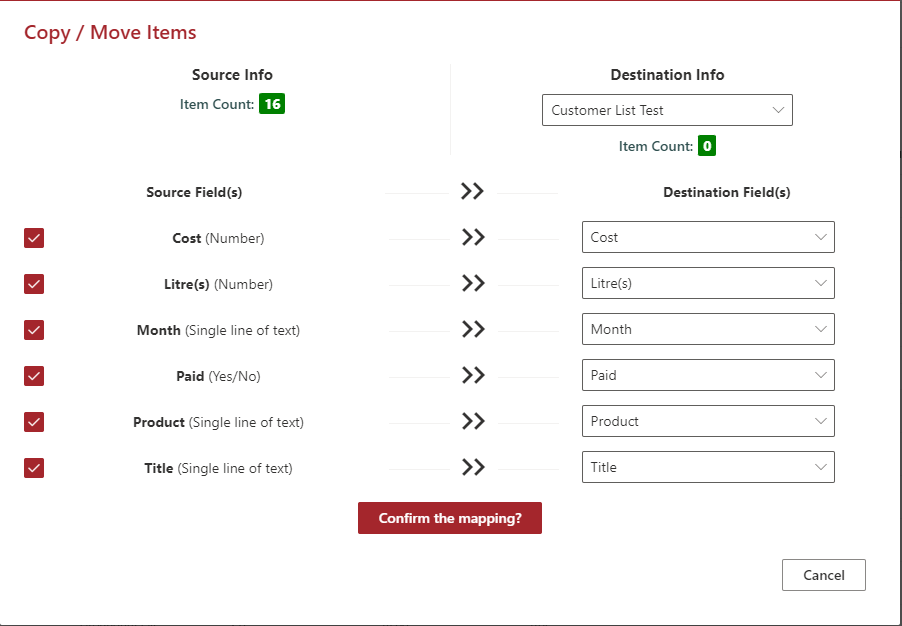

# Copy/Move Item(s)

## Summary

This application customizer will display a command button named **Copy/Move Item(s)** in all the custom lists. Using this option, the items can be copied or moved from one list to another within the site.

## Compatibility

 
 

## Applies to

- [SharePoint Framework](https://aka.ms/spfx)
- [Microsoft 365 tenant](https://docs.microsoft.com/en-us/sharepoint/dev/spfx/set-up-your-developer-tenant)

> Get your own free development tenant by subscribing to [Microsoft 365 developer program](http://aka.ms/o365devprogram)

## Prerequisites

> Nothing is required.

## Solution

Solution|Author(s)
--------|---------
react-command-copy-move-items | Sudharsan K.([@sudharsank](https://twitter.com/sudharsank), [Knowledge Share](https://spknowledge.com/))

## Version history

Version|Date|Comments
-------|----|--------
1.0|September 13, 2021|Initial release

## Minimal Path to Awesome

- Clone this repository
- Ensure that you are at the solution folder
- in the command-line run:
  - **npm install**
  - **gulp serve**

## Features

- Items can be copied or moved on the whole or only selected items.
- Information on the Source and Destination lists are shown including the item count.
- Destination lists can be chosen from the dropdown lists.
- Currently only the below fields are supported for copy or move
    - **Single line of text**
    - **Choice**
    - **Number**
    - **Date and Time**
    - **Yes or No**
- Option to choose the list of fields to be mapped.
- Auto field mapping is done once the destination field is selected (if the internal name of the field is same as source list)
- Technically the copy or move process use the batch method.

## References

- [Getting started with SharePoint Framework](https://docs.microsoft.com/en-us/sharepoint/dev/spfx/set-up-your-developer-tenant)
- [Building for Microsoft teams](https://docs.microsoft.com/en-us/sharepoint/dev/spfx/build-for-teams-overview)
- [Use Microsoft Graph in your solution](https://docs.microsoft.com/en-us/sharepoint/dev/spfx/web-parts/get-started/using-microsoft-graph-apis)
- [Publish SharePoint Framework applications to the Marketplace](https://docs.microsoft.com/en-us/sharepoint/dev/spfx/publish-to-marketplace-overview)
- [Microsoft 365 Patterns and Practices](https://aka.ms/m365pnp) - Guidance, tooling, samples and open-source controls for your Microsoft 365 development

## Disclaimer
**THIS CODE IS PROVIDED *AS IS* WITHOUT WARRANTY OF ANY KIND, EITHER EXPRESS OR IMPLIED, INCLUDING ANY IMPLIED WARRANTIES OF FITNESS FOR A PARTICULAR PURPOSE, MERCHANTABILITY, OR NON-INFRINGEMENT.**

## Help

We do not support samples, but we this community is always willing to help, and we want to improve these samples. We use GitHub to track issues, which makes it easy for  community members to volunteer their time and help resolve issues.

If you encounter any issues while using this sample, [create a new issue](https://github.com/pnp/sp-dev-fx-extensions/issues/new?assignees=&labels=Needs%3A+Triage+%3Amag%3A%2Ctype%3Abug-suspected&template=bug-report.yml&sample=react-command-copy-move-items&authors=@sudharsank&title=react-command-copy-move-items%20-%20).

For questions regarding this sample, [create a new question](https://github.com/pnp/sp-dev-fx-extensions/issues/new?assignees=&labels=Needs%3A+Triage+%3Amag%3A%2Ctype%3Abug-suspected&template=question.yml&sample=react-command-copy-move-items&authors=@sudharsank&title=react-command-copy-move-items%20-%20).

Finally, if you have an idea for improvement, [make a suggestion](https://github.com/pnp/sp-dev-fx-extensions/issues/new?assignees=&labels=Needs%3A+Triage+%3Amag%3A%2Ctype%3Abug-suspected&template=suggestion.yml&sample=react-command-copy-move-items&authors=@sudharsank&title=react-command-copy-move-items%20-%20).

