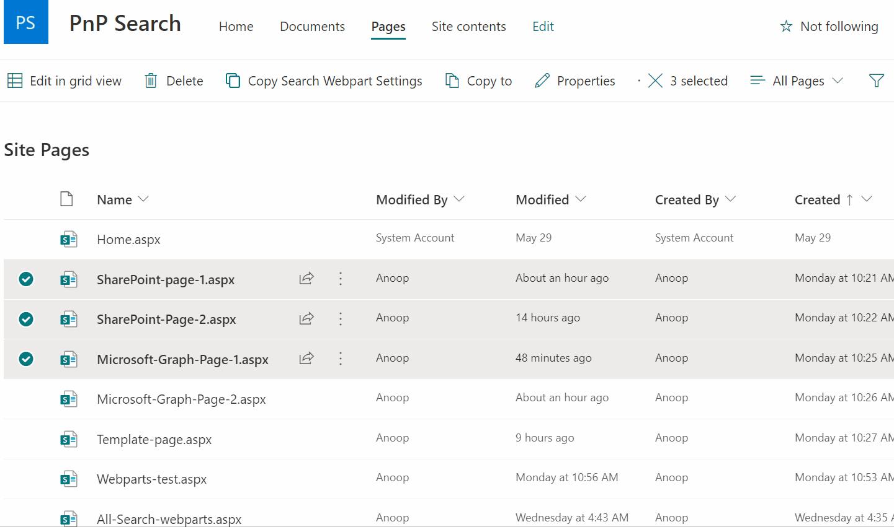

# Copy PnP search results webpart settings

## Summary

This list view command set, helps in copying the `settings` of the PnP search results web part present on a page to the `settings` of the  PnP search results web part present on the selected pages.




## Compatibility


 


## Applies to

- [SharePoint Framework](https://aka.ms/spfx)
- [Microsoft 365 tenant](https://docs.microsoft.com/en-us/sharepoint/dev/spfx/set-up-your-developer-tenant)

> Get your own free development tenant by subscribing to [Microsoft 365 developer program](http://aka.ms/o365devprogram)

## Prerequisites

[PnP search web parts](https://microsoft-search.github.io/pnp-modern-search/)

## Solution

Solution|Author(s)
--------|---------
react-command-copy-pnp-search-webpart-settings | [Anoop Tatti](https://github.com/anoopt) ([@anooptells](https://twitter.com/anooptells))

## Version history

Version|Date|Comments
-------|----|--------
1.0|June 12, 2021|Initial release
1.1|July 2, 2021|Added support PnP PoSH and updated PnP JS code 


## Features

Say we have 100s of pages with PnP search result web part in the same location (section, column, order). If that web part needs to updated on all such pages then we can use this extension.

We simply need to update the web part in one page. After that we can use this extension to copy those updates on to other pages.

While using this extension, we input the link of the page where the PnP search result web part was updated (this page acts like the template page). We then specify the section, column and order of where the PnP search result web part is. 

After that we specify the section, column and order of where the PnP search result web part is on the destination pages i.e. the pages where the PnP search result web part needs to be updated.

This extension illustrates the following concepts:

- Usage of `PnP JS` to update PnP search result web part in modern pages


## Minimal Path to Awesome

- Clone this repository
- Ensure that you are at the solution folder
- in the command-line run:
  - **npm install**
  - **gulp serve**

## Debug URL for testing

Here's a debug URL for testing around this sample. 

```
?loadSPFX=true&debugManifestsFile=https://localhost:4321/temp/manifests.js&customActions={"dc7732fc-dbe5-4995-be53-d25ddec8a2c9":{"location":"ClientSideExtension.ListViewCommandSet.CommandBar","properties":{}}}
```

## References

- [Getting started with SharePoint Framework](https://docs.microsoft.com/en-us/sharepoint/dev/spfx/set-up-your-developer-tenant)
- [Building for Microsoft teams](https://docs.microsoft.com/en-us/sharepoint/dev/spfx/build-for-teams-overview)
- [Use Microsoft Graph in your solution](https://docs.microsoft.com/en-us/sharepoint/dev/spfx/web-parts/get-started/using-microsoft-graph-apis)
- [Publish SharePoint Framework applications to the Marketplace](https://docs.microsoft.com/en-us/sharepoint/dev/spfx/publish-to-marketplace-overview)
- [Microsoft 365 Patterns and Practices](https://aka.ms/m365pnp) - Guidance, tooling, samples and open-source controls for your Microsoft 365 development


## Disclaimer
**THIS CODE IS PROVIDED *AS IS* WITHOUT WARRANTY OF ANY KIND, EITHER EXPRESS OR IMPLIED, INCLUDING ANY IMPLIED WARRANTIES OF FITNESS FOR A PARTICULAR PURPOSE, MERCHANTABILITY, OR NON-INFRINGEMENT.**

## Help

We do not support samples, but we this community is always willing to help, and we want to improve these samples. We use GitHub to track issues, which makes it easy for  community members to volunteer their time and help resolve issues.

If you encounter any issues while using this sample, [create a new issue](https://github.com/pnp/sp-dev-fx-extensions/issues/new?assignees=&labels=Needs%3A+Triage+%3Amag%3A%2Ctype%3Abug-suspected&template=bug-report.yml&sample=react-command-copy-pnp-search-webpart-settings&authors=@anoopt&title=react-command-copy-pnp-search-webpart-settings%20-%20).

For questions regarding this sample, [create a new question](https://github.com/pnp/sp-dev-fx-extensions/issues/new?assignees=&labels=Needs%3A+Triage+%3Amag%3A%2Ctype%3Abug-suspected&template=question.yml&sample=react-command-copy-pnp-search-webpart-settings&authors=@anoopt&title=react-command-copy-pnp-search-webpart-settings%20-%20).

Finally, if you have an idea for improvement, [make a suggestion](https://github.com/pnp/sp-dev-fx-extensions/issues/new?assignees=&labels=Needs%3A+Triage+%3Amag%3A%2Ctype%3Abug-suspected&template=suggestion.yml&sample=react-command-copy-pnp-search-webpart-settings&authors=@anoopt&title=react-command-copy-pnp-search-webpart-settings%20-%20).


