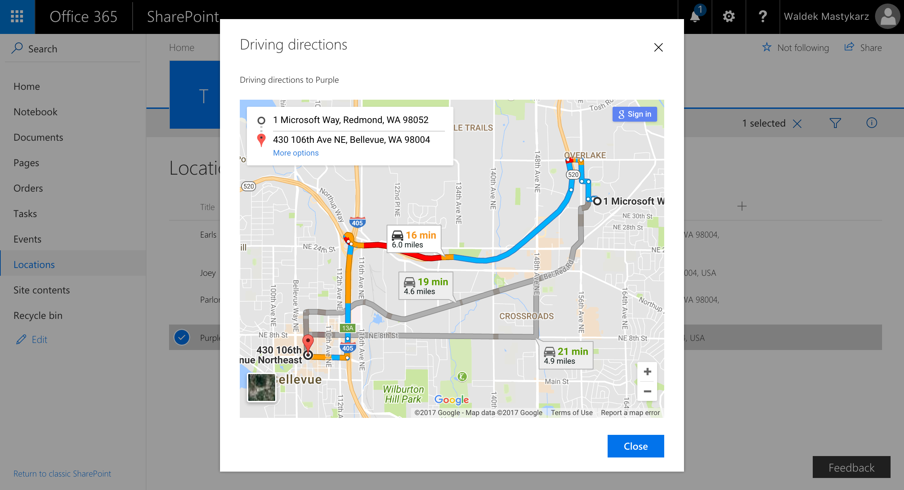

# Directions SharePoint Framework list view command set

## Summary

Sample SharePoint Framework list view command set showing travel directions to the given location using Google Maps.


## Used SharePoint Framework Version


## Applies to

* [SharePoint Framework Extensions Developer Preview](https://dev.office.com/sharepoint/docs/spfx/extensions/overview-extensions)
* [Office 365 developer tenant](http://dev.office.com/sharepoint/docs/spfx/set-up-your-developer-tenant)

## Solution

Solution|Author(s)
--------|---------
react-command-directions|Waldek Mastykarz (MVP, [Rencore](https://rencore.com), @waldekm)

## Version history

Version|Date|Comments
-------|----|--------
1.0.0|June 29, 2017|Initial release

## Disclaimer

**THIS CODE IS PROVIDED *AS IS* WITHOUT WARRANTY OF ANY KIND, EITHER EXPRESS OR IMPLIED, INCLUDING ANY IMPLIED WARRANTIES OF FITNESS FOR A PARTICULAR PURPOSE, MERCHANTABILITY, OR NON-INFRINGEMENT.**

---

## Prerequisites

* Office 365 Developer tenant with a classic site collection and a list of locations
* Google Maps API Key (get free key from [https://developers.google.com/maps/documentation/embed/get-api-key](https://developers.google.com/maps/documentation/embed/get-api-key))

## Minimal Path to Awesome

* clone this repo
* in the command line run
  * `npm i`
  * `gulp serve-info --nobrowser`
* copy the list view command set debug query string parameters from the console output
* add the required parameters (see the example below)
* in the web browser
  * navigate to the list with locations
  * to the URL of the list add the previously copied debug query string parameters

## Features

This project contains sample SharePoint Framework list view command set built using React and Google Maps.

This sample illustrates the following concepts on top of the SharePoint Framework:

* building a custom dialog using React and Office UI Fabric React
* building a generic dialog component capable of rendering arbitrary HTML
* using parameters to pass configuration values to list view command sets
* using Google Maps to display directions using the value from the selected list item
* conditionally showing the list view command set based on the number of selected list item

### Available configuration parameters

Parameter | Type | Possible values | Description
----------|------|-----------------|------------
`startingLocation`|string|address|Starting address from which the directions should be displayed
`addressColumnName`|string|any string|Name of the list column where addresses are stored
`title`|string|any string|Title of the dialog window showing the directions, eg. `Walking directions`
`message`|string|any string|Message displayed just above the map with directions. The name of the selected location is appended to this string, eg. `Walking directions to `.
`mode`|string|`walking`, `driving`, `bicycling`, `transit`, `flying`|Google Maps API method of travel values
`mapsApiKey`|string|valid Google Maps API key|Key required by the Google Maps API

**Example:**

Show driving directions from the Microsoft campus on One Microsoft Way, Redmond, Washington to the selected location specified in the **Address** column of the selected list item:

```text
?loadSPFX=true&debugManifestsFile=https://localhost:4321/temp/manifests.js&customActions={"0fdd064c-5ded-433c-9078-332226423322":{"location":"ClientSideExtension.ListViewCommandSet.CommandBar","properties":{"startingLocation":"One Microsoft Way, Redmond, Washington","addressColumnName":"Address","title":"Driving directions","message":"Driving directions to ","mode":"driving","mapsApiKey":"WDzaSyBDI1aulNOZABb-0c7IZl6FcKgR0ytM6e0"}}}
```




