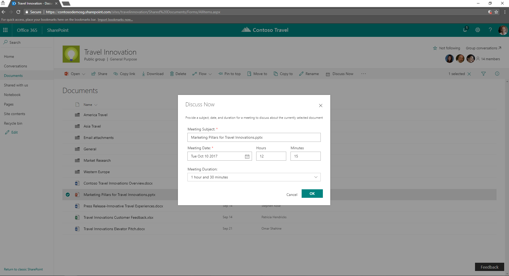

# Discuss Now Command Set

## Summary

Sample SharePoint Framework command set showing how to create a new meeting to discuss about a document selected in the current list view of a document library.



## Used SharePoint Framework Version


## Applies to

* [SharePoint Framework Extensions Developer](https://dev.office.com/sharepoint/docs/spfx/extensions/overview-extensions)
* [Office 365 developer tenant](http://dev.office.com/sharepoint/docs/spfx/set-up-your-developer-tenant)

## Solution

Solution|Author(s)
--------|---------
react-command-discuss-now|Paolo Pialorsi (MCM, MVP, [PiaSys.com](https://piasys.com), [@PaoloPia](https://twitter.com/PaoloPia))

## Version history

Version|Date|Comments
-------|----|--------
1.0.0|September 28, 2017|Initial release
1.1.0|July 18, 2018|Upgraded to SPFx 1.4.1

## Disclaimer

**THIS CODE IS PROVIDED *AS IS* WITHOUT WARRANTY OF ANY KIND, EITHER EXPRESS OR IMPLIED, INCLUDING ANY IMPLIED WARRANTIES OF FITNESS FOR A PARTICULAR PURPOSE, MERCHANTABILITY, OR NON-INFRINGEMENT.**

---

## Prerequisites

* Office 365 Developer tenant with a modern site collection and a document library

## Minimal Path to Awesome

* clone this repo
* in the command line run
  * `npm i`
  * `gulp serve --nobrowser`
* open a document library in a modern site
* append the following query string parameters to the AllItems.aspx view page URL

```text
?loadSpfx=true&debugManifestsFile=https://localhost:4321/temp/manifests.js&customActions={"95483216-5d5f-404c-bf25-563e44cdd935":{"location":"ClientSideExtension.ListViewCommandSet"}}
```

## Deployment

In order to deploy the sample solution in a real environment, or at least in order to skip using the debug mode, you need to execute the following steps:
* publish the solution on any hosting environment or CDN and update the _cdnBasePath_ property in the write-manifests.json file with the base URL of your hosting environment
* bundle and package the solution by executing the following commands in the command line:
  * `gulp bundle --ship`
  * `gulp package-solution --ship`
* upload the content of the ./temp/deploy subfolder of the sample root folder into the target hosting environment
* add to the "Apps for SharePoint" library of the AppCatalog in your tenant the spfx-discuss-now.spppkg file that you will find under the ./sharepoint/solution subfolder of the sample root folder
* add the spfx-discuss-now app to any target site where you want to use the extension

The sample solution will use the SharePoint Feature Framework to automatically provision the command set extension to all the document libraries (List Type 101) of the target site. If you want to manually bind the extension to any other custom library, please refer to the PowerShell script [DiscussNowProvisionCommandSet.ps1](./DiscussNowProvisionCommandSet.ps1), which is available in the root folder of this sample. Please, notice that the PowerShell script provides a sample code excerpt to bind the command set to all the document libraries of the target site using PnP PowerShell, as well 
a sample about how to bind the command set with a specific target library. It is up to you to choose the right option for your scenario.

## Features

This project contains sample SharePoint Framework command set extension built using React and Office UI Fabric React. The command set allows to create a new meeting in the Group's agenda of the Modern Site to discuss about the currently selected document in a document library. By default the command set invites all the Group's members.

This sample illustrates the following concepts on top of the SharePoint Framework:

* using Office UI Fabric React to build SharePoint Framework command set that seamlessly integrate with SharePoint
* using React to build SharePoint Framework command set
* logging information to console using a custom SharePoint Framework log handler
* creating new objects (event in a calendar) using the Microsoft Graph and the _graphHttpClient_ from the SharePoint Framework _context_
* using the SPFx Dialog Framework

