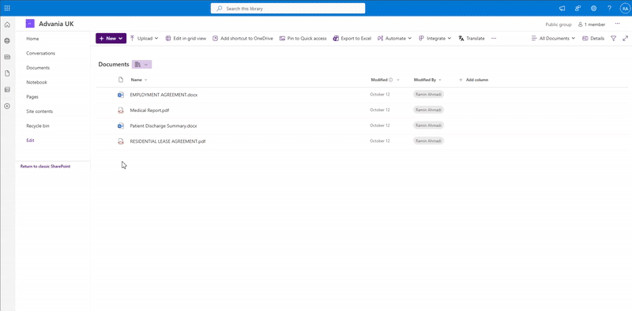

# SharePoint Framework Document Translation Extension

## Summary

A SharePoint Framework (SPFx) List View Command Set extension that enables users to translate documents from one language to another using Azure Document Translation Service. Users can select one or more documents from a SharePoint document library and translate them into multiple target languages simultaneously.



## Compatibility

| :warning: Important          |
|:---------------------------|
| Every SPFx version is optimally compatible with specific versions of Node.js. In order to be able to Toolchain this sample, you need to ensure that the version of Node on your workstation matches one of the versions listed in this section. This sample will not work on a different version of Node.|
|Refer to <https://aka.ms/spfx-matrix> for more information on SPFx compatibility.   |

This sample is optimally compatible with the following environment configuration:


-Incompatible-red.svg "SharePoint Server 2016 Feature Pack 2 requires SPFx 1.1")


## Applies to

- [SharePoint Framework](https://aka.ms/spfx)
- [Microsoft 365 tenant](https://docs.microsoft.com/en-us/sharepoint/dev/spfx/set-up-your-developer-tenant)

> Get your own free development tenant by subscribing to [Microsoft 365 developer program](http://aka.ms/o365devprogram)

## Key Features

- **Multi-Language Translation**: Translate documents to multiple target languages in a single operation
- **Auto-Detect Source Language**: Automatically detect the source language or manually specify it
- **Batch Processing**: Process multiple documents at once (configurable limit)
- **Real-Time Progress**: Monitor translation progress with live status updates
- **Wide Format Support**: Supports .docx, .xlsx, .pptx, .pdf, .html, .txt, .md, .msg, .odt, .ods, .odp
- **Secure Authentication**: Uses Azure AD OAuth 2.0 with On-Behalf-Of flow for SharePoint access
- **Error Handling**: Comprehensive error reporting with per-document failure details
- **Cost Tracking**: Displays character count processed for cost transparency

## Supported Languages

- English, French, Spanish, German, Italian, Portuguese
- Dutch, Russian, Japanese, Korean
- Chinese (Simplified & Traditional), Arabic, Hindi, Turkish
- Polish, Swedish, Norwegian, Danish, Finnish
- And many more...

## Prerequisites

### Azure Resources

1. **Azure Translator Resource** (with Document Translation enabled)
   - Create in Azure Portal: AI + Machine Learning > Translator
   - Note: Document Translation requires S1 tier or higher
   - Record: Endpoint, Subscription Key, Region

2. **Azure Storage Account**
   - For storing source and translated documents temporarily
   - Record: Connection String

3. **Azure Function App** (Optional but recommended)
   - For backend API (C# isolated worker)
   - Consumption or Premium plan

4. **Azure AD App Registration**
   - For SPFx authentication and SharePoint OBO flow
   - Configure API permissions: SharePoint AllSites.Write
   - Record: Client ID, Client Secret

5. **Azure Service Bus** (Optional)
   - For asynchronous job processing
   - Record: Connection String, Queue Name

### Development Environment

- Node.js v22.14.0 or higher (< 23.0.0)
- SPFx 1.21.1
- .NET 9.0 SDK (for Azure Function)
- Visual Studio Code or Visual Studio 2022

## Installation & Setup

### Part 1: SPFx Extension Setup

1. **Clone or Download the Repository**

   ```bash
   cd react-command-document-translation/SPFx
   ```

2. **Install Dependencies**

   ```bash
   npm install
   ```

3. **Update Configuration**

   Edit `config/serve.json` for local testing:

   ```json
   {
     "customActions": {
       "1f94503e-9f38-49f9-ab62-5dbbc086cbb6": {
         "location": "ClientSideExtension.ListViewCommandSet.CommandBar",
         "properties": {
           "azureFunctionUrl": "https://your-function-app.azurewebsites.net",
           "clientId": "api://your-azure-ad-app-id",
           "functionKey": "your-function-key-if-using",
           "maxFilesPerJob": 50,
           "maxFileSize": 41943040
         }
       }
     }
   }
   ```

4. **Build the Extension**

   ```bash
   gulp bundle --ship
   gulp package-solution --ship
   ```

5. **Deploy to SharePoint**
   - Upload `sharepoint/solution/*.sppkg` to App Catalog
   - Deploy globally or to specific site collections
   - Grant API permissions in SharePoint Admin Center:
     - `api://your-azure-ad-app-id` with User.Read scope

### Part 2: Azure Function Backend Setup

1. **Navigate to Azure Function Directory**

   ```bash
   cd ../AzureFunction/DocumentTranslationApp
   ```

2. **Review Implementation Guide**
   - Read `IMPLEMENTATION_GUIDE.md` for detailed architecture
   - Copy and adapt C# files from `react-command-documents-redaction/AzureFunction`

3. **Install NuGet Packages**

   ```bash
   dotnet restore
   ```

4. **Configure local.settings.json**

   ```json
   {
     "IsEncrypted": false,
     "Values": {
       "AzureWebJobsStorage": "UseDevelopmentStorage=true",
       "FUNCTIONS_WORKER_RUNTIME": "dotnet-isolated",
       "APPLICATIONINSIGHTS_CONNECTION_STRING": "",
       "DocumentTranslation:Endpoint": "https://<region>.cognitiveservices.azure.com",
       "DocumentTranslation:SubscriptionKey": "<your-translator-subscription-key>",
       "DocumentTranslation:Region": "<region>",
       "DocumentTranslation:DefaultTimeout": "300",
       "DocumentTranslation:ApiVersion": "2024-05-01",
       "BlobStorage:ConnectionString": "<storage-connection-string>",
       "BlobStorage:ContainerName": "translation-documents",
       "Storage:ConnectionString": "<storage-connection-string>",
       "Storage:TableName": "translationjobs",
       "Storage:SourceContainer": "translation-source",
       "Storage:TempContainer": "translation-temp",
       "Storage:MaxRetries": "3",
       "Storage:DefaultMaxRetries": "3",
       "Storage:UseManagedIdentity": "true",
       "SharePoint:ClientId": "<azure-ad-app-id>",
       "SharePoint:ClientSecret": "<azure-ad-app-secret>",
       "SharePoint:TenantUrl": "https://<your-tenant>.sharepoint.com/",
       "ServiceBus:ConnectionString": "<optional-service-bus-connection>",
       "ServiceBus:QueueName": "translation-jobs"
     },
     "Host": {
       "CORS": "*",
       "CORSCredentials": false
     }
   }
   ```

   **Configuration Details:**
   - **AzureWebJobsStorage**: Use `UseDevelopmentStorage=true` for local development with Azurite emulator, or provide actual storage connection string for remote testing
   - **FUNCTIONS_WORKER_RUNTIME**: Must be `dotnet-isolated` for .NET 9.0 isolated worker model
   - **DocumentTranslation:*** settings: Credentials and configuration for Azure Translator service (Document Translation API)
   - **BlobStorage:*** settings: Temporary blob storage for source documents and translation outputs
   - **Storage:*** settings: Azure Table Storage for job status tracking and metadata
   - **SharePoint:*** settings: Azure AD app credentials and tenant URL for SharePoint integration
   - **ServiceBus:*** settings: Optional Azure Service Bus for asynchronous job processing
   - **Host.CORS**: Set to SharePoint domain in production (e.g., `"https://yourtenant.sharepoint.com"`)

5. **Test Locally**

   ```bash
   dotnet run
   # Or use Azure Functions Core Tools
   func start
   ```

6. **Deploy to Azure**

   ```bash
   func azure functionapp publish <your-function-app-name>
   ```

7. **Configure Azure Function App Settings**
   - Set all configuration values in Azure Portal > Configuration
   - Enable Application Insights for monitoring
   - Configure CORS to allow SharePoint domains
   - (Optional) Enable Authentication to require Azure AD tokens

### Part 3: Configure SharePoint Extension

1. **Navigate to your SharePoint site**
2. **Go to a Document Library**
3. **Select one or more documents**
4. **Click "Translate Document" in the command bar**
5. **Select target languages and start translation**

## API Reference

### Azure Document Translation API

**Start Translation Job**

```http
POST https://{endpoint}/translator/document/batches?api-version=2024-05-01
Headers:
  Ocp-Apim-Subscription-Key: {key}
  Ocp-Apim-Subscription-Region: {region}
  Content-Type: application/json

Body:
{
  "inputs": [{
    "source": {
      "sourceUrl": "https://{storage}.blob.core.windows.net/source?{SAS}",
      "language": "en"
    },
    "targets": [
      {
        "targetUrl": "https://{storage}.blob.core.windows.net/target-fr?{SAS}",
        "language": "fr"
      }
    ]
  }]
}
```

**Get Translation Status**

```http
GET https://{endpoint}/translator/document/batches/{id}?api-version=2024-05-01
Headers:
  Ocp-Apim-Subscription-Key: {key}
```

## Cost Considerations

### Azure Translator Pricing

- Charged per character translated
- Pricing tier: Standard S1 or higher required
- Example: $10 per million characters (varies by region)
- Batch translations may have volume discounts

## Disclaimer

This sample is provided as-is without warranty. Test thoroughly in your environment before production use. Be aware of Azure service costs and implement appropriate controls.

## References

- [Azure Document Translation Documentation](https://learn.microsoft.com/en-us/azure/ai-services/translator/document-translation/)
- [SharePoint Framework Documentation](https://learn.microsoft.com/en-us/sharepoint/dev/spfx/sharepoint-framework-overview)
- [Azure Functions Documentation](https://learn.microsoft.com/en-us/azure/azure-functions/)
- [PnP Core SDK](https://pnp.github.io/pnpcore/)
