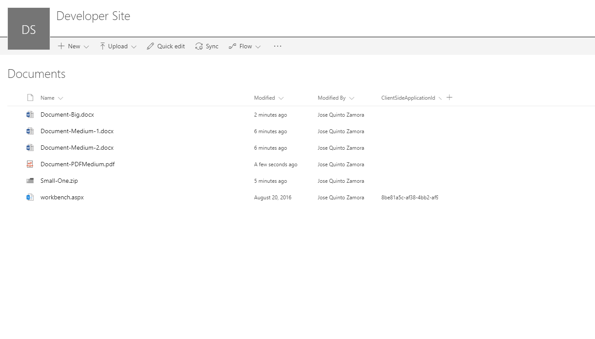

# File Size Viewer sample with Command View Set

## Summary

This sample shows how to create Command View Set working with single and multiple files selection.
Once selected some files, it will show file sizes representation using a [React D3 TreeMap component](https://www.npmjs.com/package/react-d3-treemap).
This sample also shows how to integrate [D3.js](https://d3js.org/) third party components within SharePoint Framework.



## Compatibility


## Applies to

* [SharePoint Framework](http://dev.office.com/sharepoint/docs/spfx/sharepoint-framework-overview)
* [Office 365 developer tenant](http://dev.office.com/sharepoint/docs/spfx/set-up-your-developer-tenant)

## Solution

Solution|Author(s)
--------|---------
react-command-file-size-viewer | Jose Quinto ([@jquintozamora](https://twitter.com/jquintozamora) , [blog.josequinto.com](https://blog.josequinto.com))

## Version history

Version|Date|Comments
-------|----|--------
1.0|July 3, 2017|First release
1.1|February 28, 2021|Upgraded to SPFx 1.11.0

## Disclaimer

**THIS CODE IS PROVIDED *AS IS* WITHOUT WARRANTY OF ANY KIND, EITHER EXPRESS OR IMPLIED, INCLUDING ANY IMPLIED WARRANTIES OF FITNESS FOR A PARTICULAR PURPOSE, MERCHANTABILITY, OR NON-INFRINGEMENT.**

---

## Minimal Path to Awesome

- Clone this repository
- Move to folder where this readme exists
- In the command window run:
  - `npm install`
  - `gulp serve --nobrowser`
- Use following query parameter in the SharePoint site to get extension loaded without installing it to app catalog

## Debug URL for testing

Here's a debug URL for testing around this sample.

```
?loadSPFX=true&debugManifestsFile=https://localhost:4321/temp/manifests.js&customActions={"5f509a36-9998-4a5f-a5f4-b7d02d4f90b4":{"location":"ClientSideExtension.ListViewCommandSet"}}
```
Full URL to request would be something like following:

```
contoso.sharepoint.com/Shared%20Documents/Forms/AllItems.aspx?loadSPFX=true&debugManifestsFile=https://localhost:4321/temp/manifests.js&customActions={"5f509a36-9998-4a5f-a5f4-b7d02d4f90b4":{"location":"ClientSideExtension.ListViewCommandSet"}}
```

## Features

This project contains SharePoint Framework extensions that illustrates next features:
* [Command extension](https://dev.office.com/sharepoint/docs/spfx/extensions/get-started/building-simple-cmdset-with-dialog-api)
* Custom dialog control using `@microsoft/sp-dialog` package
* [react-d3-treemap](https://www.npmjs.com/package/react-d3-treemap)

> Notice. This sample is designed to be used in debug mode and does not contain automatic packaging setup for the "production" deployment.


