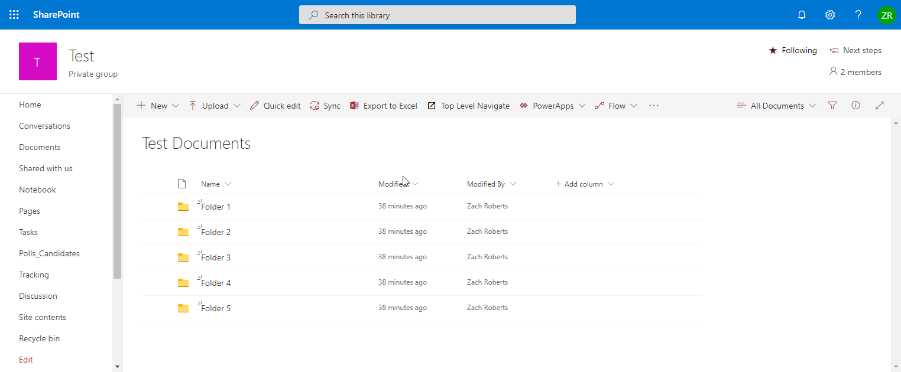

# react-command-folder-select

## Summary
This extension creates a callout with a dropdown that allows users to select from a list of top level folders in a document library. After selecting the folder they can use the button to navigate to that folder.

## Used SharePoint Framework Version 

## Applies to

* [SharePoint Framework](https://dev.office.com/sharepoint)

## Solution

Solution|Author(s)
--------|---------
react-command-folder-select | Zach Roberts, [spodev.com](https://spodev.com)

## Version history

Version|Date|Comments
-------|----|--------
1.0|January 3, 2020|Initial Version

## Disclaimer
**THIS CODE IS PROVIDED *AS IS* WITHOUT WARRANTY OF ANY KIND, EITHER EXPRESS OR IMPLIED, INCLUDING ANY IMPLIED WARRANTIES OF FITNESS FOR A PARTICULAR PURPOSE, MERCHANTABILITY, OR NON-INFRINGEMENT.**

---

## Minimal Path to Awesome

- Clone this repository
- Open the reposistory in VS Code or an editor of your choice.
- Update the pageUrl in 'config/serve.json' to the URL of a document library you want to test against.
- in the command line run:
  - `npm install`
  - `gulp serve`
- When prompted select 'Load debug scripts'

## Features
This extension illustrates the following concepts:

- Retrieiving top level folders of a document library using [PnP Js](https://pnp.github.io/pnpjs/).

