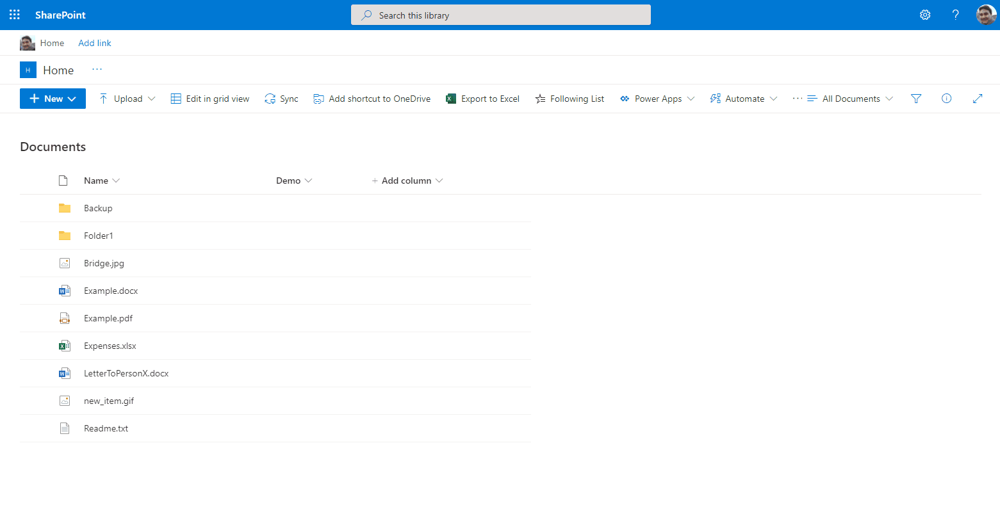

# Follow Document

## Summary

This solution has the goal to easily identify/follow user key documents from all Tenant and easily access them in Modern Pages. This solution uses the Out of Box Office 365 Tab Favorites with combination of MSGraph queries and MGT FileList/File components.

Available features:
- Follow documents (individually or multiple at same time)
- Manage followed documents (Follow/unfollow)
- List of all followed documents and option to unfollow if needed

After follow document access to Office page > Tab "Favorites" and validate document was included.

Usage of following Technologies:
- Usage of Microsoft Graph API "[Follow drive item](https://docs.microsoft.com/en-us/graph/api/driveitem-follow?view=graph-rest-1.0&tabs=http)"
- Usage of Microsoft Graph API "[Unfollow drive item](https://docs.microsoft.com/en-us/graph/api/driveitem-unfollow?view=graph-rest-1.0&tabs=http)"
- Usage of Microsoft Graph API "[List followed items](https://docs.microsoft.com/en-us/graph/api/drive-list-following?view=graph-rest-1.0&tabs=http)"
- Usage of MGT (Microsoft Graph Toolkit) [FileList](https://docs.microsoft.com/en-us/graph/toolkit/components/file-list) and [File](https://docs.microsoft.com/en-us/graph/toolkit/components/file)



## Compatibility


 


## Applies to

- [SharePoint Framework](https://aka.ms/spfx)
- [Microsoft 365 tenant](https://docs.microsoft.com/en-us/sharepoint/dev/spfx/set-up-your-developer-tenant)


## Prerequisites

### Grant the service principal permission to the Microsoft Graph API

Once installed, the solution will request the required permissions via the **Office 365 admin portal > SharePoint > Advanced > API access**.
If you prefer to approve the permissions in advance, for example when testing the solution in the Workbench page without installing it, you can do so using the [CLI for Microsoft 365](https://pnp.github.io/cli-microsoft365/):

```bash
o365 spo login https://contoso-admin.sharepoint.com
o365 spo serviceprincipal grant add --resource 'Microsoft Graph' --scope 'Files.Read'
o365 spo serviceprincipal grant add --resource 'Microsoft Graph' --scope 'Files.Read.All'
o365 spo serviceprincipal grant add --resource 'Microsoft Graph' --scope 'Sites.Read.All'
o365 spo serviceprincipal grant add --resource 'Microsoft Graph' --scope 'Files.ReadWrite.All'
o365 spo serviceprincipal grant add --resource 'Microsoft Graph' --scope '"Sites.ReadWrite.All'
```

## Solution

Solution|Author(s)
--------|---------
react-follow-document | [André Lage](https://github.com/aaclage) (http://aaclage.blogspot.com, [@aaclage](https://twitter.com/aaclage))

## Version history

Version|Date|Comments
-------|----|--------
1.0|June 14, 2021|Initial release
2.0|November 25, 2021|update to use Microsoft Graph Query "Follow" service

## Minimal Path to Awesome

- Clone this repository
- Ensure that you are at the solution folder
- in the command-line run:
  - `npm install`
  - `gulp serve`
  - `gulp bundle --ship`
  - `gulp package-solution --ship`
  - Add to AppCatalog and deploy

## Features

Description of the extension that expands upon high-level summary above.

This extension illustrates the following concepts:

- Change of SharePoint Social Feature **"Follow"** to follow key Documents for users in Modern Sites. 
- Simple UX to manage **Followed** documents and report list followed documents across Tenant.
- Option to follow/unfollow documents individually. 
- Option to follow multiple document at same time.  
- Side Panel to List all users Followed Documents.


# Debug URL for testing
Here's a debug URL for testing around this sample.
```
?debugManifestsFile=https%3A%2F%2Flocalhost%3A4321%2Ftemp%2Fmanifests%2Ejs&loadSPFX=true&customActions=%7B"e56ac563-6d72-46f2-ba3d-68169f80fa7f"%3A%7B"location"%3A"ClientSideExtension%2EListViewCommandSet%2ECommandBar"%2C"properties"%3A%7B%7D%7D%7D
```

## Disclaimer
**THIS CODE IS PROVIDED *AS IS* WITHOUT WARRANTY OF ANY KIND, EITHER EXPRESS OR IMPLIED, INCLUDING ANY IMPLIED WARRANTIES OF FITNESS FOR A PARTICULAR PURPOSE, MERCHANTABILITY, OR NON-INFRINGEMENT.**

## Help

We do not support samples, but we this community is always willing to help, and we want to improve these samples. We use GitHub to track issues, which makes it easy for  community members to volunteer their time and help resolve issues.

If you encounter any issues while using this sample, [create a new issue](https://github.com/pnp/sp-dev-fx-extensions/issues/new?assignees=&labels=Needs%3A+Triage+%3Amag%3A%2Ctype%3Abug-suspected&template=bug-report.yml&sample=react-follow-document&authors=@aaclage&title=react-follow-document%20-%20).

For questions regarding this sample, [create a new question](https://github.com/pnp/sp-dev-fx-extensions/issues/new?assignees=&labels=Needs%3A+Triage+%3Amag%3A%2Ctype%3Abug-suspected&template=question.yml&sample=react-follow-document&authors=@aaclage&title=react-follow-document%20-%20).

Finally, if you have an idea for improvement, [make a suggestion](https://github.com/pnp/sp-dev-fx-extensions/issues/new?assignees=&labels=Needs%3A+Triage+%3Amag%3A%2Ctype%3Abug-suspected&template=suggestion.yml&sample=react-follow-document&authors=@aaclage&title=react-follow-document%20-%20).


## References

- [Getting started with SharePoint Framework](https://docs.microsoft.com/en-us/sharepoint/dev/spfx/set-up-your-developer-tenant)
- [Building for Microsoft teams](https://docs.microsoft.com/en-us/sharepoint/dev/spfx/build-for-teams-overview)
- [Use Microsoft Graph in your solution](https://docs.microsoft.com/en-us/sharepoint/dev/spfx/web-parts/get-started/using-microsoft-graph-apis)
- [Publish SharePoint Framework applications to the Marketplace](https://docs.microsoft.com/en-us/sharepoint/dev/spfx/publish-to-marketplace-overview)
- [Microsoft 365 Patterns and Practices](https://aka.ms/m365pnp) - Guidance, tooling, samples and open-source controls for your Microsoft 365 development
