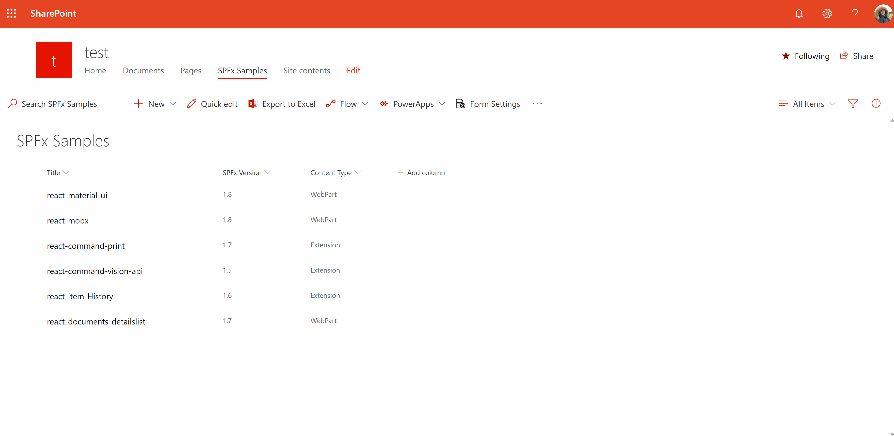

# Form Settings Command View Set

## Summary
This sample shows how you can redirect default SharePoint list forms (New,Edit,Display) to different pages.

> As it's a hacky way of overriding default SharePoint behaviour I do not recommend using it in production.
> If you have more than one content types, you need to add Content Type column to the list views



## Used SharePoint Framework Version 


## Applies to

* [SharePoint Framework](https://dev.office.com/sharepoint)
* [Office 365 tenant](https://dev.office.com/sharepoint/docs/spfx/set-up-your-development-environment)

## Solution

Solution|Author(s)
--------|---------
react-command-form-settings | Ramin Ahmadi

## Version history

Version|Date|Comments
-------|----|--------
1.0|Jun 30, 2019|Initial release

## Disclaimer
**THIS CODE IS PROVIDED *AS IS* WITHOUT WARRANTY OF ANY KIND, EITHER EXPRESS OR IMPLIED, INCLUDING ANY IMPLIED WARRANTIES OF FITNESS FOR A PARTICULAR PURPOSE, MERCHANTABILITY, OR NON-INFRINGEMENT.**

---

## Minimal Path to Awesome

- Clone this repository
- in the command line run:
  - `npm install`
  - update _serve.json_ pointing to your site collection home page
  - `gulp serve`

## Features
This sample illustrates the following concepts on top of the SharePoint Framework:

* Override SharePoint list forms
* Support content types
* Enable/Disable settings

## Debug URL for testing
Here's a debug URL for testing around this sample. **Updated based on your manifest id for easy testing of the sample**.

```
?loadSPFX=true&debugManifestsFile=https://localhost:4321/temp/manifests.js&customActions={"4c8f3df1-1d4c-4381-9590-0f4f8c16e782":{"location":"ClientSideExtension.ApplicationCustomizer","properties":{"testMessage":"Hello as property!"}}}
```

> Notice that better pictures and documentation will increase the sample usage and the value you are providing for others. Thanks for your submissions advance.


