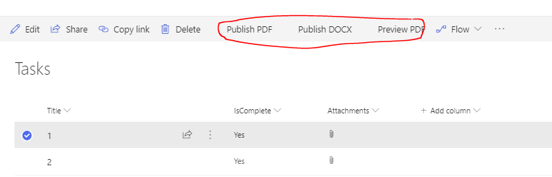

# react-command-generate-documents

## Summary
This project contains an azure function that can populate a word template stored in a document library with information passed into it in the post body. It can be used to add text, images, checkboxes and tables to a Word template. The function saves the generated document back to another SharePoint document library. The function impersonates the logged in user to ensure that the function only can write to libraries the caller has access to. It can also create a PDF version of the file using the  v2.0 SharePoint rest interface. 
A sample SPFX list view command set is also included to demonstrate how to call the azure function. The replacement parameters in this sample came from a single list, but in real life they would likely come from multiple lists (order header/order detail). 

## Used SharePoint Framework Version

## Applies to

* [SharePoint Framework](https://dev.office.com/sharepoint)
* [Office 365 tenant](https://dev.office.com/sharepoint/docs/spfx/set-up-your-development-environment)

## Prerequisites
 
Solution requires azure subscription. Installer must have tenant admin priveleges to approve the application request/

## Solution

Solution|Author(s)
--------|---------
react-command-generate-documents|Russell Gove, RussellGove@gmail.com)

## Version history

Version|Date|Comments
-------|----|--------
1.0.0|January 1, 2019|Initial release

## Disclaimer

**THIS CODE IS PROVIDED *AS IS* WITHOUT WARRANTY OF ANY KIND, EITHER EXPRESS OR IMPLIED, INCLUDING ANY IMPLIED WARRANTIES OF FITNESS FOR A PARTICULAR PURPOSE, MERCHANTABILITY, OR NON-INFRINGEMENT.**

## Minimal Path to Awesome

Build and install instructions for both the azure function and the spfx extension  can be found in the file at misc/Gernerating a word.docx

