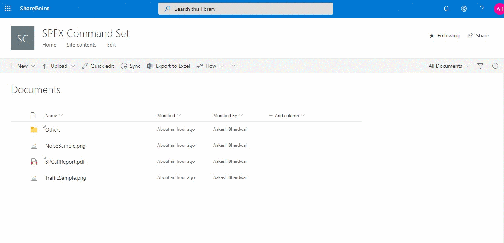

# Get Thumbnail List Item Command View Set

## Summary
This Command Set uses Microsoft Graph API to get the Thumbnail URL, of selected size (small, medium, large), for any file stored in a SharePoint Document Library.



## Used SharePoint Framework Version


## Applies to

* [SharePoint Framework](https://dev.office.com/sharepoint)
* [Office 365 tenant](https://dev.office.com/sharepoint/docs/spfx/set-up-your-development-environment)

## Prerequisites

There are no pre-requisites.

## Solution

Solution|Author(s)
--------|---------
react-command-get-thumbnail | [Aakash Bhardwaj](https://twitter.com/aakash_316)

## Version history

Version|Date|Comments
-------|----|--------
1.0|October 25, 2019|Initial release

## Disclaimer

**THIS CODE IS PROVIDED *AS IS* WITHOUT WARRANTY OF ANY KIND, EITHER EXPRESS OR IMPLIED, INCLUDING ANY IMPLIED WARRANTIES OF FITNESS FOR A PARTICULAR PURPOSE, MERCHANTABILITY, OR NON-INFRINGEMENT.**

---

## Minimal Path to Awesome

* Clone this repository
* `npm install`
* `gulp bundle --ship`
* `gulp package-solution --ship`
* Add to Site Collection App Catalog and Install the App
* Go to the API Management section in the new SharePoint Admin Center (https://{tenantname}-admin.sharepoint.com/_layouts/15/online/AdminHome.aspx#/webApiPermissionManagement)
* Approve the permission request for Sites.Read.All to Microsoft Graph

## Features

This extension uses Microsoft Graph API to get the Thumbnail URL, of selected size (small, medium, large), for any file stored in a SharePoint Document Library. If no files are selected, multiple files are selected or a folder is selected then the command set will be hidden.

This extension illustrates the following concepts:

* Requesting Sites.Read.All permission scope for Microsoft Graph through the webApiPermissionRequests property in package-solution.json
* Using MSGraphClient to call the thumbnail api for the selected item in SharePoint Document Library and get its URL
* Hiding the command set when no item is selected or multiple items are selected
* Hiding the command set when an item of the Folder content type is selected
* Copying the Thumbnail URL to the clipboard

## Debug URL for testing

Here's a debug URL for testing around this sample. 

```
?loadSPFX=true&debugManifestsFile=https://localhost:4321/temp/manifests.js&customActions={"46fe1f48-0c8d-4236-b8c0-e70f2a5eeb08":{"location":"ClientSideExtension.ListViewCommandSet","properties":{}}}
```
