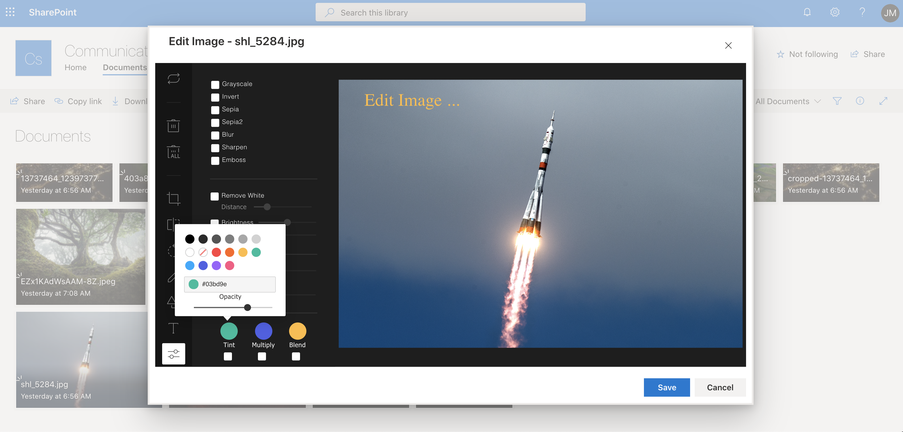
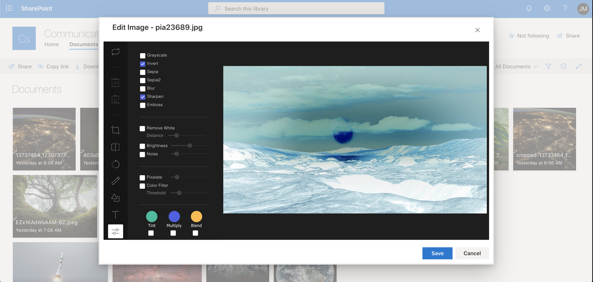

# Image Editor Command Set

## Summary

This command set allows  quick edit images located in Document Library. It implement a library called Tui Image Editor  available on GitHub. https://github.com/nhn/tui.image-editor

The file format supported are `*.jpg`, `*.jpeg` and `*.png`






## Used SharePoint Framework Version


## Applies to

* [SharePoint Framework](http://dev.office.com/sharepoint/docs/spfx/sharepoint-framework-overview)
* [Office 365 tenant](http://dev.office.com/sharepoint/docs/spfx/set-up-your-developer-tenant)

## Solution

Solution|Author(s)
--------|---------
React-Command-image-editor | João Mendes

## Version history

Version|Date|Comments
-------|----|--------
1.0|June 16, 2020|Initial version


## Disclaimer

**THIS CODE IS PROVIDED *AS IS* WITHOUT WARRANTY OF ANY KIND, EITHER EXPRESS OR IMPLIED, INCLUDING ANY IMPLIED WARRANTIES OF FITNESS FOR A PARTICULAR PURPOSE, MERCHANTABILITY, OR NON-INFRINGEMENT.**

---

## Minimal Path to Awesome

- Clone this repository
- Move to folder where this readme exists
- In the command window run:
  - `npm install`
  - `gulp serve --nobrowser`
- Use following query parameter in the SharePoint site to get extension loaded without installing it to app catalog

## Debug URL for testing

Here's a debug URL for testing around this sample. 

```
?debugManifestsFile=https://localhost:4321/temp/manifests.js&loadSPFX=true&customActions={"1d924752-366f-4e86-b3aa-c4fa9c0805b2":{"location":"ClientSideExtension.ListViewCommandSet.CommandBar","properties":{"sampleTextOne":"One+item+is+selected+in+the+list"}}}
```

Full URL to request would be something like following:

```
https://contoso.sharepoint.com/Shared Documents/Forms/AllItems.aspx?debugManifestsFile=https://localhost:4321/temp/manifests.js&loadSPFX=true&customActions={"1d924752-366f-4e86-b3aa-c4fa9c0805b2":{"location":"ClientSideExtension.ListViewCommandSet.CommandBar","properties":{"sampleTextOne":"One+item+is+selected+in+the+list"}}}
```

## Features

This project contains SharePoint Framework extensions that illustrates:

* Command extension
* use @pnp/pnpjs
* TUI-Image Editor Library

> Notice. This sample is designed to be used in debug mode and does not contain automatic packaging setup for the "production" deployment.


