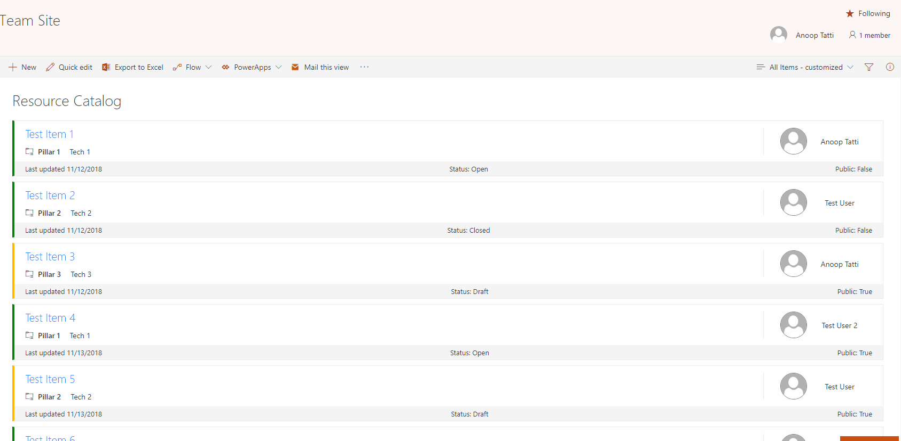

# SPFx Mail Current View as Image

## Summary
Sample SharePoint Framework list view command set extension that emails the current view to selected (external or internal user) and also saves the same image in SharePoint. Uses html2canvas library, pnp spfx controls, pnp js and office fabric ui react.

Example use case - say if a list has a nice list view formatting applied and external user cannot be given access to it then this extension can be used to send the formatted view as an image to the external user.



## Used SharePoint Framework Version 


## Applies to

* [SharePoint Framework Extensions](https://dev.office.com/sharepoint/docs/spfx/extensions/overview-extensions)

## Solution

Solution|Author(s)
--------|---------
react-command-mail-view-as-image | Anoop T ([@anooptells](https://twitter.com/anooptells))

## Version history

Version|Date|Comments
-------|----|--------
1.0|November 13, 2018|Initial release

## Disclaimer
**THIS CODE IS PROVIDED *AS IS* WITHOUT WARRANTY OF ANY KIND, EITHER EXPRESS OR IMPLIED, INCLUDING ANY IMPLIED WARRANTIES OF FITNESS FOR A PARTICULAR PURPOSE, MERCHANTABILITY, OR NON-INFRINGEMENT.**

---

## Minimal Path to Awesome

- Clone this repository
- Update the `pageUrl` properties in the **config/serve.json** file
  - The `pageUrl` should be a modern page
  - This property is only used during development in conjunction with the `gulp serve` command
- In the command line navigate to the js-command-copy-classic-link folder and run:
  - `npm install`
  - `gulp serve --config=mailViewAsImage`

## Features

This extension illustrates the following concepts:

- Using **html2canvas** for building the image of the view.
- Using **pnp spfx controls** for selecting people and selecting library.
- Using **Office fabric UI react** components for the UI. 
- Using **pnp js** to check permissions and to upload image to library.

## Debug URL for testing
Here's a debug querystring for testing this sample:

```
?loadSPFX=true&debugManifestsFile=https://localhost:4321/temp/manifests.js&customActions={"7259f167-9c45-4829-be24-34ef6b0c896b":{"location":"ClientSideExtension.ApplicationCustomizer","properties":{}}}
```

Your URL will look similar to the following (replace with your domain and site address):
```
https://yourtenant.sharepoint.com/sites/yoursite?loadSPFX=true&debugManifestsFile=https://localhost:4321/temp/manifests.js&customActions={"7259f167-9c45-4829-be24-34ef6b0c896b":{"location":"ClientSideExtension.ApplicationCustomizer","properties":{}}}
```