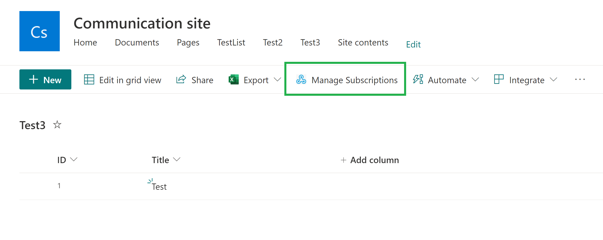
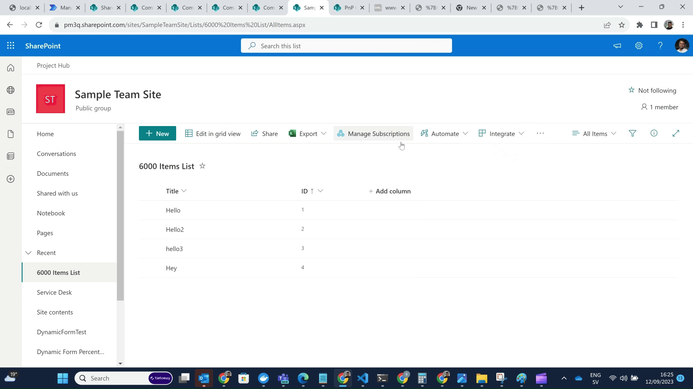

# Manage List Subscriptions

## Summary
With the use of Rest calls, this sample commandset shows how to manage list subscriptions (SharePoint webhooks) and take action to extend the webhook expiration date. The commandset will be added to the lists and libraries and will only be shown if there are any list subscriptions available on the list. The subscriptions that are accessible are shown when you click on the Commandset. The 'Renew subscription' action can be used in accordance with the subscription's expiration date. Given that the default number of days is 180, the subscription's (webhook expiration renewal date) renewal date is set to 179 days. 

Example use case - Since the webhook subscriptions are only valid to 180 days, and it is usually hard to keep a track on the expiration date. Say if the list has subscriptions, this commandset allows to manage those subscriptions with a possiblity to renew the subscriptions when expired. 






## Used SharePoint Framework Version 


## Applies to

* [SharePoint Framework Extensions](https://dev.office.com/sharepoint/docs/spfx/extensions/overview-extensions)

## Solution

Solution|Author(s)
--------|---------
react-command-manage-list-subscriptions | Nishkalank Bezawada ([GitHub](https://github.com/NishkalankBezawada))

## Version history

Version|Date|Comments
-------|----|--------
1.0|September 12, 2023|Initial release

## Disclaimer
**THIS CODE IS PROVIDED *AS IS* WITHOUT WARRANTY OF ANY KIND, EITHER EXPRESS OR IMPLIED, INCLUDING ANY IMPLIED WARRANTIES OF FITNESS FOR A PARTICULAR PURPOSE, MERCHANTABILITY, OR NON-INFRINGEMENT.**

---

## Minimal Path to Awesome

- Clone this repository
- Update the `pageUrl` properties in the **config/serve.json** file
  - The `pageUrl` should be a modern page
  - This property is only used during development in conjunction with the `gulp serve` command
  - In the command line navigate to the react-command-manage-list-subscriptions folder and run:
  - `npm install`
  - `gulp serve`

## Features

This extension illustrates the following concepts:

- Using **Office fabric UI react** components for the UI. 


## Debug URL for testing
Here's a debug querystring for testing this sample:

```
?loadSPFX=true&debugManifestsFile=https://localhost:4321/temp/manifests.js&loadSPFX=true&customActions={"038b9697-9b22-4e42-8078-66ec93f546d0":{"location":"ClientSideExtension.ListViewCommandSet.CommandBar","properties":{}}}
```

Your URL will look similar to the following (replace with your domain and site address):
```
https://yourtenant.sharepoint.com/sites/yoursite?loadSPFX=true&debugManifestsFile=https://localhost:4321/temp/manifests.js&loadSPFX=true&customActions={"038b9697-9b22-4e42-8078-66ec93f546d0":{"location":"ClientSideExtension.ListViewCommandSet.CommandBar","properties":{}}}
```