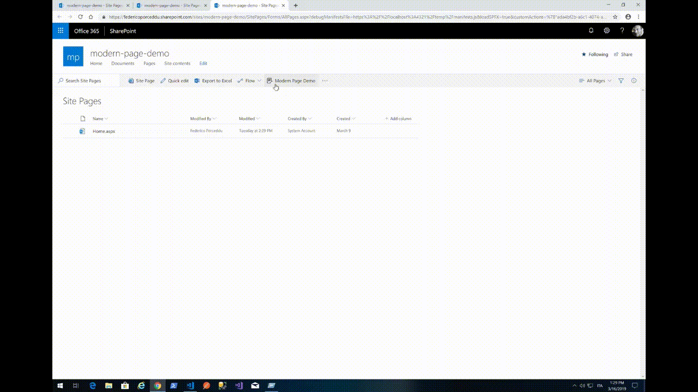

# Modern Page Model with PnP/PnPjs

## Summary

A SPFx extension using [@pnp/sp](https://pnp.github.io/pnpjs/sp/docs/client-side-pages/) that allow creating Modern Pages based on pre-filled modern pages marked as "Page Model", inside the Site Pages Library, and code defined pages.
Users can select a Modern page as Model just setting a custom property page named "Is Model"  to "Yes".
People often need to create periodically editorial pages with the same composition, sections structure and web part configuration, in order to give users the same users experience between pages with different contents but with the same communicative purpose.
e.g.
* Employee of the month
* Weekly post from General Manager
* New hires list

This SPFX extension allows users to define their own page models and reuse them easily.

## Modern Page Model with PnP/PnPjs in action



## How to set a Modern Page as Page Model


## Future improvements

* Hide pages model from search results
* Host pages model in a different site / library in order to share them cross site or just for isolate site pages from site model.

## Compatibility


-Incompatible-red.svg "SharePoint Server 2016 Feature Pack 2 requires SPFx 1.1")


## Applies to

* [SharePoint Framework](https://dev.office.com/sharepoint)
* [Office 365 tenant](https://dev.office.com/sharepoint/docs/spfx/set-up-your-development-environment)

## Prerequisites

* Add a boolean (yes/no) Site Column to Page Library named "Is Model" to "Site Page" Content Type
* @pnp/sp 
in 1.3.0 pnp/pnpjs team introduce ClientSidePage copyPage extension method, so you need to use this version or a major

## Contributors

* [Federico Porceddu](https://github.com/fredupstair)
- [Mohammad Amer](https://github.com/mohammadamer)

## Version history

Version|Date|Comments
-------|----|--------
1.0|March 16, 2019|Initial release
1.1|March 23, 2019|Added pnp ps script for field provisioning
1.2|February 11, 2023| Upgrade SPFx to version 1.12.1

## Minimal Path to Awesome

- Clone this repository
- Move to right solution folder 
- in the command line run:
  - `npm install`
  - `gulp serve`
- create in your SharePoint Modern Site a boolean list column named `Is Modern` in Site Pages Library
  using `AddFieldToList.ps1` script under `ps` folder


## Features

This SPFx extension illustrates the following concepts:

- [@pnp/sp/clientsidepages](https://pnp.github.io/pnpjs/sp/docs/client-side-pages/) 
- [Office UI Fabric React Component Modal](https://developer.microsoft.com/fabric/#/components/modal)
- [Office UI Fabric React Component ComboBox](https://developer.microsoft.com/fabric/#/components/ComboBox)
- [Office UI Fabric React Component ChoiceGroup](https://developer.microsoft.com/fabric/#/components/choicegroup)
- [Office UI Fabric React Component SpinnerSize](https://developer.microsoft.com/fabric/#/components/Spinner)

## Debug URL for testing

Here's a debug URL for testing around this sample.

```
?loadSPFX=true&debugManifestsFile=https%3A%2F%2Flocalhost%3A4321%2Ftemp%2Fmanifests.js&loadSPFX=true&customActions=%7B%22ada4bf2b-a6c1-4074-a273-9d220c815e11%22%3A%7B%22location%22%3A%22ClientSideExtension.ListViewCommandSet.CommandBar%22%7D%7D
```

## Disclaimer

**THIS CODE IS PROVIDED *AS IS* WITHOUT WARRANTY OF ANY KIND, EITHER EXPRESS OR IMPLIED, INCLUDING ANY IMPLIED WARRANTIES OF FITNESS FOR A PARTICULAR PURPOSE, MERCHANTABILITY, OR NON-INFRINGEMENT.**

## Help

We do not support samples, but we this community is always willing to help, and we want to improve these samples. We use GitHub to track issues, which makes it easy for  community members to volunteer their time and help resolve issues.

You can try looking at [issues related to this sample](https://github.com/pnp/sp-dev-fx-extensions/issues?q=label%3Areact-command-page-model-pnpjs) to see if anybody else is having the same issues.

You can also try looking at [discussions related to this sample](https://github.com/pnp/sp-dev-fx-extensions/discussions?discussions_q=label%3Areact-command-page-model-pnpjs) and see what the community is saying.

If you encounter any issues while using this sample, [create a new issue](https://github.com/pnp/sp-dev-fx-extensions/issues/new?assignees=&labels=Needs%3A+Triage+%3Amag%3A%2Ctype%3Abug-suspected&template=bug-report.yml&sample=react-command-page-model-pnpjs&authors=@fredupstair%20@mohammadamer&title=react-command-page-model-pnpjs%20-%20).

For questions regarding this sample, [create a new question](https://github.com/pnp/sp-dev-fx-extensions/issues/new?assignees=&labels=Needs%3A+Triage+%3Amag%3A%2Ctype%3Abug-suspected&template=question.yml&sample=react-command-page-model-pnpjs&authors=@fredupstair%20@mohammadamer&title=react-command-page-model-pnpjs%20-%20).

Finally, if you have an idea for improvement, [make a suggestion](https://github.com/pnp/sp-dev-fx-extensions/issues/new?assignees=&labels=Needs%3A+Triage+%3Amag%3A%2Ctype%3Abug-suspected&template=suggestion.yml&sample=react-command-page-model-pnpjs&authors=@fredupstair%20@mohammadamer&title=react-command-page-model-pnpjs%20-%20).


