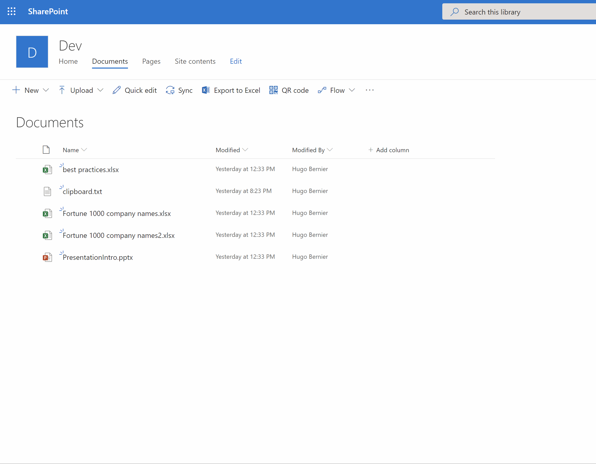

# Generate QR Code List Item Command View Set

## Summary

Generates a printable QR code which links to a SharePoint list item.

If your organization likes to post signs, announcements and posters on the hallway walls, break rooms, copy rooms, etc. -- this extension is for you!

Instead of printing lengthy SharePoint URLs that your users can't interact with, generate a QR code that will link them back to your SharePoint site.



## Used SharePoint Framework Version


## Applies to

* [SharePoint Framework](https://dev.office.com/sharepoint)
* [Office 365 tenant](https://dev.office.com/sharepoint/docs/spfx/set-up-your-development-environment)

## Prerequisites

There are no pre-requisites.

## Solution

Solution|Author(s)
--------|---------
react-command-qrcode | Hugo Bernier ([Point Alliance](pointalliance.com), @bernierh)

## Version history

Version|Date|Comments
-------|----|--------
1.0|September 1, 2019|Initial release

## Disclaimer

**THIS CODE IS PROVIDED *AS IS* WITHOUT WARRANTY OF ANY KIND, EITHER EXPRESS OR IMPLIED, INCLUDING ANY IMPLIED WARRANTIES OF FITNESS FOR A PARTICULAR PURPOSE, MERCHANTABILITY, OR NON-INFRINGEMENT.**

---

## Minimal Path to Awesome

* Clone this repository
* in the command line run:
  * `npm install`
  * `gulp serve`

## Features

This extension will generate a QR code for a selected list item. If no list items are selected, the extension will generate a QR code for the library.

This extension illustrates the following concepts:

* Specifying an SVG icon for the list item command view icon
* Customizing the SVG icon at run-time
* Generating a QR code for a selection
* Downloading an SVG image as a PNG file
* Copying an image to the clipboard

## Debug URL for testing

Here's a debug URL for testing around this sample. 

```
?loadSPFX=true&debugManifestsFile=https://localhost:4321/temp/manifests.js&customActions={"7c5a85c1-8b1e-4370-8198-642908faee60":{"location":"ClientSideExtension.ApplicationCustomizer","properties":{}}}
```


