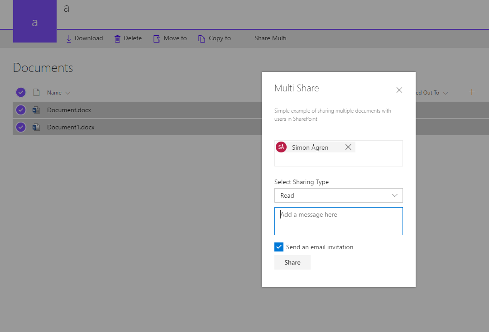

# React Multishare Command Extension with PNP-js

## Summary
The sample is an custom action only active on multiple selected items.
This is just a proof of concept, I don't think multishare is viable necessarally.
It uses multiple Office UI Fabric React components:
- Dialog
- Peoplepicker
- Checkbox
- Messagebar
- etc...
The action opens a dialog where the user can choose people from SharePoint in a peoplepicker, to share the selected items with.
It utilizes pnp-js to get suggestions for the peoplepicker, and for the sharing of the listitems.




## Used SharePoint Framework Version 
SPFx Extensions Dev Preview

## Applies to

* [SharePoint Framework](http://dev.office.com/sharepoint/docs/spfx/sharepoint-framework-overview)
* [Office 365 developer tenant](http://dev.office.com/sharepoint/docs/spfx/set-up-your-developer-tenant)
* [PNP JS Core](https://github.com/SharePoint/PnP-JS-Core)


Solution|Author(s)
--------|---------
react-command-share-pnp-js | Simon Ågren ([dizparc AB](http://www.dizparc.se), [@simondizparc](https://twitter.com/simondizparc), [simonagren GitHub](https://github.com/simonagren))

## Version history

Version|Date|Comments
-------|----|--------
1.0|June 14, 2017|Initial release

## Disclaimer
**THIS CODE IS PROVIDED *AS IS* WITHOUT WARRANTY OF ANY KIND, EITHER EXPRESS OR IMPLIED, INCLUDING ANY IMPLIED WARRANTIES OF FITNESS FOR A PARTICULAR PURPOSE, MERCHANTABILITY, OR NON-INFRINGEMENT.**

## Minimal Path to Awesome

- Clone this repository
- Move to folder where this readme exists
- In the command window run:
  - `npm install`
  - `gulp serve --nobrowser`
- Use following query parameter in the SharePoint site to get extension loaded without installing it to app catalog

```
?loadSpfx=true&debugManifestsFile=https://localhost:4321/temp/manifests.js&customActions={"06006535-1336-436b-a717-827e28d2ea6e":{"location":"ClientSideExtension.ListViewCommandSet.CommandBar"}}
```
Full URL to request would be something like following:

```
contoso.sharepoint.com/Lists/Orders/AllItems.aspx?loadSpfx=true&debugManifestsFile=https://localhost:4321/temp/manifests.js&customActions={"06006535-1336-436b-a717-827e28d2ea6e":{"location":"ClientSideExtension.ListViewCommandSet.CommandBar"}}
```


## Features
This project contains SharePoint Framework extensions that illustrates next features:
* Command extension
* usage of Office UI Fabric React
* usage of PnP JS

> Notice. This sample is designed to be used in debug mode and does not contain automatic packaging setup for the "production" deployment.

### Building the code

```bash
git clone the repo
npm i
npm i -g gulp
gulp
```

This package produces the following:

* lib/* - intermediate-stage commonjs build artifacts
* dist/* - the bundled script, along with other resources
* deploy/* - all resources which should be uploaded to a CDN.


