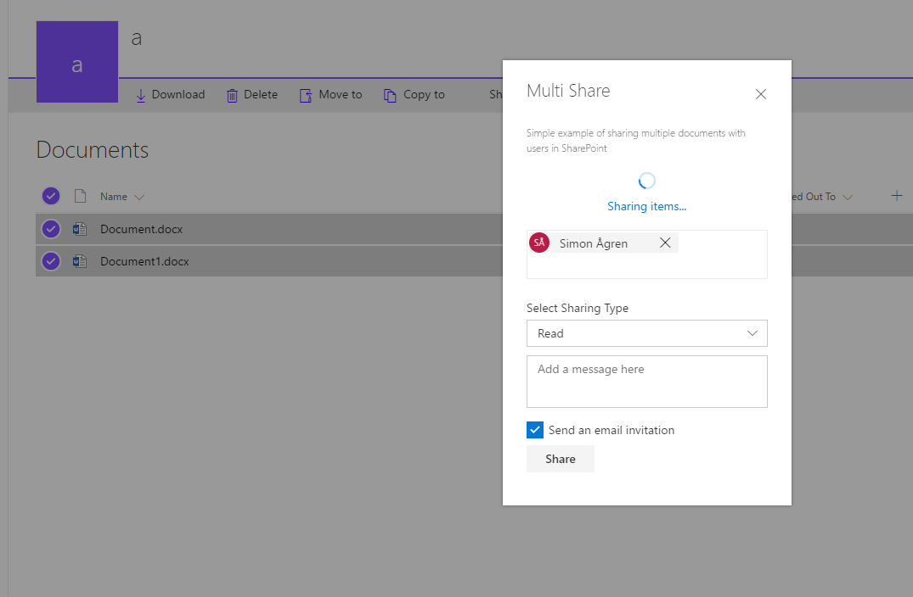

# React Multishare Command Extension with PnPJs

## Summary
The sample is an custom action only active when multiple items are selected.

It uses multiple Office UI Fabric React components:
- Dialog
- Peoplepicker
- Checkbox
- Messagebar
- etc...

The action opens a dialog where the user can choose people from SharePoint in a people picker, to share the selected items with.
It utilizes PnPJs to get suggestions for the peoplepicker, and for the sharing of the listitems.




## Used SharePoint Framework Version 
SPFx 1.6

## Applies to

* [SharePoint Framework](http://dev.office.com/sharepoint/docs/spfx/sharepoint-framework-overview)
* [Office 365 tenant](http://dev.office.com/sharepoint/docs/spfx/set-up-your-developer-tenant)
* [PNP JS ](https://github.com/pnp/pnpjs)


Solution|Author(s)
--------|---------
react-command-share-pnpjs | Simon Ågren ([@agrenpoint](https://twitter.com/agrenpoint), [simonagren GitHub](https://github.com/simonagren), [Sogeti](http://www.sogeti.se))

## Version history

Version|Date|Comments
-------|----|--------
2.0|Sept 19, 2018|Upgraded to 1.6. Made some additional code improvements.
1.0|June 14, 2017|Initial release

## Disclaimer
**THIS CODE IS PROVIDED *AS IS* WITHOUT WARRANTY OF ANY KIND, EITHER EXPRESS OR IMPLIED, INCLUDING ANY IMPLIED WARRANTIES OF FITNESS FOR A PARTICULAR PURPOSE, MERCHANTABILITY, OR NON-INFRINGEMENT.**

## Minimal Path to Awesome

- Clone this repository
- Move to folder where this readme exists
- In the command window run:
  - `npm install`
  - `gulp serve --nobrowser`
- Use following query parameter in the SharePoint site to get extension loaded without installing it to app catalog

## Debug URL for testing
Here's a debug URL for testing around this sample. 

```
?debugManifestsFile=https://localhost:4321/temp/manifests.js&loadSPFX=true&customActions={"a0eacac3-5984-4d85-ab63-c7b245c8e2f5":{"location":"ClientSideExtension.ListViewCommandSet.CommandBar"}}"

```
Full URL to request would be something like following (Remember to open a modern List):

```
contoso.sharepoint.com/Lists/Orders/AllItems.aspx?debugManifestsFile=https://localhost:4321/temp/manifests.js&loadSPFX=true&customActions={"a0eacac3-5984-4d85-ab63-c7b245c8e2f5":{"location":"ClientSideExtension.ListViewCommandSet.CommandBar"}}
```

## Features
This project contains SharePoint Framework extensions that illustrates features:
* Command extension
* usage of Office UI Fabric React
* usage of PnPJs

> Notice. This sample is designed to be used in debug mode and does not contain automatic packaging setup for the "production" deployment.

### Building the code

```bash
git clone the repo
npm i
npm i -g gulp
gulp
```

This package produces the following:

* lib/* - intermediate-stage commonjs build artifacts
* dist/* - the bundled script, along with other resources
* deploy/* - all resources which should be uploaded to a CDN.


