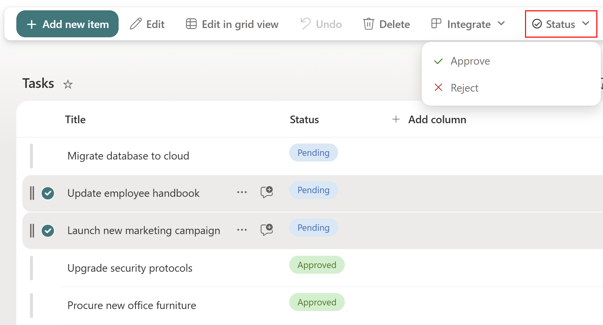

# Grouped ListView Command Set - Task Management

## Summary

This sample demonstrates the new **Grouping support for ListView Command Sets** introduced in **SPFx 1.23**. It adds a grouped **Status** command (with **Approve** and **Reject** sub-commands) to the SharePoint modern list view toolbar and context menu.

When one or more items are selected, the user can approve or reject the selected items in bulk. The extension updates the `Status` column for every selected item using **PnPjs** and refreshes the list view to surface the new values.

> Use case: Quickly triage a list of requests / tasks directly from the SharePoint list view without opening each item individually.



## Compatibility


-Incompatible-red.svg "SharePoint Server 2016 Feature Pack 2 requires SPFx 1.1")


## Applies to

- [SharePoint Framework](https://aka.ms/spfx)
- [SharePoint Framework Extensions](https://learn.microsoft.com/sharepoint/dev/spfx/extensions/overview-extensions)
- [Microsoft 365 tenant](https://learn.microsoft.com/sharepoint/dev/spfx/set-up-your-developer-tenant)

> Get your own free development tenant by subscribing to the [Microsoft 365 developer program](http://aka.ms/o365devprogram).

## Prerequisites

- Node.js **v22.14.0** or later (and below v23).
- A SharePoint list that contains a single-line text or choice column named **`Status`** (the internal name must be `Status`).
- Permissions to edit items on the target list.

## Solution

| Solution                | Author(s) |
| ----------------------- | --------- |
| react-command-task-mgmt | [Aimery Thomas](https://github.com/a1mery) |

## Version history

| Version | Date         | Comments        |
| ------- | ------------ | --------------- |
| 1.0     | May 31, 2026 | Initial release |

## Disclaimer

**THIS CODE IS PROVIDED _AS IS_ WITHOUT WARRANTY OF ANY KIND, EITHER EXPRESS OR IMPLIED, INCLUDING ANY IMPLIED WARRANTIES OF FITNESS FOR A PARTICULAR PURPOSE, MERCHANTABILITY, OR NON-INFRINGEMENT.**

---

## Minimal Path to Awesome

- Clone this repository
- Ensure that you are at the solution folder
- In the command-line run:
  - `npm install`
  - `npm start` (runs `heft start --clean`)

To package the solution for deployment:

- `npm run build` — produces a production `.sppkg` under `sharepoint/solution/`.

Other build commands can be listed using `heft --help`.

### Debug URL for testing

Append the following query string to a modern list page URL (replace the GUID with the value from `GroupingCommandSetCommandSet.manifest.json` if you regenerate it):

```url
?loadSPFX=true&debugManifestsFile=https://localhost:4321/temp/manifests.js&customActions={"8a3f5c12-1d4e-4b2a-9c8f-3b1e5d6a7f90":{"location":"ClientSideExtension.ListViewCommandSet.CommandBar"}}
```

## Features

This extension illustrates the following concepts:

- Using the **new SPFx 1.23 manifest** with `"type": "group"` items to declare grouped commands in a `ListViewCommandSet`.
- Nesting commands under a group with the `"group": "<GROUP_ID>"` property (two levels: group → command).
- Using **Heft** (Rushstack) as the build engine instead of Gulp.

### How grouping works

The manifest defines:

| Item ID        | Type    | Group          | Purpose                        |
| -------------- | ------- | -------------- | ------------------------------ |
| `GROUP_STATUS` | group   | —              | Dropdown header named "Status" |
| `CMD_APPROVE`  | command | `GROUP_STATUS` | Sets `Status` to `Approved`    |
| `CMD_REJECT`   | command | `GROUP_STATUS` | Sets `Status` to `Rejected`    |

## References

- [Getting started with SharePoint Framework](https://learn.microsoft.com/sharepoint/dev/spfx/set-up-your-developer-tenant)
- [Build your first ListView Command Set extension](https://learn.microsoft.com/sharepoint/dev/spfx/extensions/get-started/building-simple-cmdset-with-list-view)
- [SPFx 1.23 release notes](https://learn.microsoft.com/sharepoint/dev/spfx/release-1.23)
- [PnPjs documentation](https://pnp.github.io/pnpjs/)
- [Heft Documentation](https://heft.rushstack.io/)
- [Microsoft 365 Patterns and Practices](https://aka.ms/m365pnp) - Guidance, tooling, samples and open-source controls for your Microsoft 365 development
