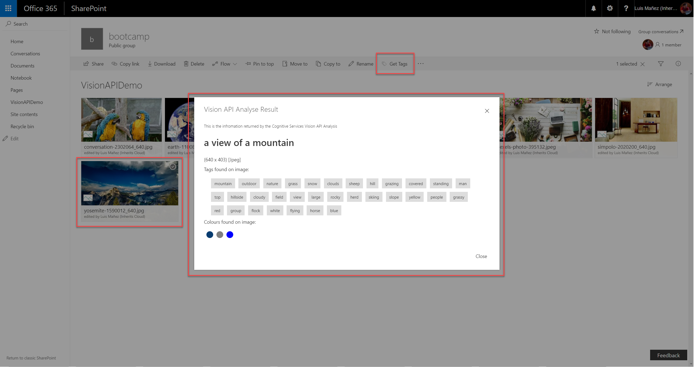

# Image Metadata from Cognitive Services Vision API List View Command Set

## Summary
Custom Command Set that gets metadata information from MS Cognitive Services Vision API for the selected Image



## Used SharePoint Framework Version


## Applies to

* [SharePoint Framework Extensions](https://dev.office.com/sharepoint/docs/spfx/extensions/overview-extensions)
* [Office 365 developer tenant](http://dev.office.com/sharepoint/docs/spfx/set-up-your-developer-tenant)

## Solution

Solution|Author(s)
--------|---------
react-command-vision-api|Luis Mañez (MVP, [ClearPeople](http://www.clearpeople.com), @luismanez)

## Version history

Version|Date|Comments
-------|----|--------
1.0.0|September 30, 2017|Initial release
2.0.0|November 11, 2017|Storing API Key as Tenant property. Image model. React custom Dialog component
2.0.1|September 1, 2019|Update to spfx 1.9.1 and better error handling

## Disclaimer

**THIS CODE IS PROVIDED *AS IS* WITHOUT WARRANTY OF ANY KIND, EITHER EXPRESS OR IMPLIED, INCLUDING ANY IMPLIED WARRANTIES OF FITNESS FOR A PARTICULAR PURPOSE, MERCHANTABILITY, OR NON-INFRINGEMENT.**

---

## Prerequisites

* Office 365 Developer tenant First Release (this sample uses [sfpx Tenant Properties](https://docs.microsoft.com/en-us/sharepoint/dev/spfx/tenant-properties))
* Library with Images
* Cognitive Services Vision API Key (more info [https://azure.microsoft.com/en-us/services/cognitive-services/](https://azure.microsoft.com/en-us/services/cognitive-services/))

## Minimal Path to Awesome

* register a Cognitive Services Vision API in your Azure subscription
* ensure your tenant is configured as "First Release"
* install latest PowerShell SharePoint Online commands
* configure a Tenant Property called "VisionAPIKey" with the API Key value:

```ps
Connect-SPOService -Url https://yourtenant-admin.sharepoint.com

Set-SPOStorageEntity -Site "https://yourtenant.sharepoint.com/sites/appcatalog" -Key "VisionAPIKey" -value YOUR_API_KEY_VALUE -Description "Key to use Vision API" -Comments "spfx demo"
```

To ensure the Property has been added, you can run:

```ps
Get-SPOStorageEntity -Site "https://yourtenant.sharepoint.com/sites/appcatalog" -Key "VisionAPIKey"
```

* clone this repo

* update config/serve.json with your tenant URL, pointing to an existing Image library

* in the command line run
  * `npm i`
  * `gulp serve --config=vision`


## Features

Sample SharePoint Framework list view command set calling the Cognitive Services Vision API and showing the information extracted from the Image.

This sample illustrates the following concepts on top of the SharePoint Framework:

* using Vision API to get the image Tags
* how to get the download url of the selected file
* using async / await for the async calls
* get a tenant property using SP REST API (**_api/web/GetStorageEntity('key')**)
* custom Dialog component


