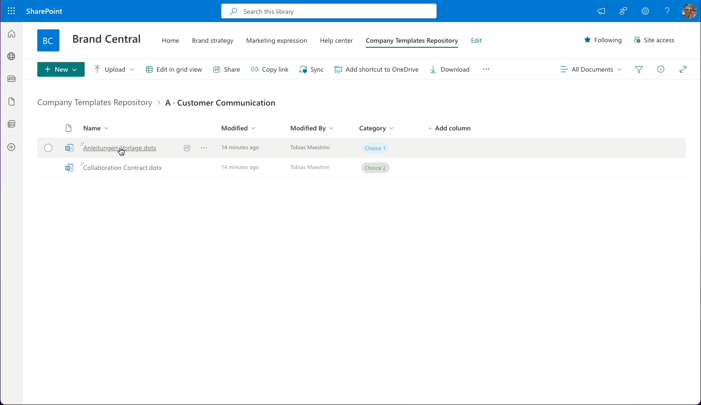
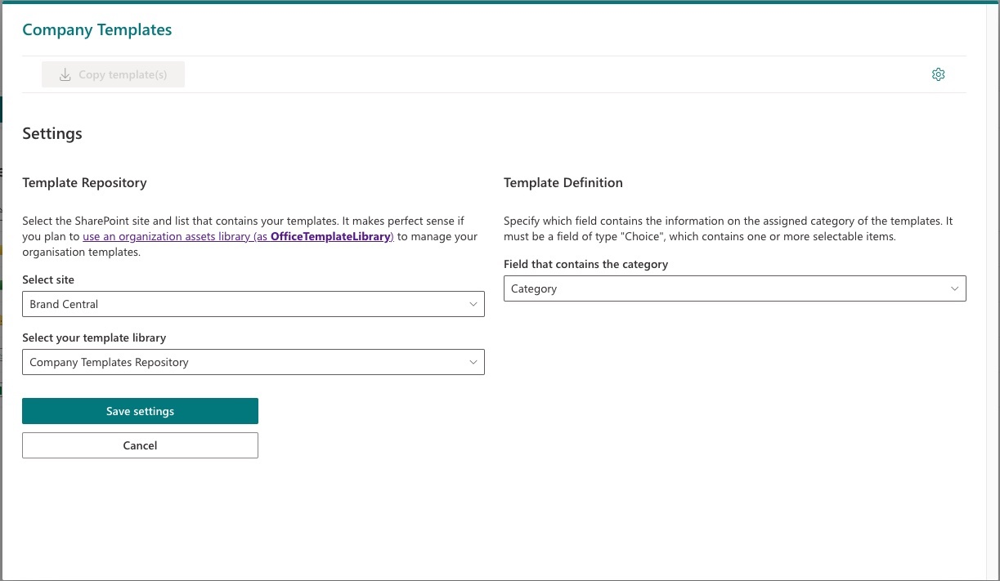

# Company Templates · Simple Management of Company Templates in SharePoint Online

## Summary

Useful scenario to make centrally managed company templates (from a document library in SharePoint Online) available in every document library within the whole SharePoint tenant.


A SharePoint administrator can easily configure the document library that contains all templates in the settings view:


> [!WARNING]
> 👉 For now, company templates can only be stored in one single library (aka «template repository») within the whole SPO tenant. Therefore, only a user that has `isSiteAdmin` property assigned can access the settings view. We strongly recommend that only a tenant admin should / can configure the template repository settings.

> [!NOTE]
> By defining the template repository, the settings will be stored in a **tenant property** (property name `easyTemplatesSettings`). Every instance of this extension refers to this tenant property.

## Features

Under the hood, the extension is built on React and PnPjs and touches on the following topics:

- **SharePoint Tenant Properties** to store the settings tenant-wide
- **React Providers** for a centralized state management of the templates and the actions
- **React Hooks** to access several states and to load data asynchronously within different React Components

From a user perspective, the extension covers these features:

- [x] Show an additional button 'Company templates' (when the actual user is authorized to add files to the library)
- [x] List files that serve as company templates in a tree structure
- [x] Filter by file category
- [x] Filter by name
- [x] Copy selected files from template repository to the current document library
- [x] Show a settings page to all users who are (at least) site admins
- [x] Display additional metadata (file size, current version) of the template file
- [x] Show a preview of a selected template file by clicking on its file name
- [x] Refresh template list by clicking on a refresh button in the command bar
- [x] Advanced filtering by date range and file size
- [x] View template version history through SharePoint's built-in history viewer
- [x] Toggle between list and grid view for template browsing
- [x] Bulk download of selected templates

It uses several ["Reusable React controls"](https://pnp.github.io/sp-dev-fx-controls-react/) for an awesome user experience.

### Upcoming Features (or not yet implemented ideas)

- [ ] Show link(s) to copied file(s) to be opened in a new browser tab (Dan's feature request 😃)
- [ ] Add template usage statistics
- [ ] Improved mobile experience
- [ ] Integration with Microsoft Teams

## Compatibility

| :warning: Important                                                                                                                                                                                                                                                                           |
| :-------------------------------------------------------------------------------------------------------------------------------------------------------------------------------------------------------------------------------------------------------------------------------------------- |
| Every SPFx version is only compatible with specific version(s) of Node.js. In order to be able to build this sample, please ensure that the version of Node on your workstation matches one of the versions listed in this section. This sample will not work on a different version of Node. |
| Refer to <https://aka.ms/spfx-matrix> for more information on SPFx compatibility.                                                                                                                                                                                                             |

This sample is optimally compatible with the following environment configuration:


-Incompatible-red.svg> "SharePoint Server 2016 Feature Pack 2 requires SPFx 1.1")


For more information about SPFx compatibility, please refer to <https://aka.ms/spfx-matrix>

## Contributors

- [Tobias Maestrini](https://github.com/tmaestrini)
- [Dan Toft](https://github.com/Tanddant) (👀 Code reviews)
- [Nicolas Kheirlalah](https://github.com/nicolaskheirallah)


## Version history

| Version | Date           | Comments                       |
| ------- | -------------- | ------------------------------ |
| 1.1     | March 11, 2025 | Upgrade to SPFx version 1.20.0 |
| 1.0     | March 29, 2024 | Initial release                |

## Prerequisites

A SharePoint Tenant with a dedicated document library that serves as repository for company templates. Any document library is supported; we suggest to make proper use of a SharePoint [organization assets library](https://learn.microsoft.com/en-us/sharepoint/organization-assets-library).

## Minimal path to awesome

- Clone this repository (or [download this solution as a .ZIP file](https://pnp.github.io/download-partial/?url=https://github.com/pnp/sp-dev-fx-webparts/tree/main/samples/react-company-templates) then unzip it)
- From your command line, change your current directory to the directory containing this sample (`react-company-templates`, located under `samples`)
- in the command line run:
  - `npm install`
  - `gulp serve`

If you prefer using `fast-serve`, you can run the following command:
`npm run serve`

> This sample can also be opened with [VS Code Remote Development](https://code.visualstudio.com/docs/remote/remote-overview). Visit <https://aka.ms/spfx-devcontainer> for further instructions.
> \*\*

## How to use the new features

### Advanced Filtering
1. Click the filter icon in the command bar to open the advanced filters panel
2. Set date ranges using the date pickers to filter by modification date
3. Use the file size slider to limit results by file size
4. Click "Apply Filters" to see filtered results or "Clear Filters" to reset

### Template Preview
1. Click on any template filename to open a preview panel
2. The preview shows file content for supported file types
3. Preview panel displays additional metadata including file size, version, and creation/modification dates

### Version History
1. Click the history icon next to any template
2. SharePoint's built-in version history page opens in a new tab
3. View all versions and their details

### Grid View
1. Toggle between list and grid views using the toggle switch in the command bar
2. Grid view displays templates in a column layout with more metadata visible
3. Both views support selection, preview, and actions

### Bulk Operations
1. Select multiple templates using the checkboxes
2. The number of selected items appears above the list
3. Click "Download selected" to download all selected templates

## How to run the solution locally

- Clone this repository
- Ensure that you are in the solution folder
- in the command-line run:
  - `npm install`
  - `gulp serve`

### Debug URL for testing

Here's a debug URL for testing around this sample.

```
?loadSPFX=true&debugManifestsFile=https://localhost:4321/temp/manifests.js&customActions={"532b1c1d-bcbd-4831-a821-ec95eac1ca1c":{"location":"ClientSideExtension.ListViewCommandSet.CommandBar","properties":{}}}
```

## Help

We do not support samples, but this community is always willing to help, and we want to improve these samples. We use GitHub to track issues, which makes it easy for community members to volunteer their time and help resolve issues.

If you're having issues building the solution, please run [spfx doctor](https://pnp.github.io/cli-microsoft365/cmd/spfx/spfx-doctor/) from within the solution folder to diagnose incompatibility issues with your environment.

You can try looking at [issues related to this sample](https://github.com/pnp/sp-dev-fx-webparts/issues?q=label%3A%22sample%3A%20react-company-templates%22) to see if anybody else is having the same issues.

You can also try looking at [discussions related to this sample](https://github.com/pnp/sp-dev-fx-webparts/discussions?discussions_q=react-company-templates) and see what the community is saying.

If you encounter any issues using this sample, [create a new issue](https://github.com/pnp/sp-dev-fx-webparts/issues/new?assignees=&labels=Needs%3A+Triage+%3Amag%3A%2Ctype%3Abug-suspected%2Csample%3A%20react-company-templates&template=bug-report.yml&sample=react-company-templates&authors=@tmaestrini&title=react-company-templates%20-%20).

For questions regarding this sample, [create a new question](https://github.com/pnp/sp-dev-fx-webparts/issues/new?assignees=&labels=Needs%3A+Triage+%3Amag%3A%2Ctype%3Aquestion%2Csample%3A%20react-company-templates&template=question.yml&sample=react-company-templates&authors=@tmaestrini&title=react-company-templates%20-%20).

Finally, if you have an idea for improvement, [make a suggestion](https://github.com/pnp/sp-dev-fx-webparts/issues/new?assignees=&labels=Needs%3A+Triage+%3Amag%3A%2Ctype%3Aenhancement%2Csample%3A%20react-company-templates&template=suggestion.yml&sample=react-company-templates&authors=@tmaestrini&title=react-company-templates%20-%20).

## Disclaimer

**THIS CODE IS PROVIDED _AS IS_ WITHOUT WARRANTY OF ANY KIND, EITHER EXPRESS OR IMPLIED, INCLUDING ANY IMPLIED WARRANTIES OF FITNESS FOR A PARTICULAR PURPOSE, MERCHANTABILITY, OR NON-INFRINGEMENT.**

