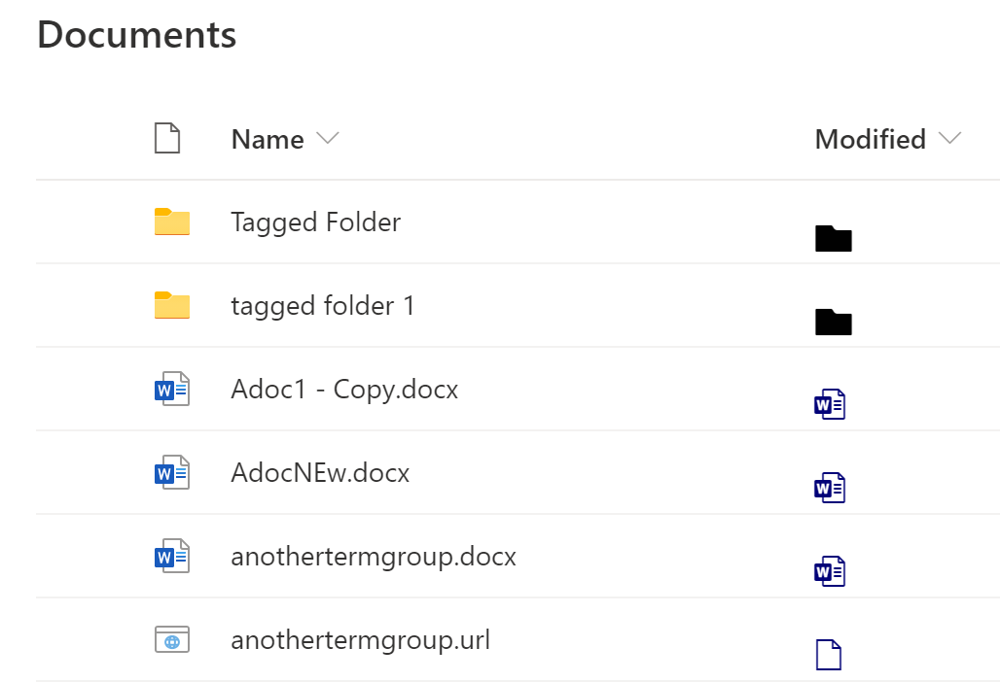

# react-field-pnp-file-type-renderer

## Summary

This field customizer shows how to use [PnP FieldFileTypeRenderer](https://pnp.github.io/sp-dev-fx-controls-react/controls/fields/FieldFileTypeRenderer/) controls.



## Used SharePoint Framework Version


## Applies to

- [SharePoint Framework](https://aka.ms/spfx)
- [Microsoft 365 tenant](https://docs.microsoft.com/en-us/sharepoint/dev/spfx/set-up-your-developer-tenant)

> Get your own free development tenant by subscribing to [Microsoft 365 developer program](http://aka.ms/o365devprogram)

## Prerequisites

None

## Solution

Solution|Author(s)
--------|---------
react-field-pnp-file-type-renderer | Alex Terentiev ([Sharepointalist Inc.](http://www.sharepointalist.com), [AJIXuMuK](https://github.com/AJIXuMuK))

## Version history

Version|Date|Comments
-------|----|--------
1.0|September 30, 2020|Initial release

## Disclaimer

**THIS CODE IS PROVIDED *AS IS* WITHOUT WARRANTY OF ANY KIND, EITHER EXPRESS OR IMPLIED, INCLUDING ANY IMPLIED WARRANTIES OF FITNESS FOR A PARTICULAR PURPOSE, MERCHANTABILITY, OR NON-INFRINGEMENT.**

---

## Minimal Path to Awesome

- Clone this repository
- Ensure that you are at the solution folder
- in the command-line run:
  - **npm install**
  - **gulp serve**

## Features

`FieldFileTypeRenderer` allows to render list column similarly to Type (DocIcon) column.
The sample shows how to get needed properties from `listItem` property of the field render event and provide them to the `FieldFileTypeRenderer`. It also shows how to apply custom CSS class and styles to the renderer.

## Debug URL for testing

Here's a debug URL for testing this sample. Make sure to replace `InternalFieldName` with the internal field name of the column you wish to display the file field renderer.

```
?debugManifestsFile=https://localhost:4321/temp/manifests.js&loadSPFX=true&fieldCustomizers={"InternalFieldName":{"id":"eb28c870-e1fc-4e0c-80be-968c314fdb8c","properties":{}}}
```

## References

- [Getting started with SharePoint Framework](https://docs.microsoft.com/en-us/sharepoint/dev/spfx/set-up-your-developer-tenant)
- [Building for Microsoft teams](https://docs.microsoft.com/en-us/sharepoint/dev/spfx/build-for-teams-overview)
- [Use Microsoft Graph in your solution](https://docs.microsoft.com/en-us/sharepoint/dev/spfx/web-parts/get-started/using-microsoft-graph-apis)
- [Publish SharePoint Framework applications to the Marketplace](https://docs.microsoft.com/en-us/sharepoint/dev/spfx/publish-to-marketplace-overview)
- [Microsoft 365 Patterns and Practices](https://aka.ms/m365pnp) - Guidance, tooling, samples and open-source controls for your Microsoft 365 development


