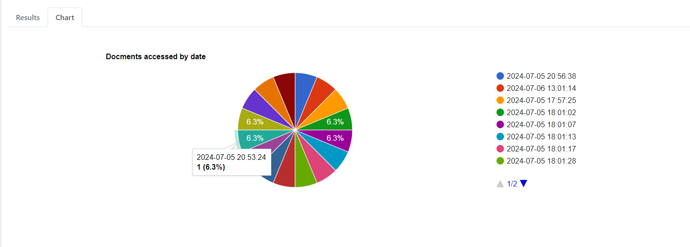
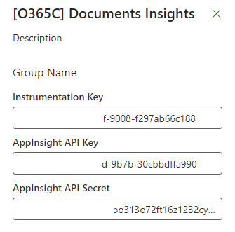

# React Document Reporting Field Customizer

## Summary

This React-based SharePoint Framework (SPFx) application serves as a comprehensive solution for monitoring user activity within SharePoint documents. It features a field customizer that logs details about who has opened a document directly into Application Insights. Additionally, the application includes a SPFx web part designed to display this real-time reporting data. The data is presented in both a tabular format and visually, using charts, to provide a clear and insightful overview of user interactions with documents. This dual functionality not only enhances document tracking but also facilitates the analysis of user engagement through intuitive and accessible reporting tools.

## DEMO




## Used SharePoint Framework Version


## Applies to

- [SharePoint Framework](https://aka.ms/spfx)
- [Microsoft 365 tenant](https://docs.microsoft.com/en-us/sharepoint/dev/spfx/set-up-your-developer-tenant)

> Get your own free development tenant by subscribing to [Microsoft 365 developer program](http://aka.ms/o365devprogram)

Solution|Author(s)
--------|---------
React Document Reporting Field Customizer | Ejaz Hussain ([Office 355 Clinic](https://www.office365clinic.com/), [GitHub](https://github.com/ejazhussain))

## Version history

Version|Date|Comments
-------|----|--------
1.0|July 9, 2024|Initial release

## Disclaimer

`THIS CODE IS PROVIDED *AS IS* WITHOUT WARRANTY OF ANY KIND, EITHER EXPRESS OR IMPLIED, INCLUDING ANY IMPLIED WARRANTIES OF FITNESS FOR A PARTICULAR PURPOSE, MERCHANTABILITY, OR NON-INFRINGEMENT.`

## Prerequisites

- Office 365 Developer tenant with a modern site collection
- Get Azure Application Insight Instrumentation key -  [more info](https://learn.microsoft.com/en-us/azure/bot-service/bot-service-resources-app-insights-keys?view=azure-bot-service-4.0#instrumentation-key)
- Get Azure AppInsight API Key and Secret - [more info]([more info](https://learn.microsoft.com/en-us/azure/bot-service/bot-service-resources-app-insights-keys?view=azure-bot-service-4.0#instrumentation-key))

---

## Minimal Path to Awesome

- Clone this repository
- Ensure that you are at the solution folder
- Navigate to the following file and specify instrumentation Key
  
```
react-field-reporting\src\extensions\documentReporting\DocumentReportingFieldCustomizer.ts
```

- in the command-line run:
  - `npm install`
  - `gulp bundle --ship`
  - `gulp package-solution --ship`
- Deploy the package to app catalog
- Add the app to the any site

### Field Customizer configurations

- Add the `ExtendedDocName` site column to the Document library
- Hide the existing Name column from the Document library
- Click on any document name under the Extended Doc Name column, it should track the event in the Application Insights

### Documents Insights web part configurations

- Configure the following properties in the web part



## Features

- `User Activity Monitoring`: Tracks and logs user interactions with documents, specifically noting when a document is opened.
- `Integration with Application Insights`: Utilizes Application Insights for logging and monitoring document access events.
- `Field Customizer for Enhanced Document Library`: Implements a custom field named `ExtendedDocName` to replace the default document name column, facilitating the tracking of document access.
- `Real-time Reporting`: Offers a SharePoint Framework (SPFx) web part that displays real-time data on document interactions from Application Insights in both tabular and chart formats.
- `Easy Configuration`: Provides straightforward setup instructions for deploying the package, adding the app to sites, and configuring both the field customizer and the web part.
- `Visual Insights into Document Usage`: Through the Documents Insights web part, users can visually analyze document usage patterns within SharePoint.

## References

- [Getting started with SharePoint Framework](https://docs.microsoft.com/en-us/sharepoint/dev/spfx/set-up-your-developer-tenant)
- [Building for Microsoft teams](https://docs.microsoft.com/en-us/sharepoint/dev/spfx/build-for-teams-overview)
- [Use Microsoft Graph in your solution](https://docs.microsoft.com/en-us/sharepoint/dev/spfx/web-parts/get-started/using-microsoft-graph-apis)
- [Publish SharePoint Framework applications to the Marketplace](https://docs.microsoft.com/en-us/sharepoint/dev/spfx/publish-to-marketplace-overview)
- [Microsoft 365 Patterns and Practices](https://aka.ms/m365pnp) - Guidance, tooling, samples and open-source controls for your Microsoft 365 development
