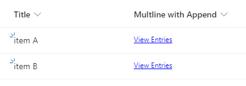
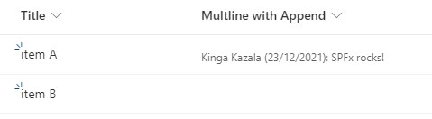

# Show all entries for Multiple lines of text fields

## Summary

Typically, if "Append Changes to Existing Text" option is enabled on a Multiple lines of text field, "View Entries" link is displayed, no matter if the field has a value or not.



This field customizer aggregates all entries and displays them with a date and an author information. If the field has no values, it remains empty.




## Compatibility


[](https://docs.microsoft.com/sharepoint/dev/spfx/sharepoint-framework-overview)  


-Incompatible-red.svg "SharePoint Server 2016 Feature Pack 2 requires SPFx 1.1")


## Applies to

- [SharePoint Framework](https://aka.ms/spfx)
- [Microsoft 365 tenant](https://docs.microsoft.com/en-us/sharepoint/dev/spfx/set-up-your-developer-tenant)

> Get your own free development tenant by subscribing to [Microsoft 365 developer program](http://aka.ms/o365devprogram)

## Solution

Solution|Author(s)
--------|---------
react-field-showentries | Kinga Kazala

## Version history

Version|Date|Comments
-------|----|--------
1.0.0 |December 23, 2021 |Initial release

## Prerequisites

SPFx 1.13 does not support local workbench. To test this solution you must have a SharePoint site.

## Minimal Path to Awesome

- Clone this repository
- Ensure that you are at the solution folder
- in the command-line run:
  - **npm install**
  - **gulp serve --nobrowser**
  - **debug**

> As of version 1.13, SPFx [does not support Local workbench](https://docs.microsoft.com/en-us/sharepoint/dev/spfx/release-1.13#deprecations-and-removed-items-in-this-release). To easily debug SPFx solutions, you may use [SharePoint Framework - Visual Studio Code Debug Configuration Extension](https://marketplace.visualstudio.com/items?itemName=eliostruyf.spfx-debug) which adds required debugging configurations. Please remember to update the url, according to the [Debug field customizer](https://docs.microsoft.com/en-us/sharepoint/dev/spfx/debug-modern-pages#debug-field-customizer).

## Debug URL for testing
Here's a debug URL for testing around this sample.

```
loadSPFX=true&debugManifestsFile=https://localhost:4321/temp/manifests.js&fieldCustomizers={\"FieldName\":{\"id\":\"0b44d87a-1de2-4f21-9f67-3bcd0d3cab34\",\"properties\":{\"logLevel\":\"1\"}}}
```
- **FieldName**: According to the [Debug field customizer](https://docs.microsoft.com/en-us/sharepoint/dev/spfx/debug-modern-pages#debug-field-customizer), FieldName should be set to the InternalName. However, at the time of this writing, it only works for me with a DisplayName.
- **logLevel**: This property defines logging level that will be enabled. It accepts values as defined in [Log Levels](https://pnp.github.io/pnpjs/logging/#log-levels)

## Deployment

- follow [Deploy the field to SharePoint Online and host JavaScript from local host](https://docs.microsoft.com/en-us/sharepoint/dev/spfx/extensions/get-started/building-simple-field-customizer#deploy-the-field-to-sharepoint-online-and-host-javascript-from-local-host)
- Apply field customizers to all Mutliline fields with "Append Changes to Existing Text"

```powershell
$listNames | ForEach-Object {
        $listName = $_
        Write-Host $listName

        # MultilineText field with AppendOnly
        Get-PnPField -list $listName | Where-Object { $_.FieldTypeKind -eq "Note" -and $_.AppendOnly -eq $true } | ForEach-Object {
            Set-PnPField -List $listName -Identity $_.Id.Guid -Values @{ClientSideComponentId = [GUID]"0b44d87a-1de2-4f21-9f67-3bcd0d3cab34" }
            Write-Host "$($_.Title) field customizer set to ShowEntries"
        }
    }
```

## Disclaimer

**THIS CODE IS PROVIDED *AS IS* WITHOUT WARRANTY OF ANY KIND, EITHER EXPRESS OR IMPLIED, INCLUDING ANY IMPLIED WARRANTIES OF FITNESS FOR A PARTICULAR PURPOSE, MERCHANTABILITY, OR NON-INFRINGEMENT.**

## References

- [Getting started with SharePoint Framework](https://docs.microsoft.com/en-us/sharepoint/dev/spfx/set-up-your-developer-tenant)
- [Build your first Field Customizer extension](https://docs.microsoft.com/en-us/sharepoint/dev/spfx/extensions/get-started/building-simple-field-customizer#deploy-the-field-to-sharepoint-online-and-host-javascript-from-local-host)
- [Microsoft 365 Patterns and Practices](https://aka.ms/m365pnp) - Guidance, tooling, samples and open-source controls for your Microsoft 365 development
- [Debug SharePoint Framework extensions on modern SharePoint pages](https://docs.microsoft.com/en-us/sharepoint/dev/spfx/debug-modern-pages)
- [SharePoint Framework - Visual Studio Code Debug Configuration Extension](https://marketplace.visualstudio.com/items?itemName=eliostruyf.spfx-debug)
- [Log Levels in @pnp/logging](https://pnp.github.io/pnpjs/logging/#log-levels)

## Help

We do not support samples, but we this community is always willing to help, and we want to improve these samples. We use GitHub to track issues, which makes it easy for  community members to volunteer their time and help resolve issues.

You can try looking at [issues related to this sample](https://github.com/pnp/sp-dev-fx-extensions/issues?q=label%3AYOUR-SOLUTION-NAME) to see if anybody else is having the same issues.

You can also try looking at [discussions related to this sample](https://github.com/pnp/sp-dev-fx-extensions/discussions?discussions_q=label%3AYOUR-SOLUTION-NAME) and see what the community is saying.

If you encounter any issues while using this sample, [create a new issue](https://github.com/pnp/sp-dev-fx-extensions/issues/new?assignees=&labels=Needs%3A+Triage+%3Amag%3A%2Ctype%3Abug-suspected&template=bug-report.yml&sample=YOUR-SOLUTION-NAME&authors=@YOURGITHUBUSERNAME&title=YOUR-SOLUTION-NAME%20-%20).

For questions regarding this sample, [create a new question](https://github.com/pnp/sp-dev-fx-extensions/issues/new?assignees=&labels=Needs%3A+Triage+%3Amag%3A%2Ctype%3Abug-suspected&template=question.yml&sample=YOUR-SOLUTION-NAME&authors=@YOURGITHUBUSERNAME&title=YOUR-SOLUTION-NAME%20-%20).

Finally, if you have an idea for improvement, [make a suggestion](https://github.com/pnp/sp-dev-fx-extensions/issues/new?assignees=&labels=Needs%3A+Triage+%3Amag%3A%2Ctype%3Abug-suspected&template=suggestion.yml&sample=YOUR-SOLUTION-NAME&authors=@YOURGITHUBUSERNAME&title=YOUR-SOLUTION-NAME%20-%20).

