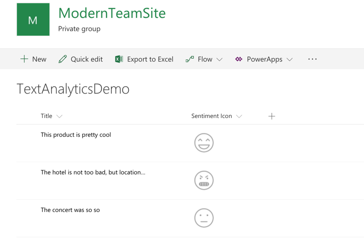

# Spfx Field Customiser sample using Text Analytics API

## Summary
This sample shows how to use the Text Analytics API (Cognitive Services) to render a sentiment icon based on the text of a field in the List

## Used SharePoint Framework Version

## Applies to

* [SharePoint Framework Extensions Developer Preview](https://dev.office.com/sharepoint/docs/spfx/extensions/overview-extensions)
* [Office 365 developer tenant](http://dev.office.com/sharepoint/docs/spfx/set-up-your-developer-tenant)

## Solution

Solution|Author(s)
--------|---------
react-field-text-analytics-api|Luis Mañez (MVP, [ClearPeople](http://www.clearpeople.com), @luismanez)

## Version history

Version|Date|Comments
-------|----|--------
1.0.0|January 7, 2018|Initial release

## Disclaimer

**THIS CODE IS PROVIDED *AS IS* WITHOUT WARRANTY OF ANY KIND, EITHER EXPRESS OR IMPLIED, INCLUDING ANY IMPLIED WARRANTIES OF FITNESS FOR A PARTICULAR PURPOSE, MERCHANTABILITY, OR NON-INFRINGEMENT.**

---

## Prerequisites

* Cognitive Services Text Analytics API Key (more info [https://azure.microsoft.com/en-us/services/cognitive-services/](https://azure.microsoft.com/en-us/services/cognitive-services/))

## Minimal Path to Awesome

* register a Cognitive Services Vision API in your Azure subscription
* create a List and add a Field called "SPFxSentimentIcon" (type: Number)
* clone repo
* update serve.json pointing to your List URL and Text Analytics API Key
* run _gulp serve --configuration=sentimentAnalytics_

## Features

Sample SharePoint Framework list field customiser calling the Cognitive Services Text Analytics API and showing the _sentiment_ of the Text with an Icon.

This sample illustrates the following concepts on top of the SharePoint Framework:

* using Text Analytics API to get the sentiment score from a given Text
* using async / await for the async calls