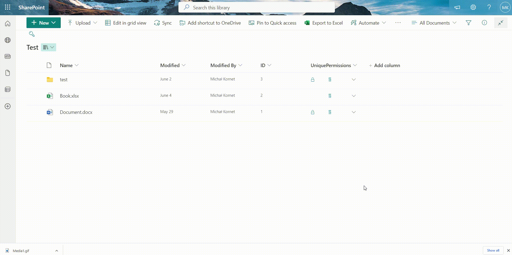
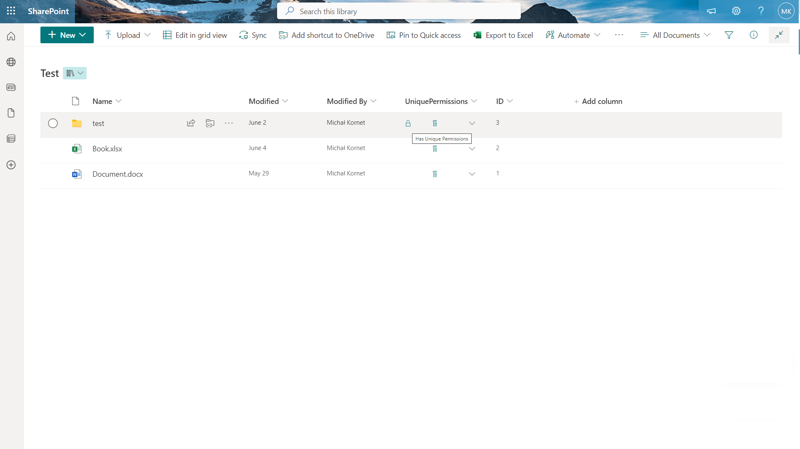
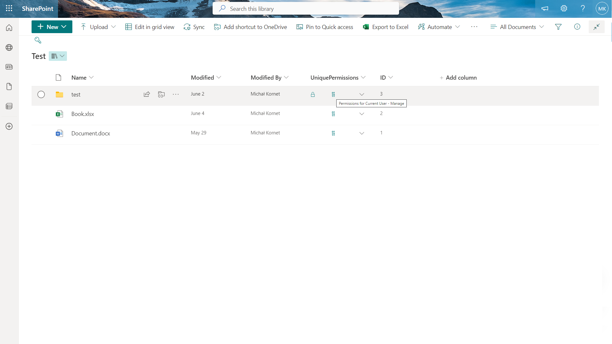
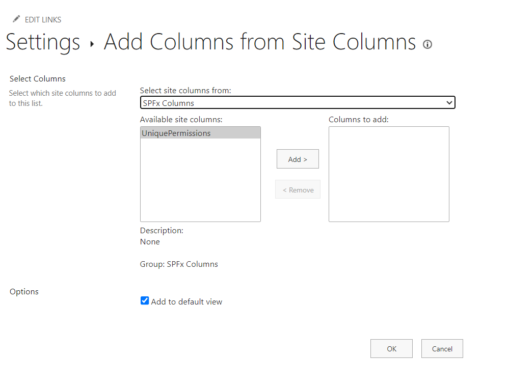

# SPFx Field Customiser sample to handle unique permissions on list items

This sample demonstrates how to use field customizer to handle unique permissions on list items. 

With this solution, users with manage permission can review and manage permissions for themselves and other users.


## Summary

This sample shows how to use field customiser to handle unique permissions on list items.




### **Show items with unique permissions**





### **Show current user permissions**





### **Show chosen user permissions**
</br>


### **Manage item permissions from field customiser**
</br>


## Used SharePoint Framework Version


-Incompatible-red.svg "SharePoint Server 2016 Feature Pack 2 requires SPFx 1.1")


Tested on Node version:v16.13.0

## Applies to

* [SharePoint Framework Extensions](https://dev.office.com/sharepoint/docs/spfx/extensions/overview-extensions)
* [Office 365 tenant](http://dev.office.com/sharepoint/docs/spfx/set-up-your-developer-tenant)

## Contributors

* [Michał Kornet](https://github.com/mkm17)

## Version history

Version|Date|Comments
-------|----|--------
1.0.49|June 21, 2023|Initial release

## Minimal Path to Awesome

- Clone this repository
- Move to folder where this readme exists
- In the command window run:
  - `npm install`
  - `gulp serve --nobrowser`
- Use following query parameter in the SharePoint site to get extension loaded without installing it to app catalog

## Debug URL for testing

Here's a debug URL for testing around this sample. Notice that this sample is designed to be used with **Text** field type. In below debug URL sample we define the field internal name as **UniquePermissions**.

```
?debugManifestsFile=https%3A%2F%2Flocalhost%3A4321%2Ftemp%2Fmanifests.js&loadSPFX=true&fieldCustomizers=%7B%22UniquePermissions%22%3A%7B%22id%22%3A%22e0424f4f-5973-492b-aa7c-b8d00fc1a6a0%22%2C%22properties%22%3A%7B%7D%7D%7D
```

The **UniquePermissions** field would be available after deployment and installation of SPFx package to the app catalog.



## Features

This sample illustrates the following concepts on top of the SharePoint Framework:

* *SPFx field customizer*
* Usage of *People Picker* control from *@pnp/spfx-controls-react*
* Sample tests using *jest* and *testing-library*


## Disclaimer
**THIS CODE IS PROVIDED *AS IS* WITHOUT WARRANTY OF ANY KIND, EITHER EXPRESS OR IMPLIED, INCLUDING ANY IMPLIED WARRANTIES OF FITNESS FOR A PARTICULAR PURPOSE, MERCHANTABILITY, OR NON-INFRINGEMENT.**

## Help

We do not support samples, but we this community is always willing to help, and we want to improve these samples. We use GitHub to track issues, which makes it easy for  community members to volunteer their time and help resolve issues.

You can try looking at [issues related to this sample](https://github.com/pnp/sp-dev-fx-extensions/issues?q=label%3Areact-field-unique-permissions) to see if anybody else is having the same issues.

You can also try looking at [discussions related to this sample](https://github.com/pnp/sp-dev-fx-extensions/discussions?discussions_q=label%3Areact-field-unique-permissions) and see what the community is saying.

If you encounter any issues while using this sample, [create a new issue](https://github.com/pnp/sp-dev-fx-extensions/issues/new?assignees=&labels=Needs%3A+Triage+%3Amag%3A%2Ctype%3Abug-suspected&template=bug-report.yml&sample=react-field-unique-permissions&authors=@mkm17&title=react-field-unique-permissions%20-%20).

For questions regarding this sample, [create a new question](https://github.com/pnp/sp-dev-fx-extensions/issues/new?assignees=&labels=Needs%3A+Triage+%3Amag%3A%2Ctype%3Abug-suspected&template=question.yml&sample=react-field-unique-permissions&authors=@mkm17&title=react-field-unique-permissions%20-%20).

Finally, if you have an idea for improvement, [make a suggestion](https://github.com/pnp/sp-dev-fx-extensions/issues/new?assignees=&labels=Needs%3A+Triage+%3Amag%3A%2Ctype%3Abug-suspected&template=suggestion.yml&sample=react-field-unique-permissions&authors=@mkm17&title=react-field-unique-permissions%20-%20).

