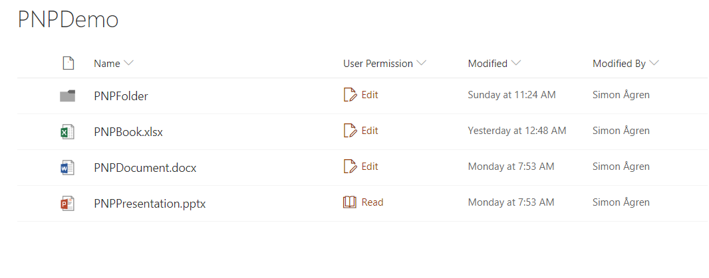

# SPFx Field Customiser sample displaying the current user permission with PNPJs

## Summary
This sample shows how to use PNPJs to get the current users permission on the specific list item. Then a corresponding icon and text is shown in the field. For this sample I'm using simplified roles, so the code is is only checking for edit or read permissions.



## Used SharePoint Framework Version


## Applies to

* [SharePoint Framework Extensions](https://dev.office.com/sharepoint/docs/spfx/extensions/overview-extensions)
* [Office 365 tenant](http://dev.office.com/sharepoint/docs/spfx/set-up-your-developer-tenant)
* [PNP JS](https://github.com/pnp/pnpjs)


## Solution

Solution|Author(s)
--------|---------
react-field-user-permission|Simon Ågren ([@agrenpoint](https://twitter.com/agrenpoint), [simonagren GitHub](https://github.com/simonagren), [Sogeti](http://www.sogeti.se))

## Version history

Version|Date|Comments
-------|----|--------
1.0.0|October 22, 2018|Initial release

## Disclaimer

**THIS CODE IS PROVIDED *AS IS* WITHOUT WARRANTY OF ANY KIND, EITHER EXPRESS OR IMPLIED, INCLUDING ANY IMPLIED WARRANTIES OF FITNESS FOR A PARTICULAR PURPOSE, MERCHANTABILITY, OR NON-INFRINGEMENT.**

---

## Minimal Path to Awesome

- Clone this repository
- Move to folder where this readme exists
- In the command window run:
  - `npm install`
  - `gulp serve --nobrowser`
- Use following query parameter in the SharePoint site to get extension loaded without installing it to app catalog

## Debug URL for testing
Here's a debug URL for testing around this sample. 

```
?debugManifestsFile=https://localhost:4321/temp/manifests.js&loadSPFX=true&fieldCustomizers={"SPFxUserPermission":{"id":"62a15882-603f-4dfd-8580-4decc98033a7","properties":{"sampleText":"Value"}}}

```
Full URL to request would be something like following (Remember to open a modern List):

```
contoso.sharepoint.com/Lists/Orders/AllItems.aspx?debugManifestsFile=https://localhost:4321/temp/manifests.js&loadSPFX=true&fieldCustomizers={"SPFxUserPermission":{"id":"62a15882-603f-4dfd-8580-4decc98033a7","properties":{"sampleText":"Value"}}}
```

## Features

Sample SharePoint Framework list field customiser using PNPJs to get the current user permission and displaying a corresponding icon and text.

This sample illustrates the following concepts on top of the SharePoint Framework:

* using PNPJs
* using React
* using async calls