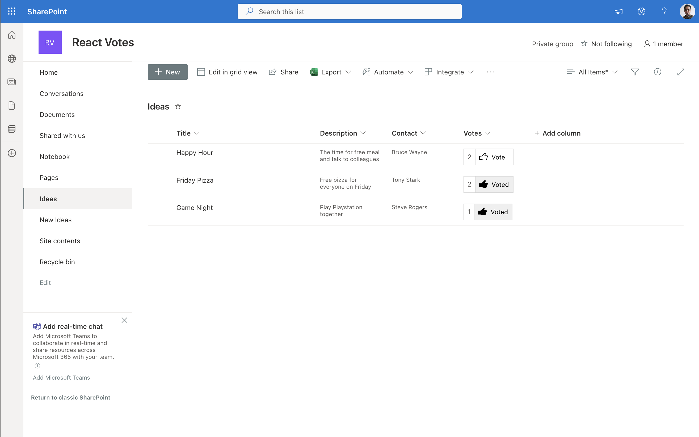
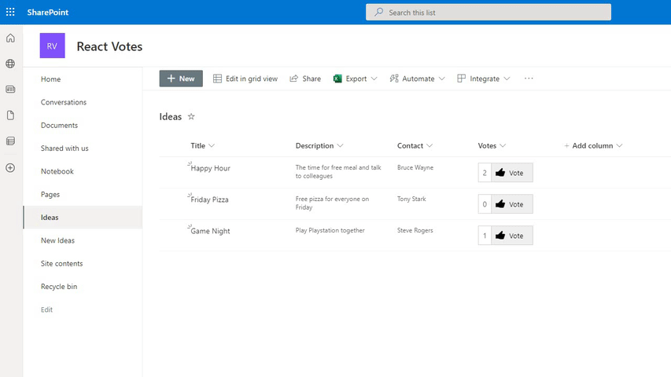

# Field Votes

## Summary

An extension that displays Vote counter and button to vote or unvote.
If the current user hasn't been voted, the button will become Vote button
but if the current user has been voted, it will become Unvote button.

The underlying value is a multiple person field.
When a user clicks the 'vote' button, it will append the current user to the existing field value. Conversely, clicking the 'unvote' button will remove the current user from the current field value.





## Compatibility


## Applies to

* [SharePoint Framework](https://docs.microsoft.com/sharepoint/dev/spfx/sharepoint-framework-overview)
* [Microsoft 365 tenant](https://docs.microsoft.com/sharepoint/dev/spfx/set-up-your-developer-tenant)

## Contributors

* [Ari Gunawan](https://github.com/AriGunawan)
* [Ervin Gayle](https://github.com/ErvinGayle)

## Version history

Version|Date|Comments
-------|----|--------
1.5|October 26, 2024|Updated SPFx packages to 1.20.0
1.4|October 8, 2023|Change underlying field type from JSON text to multiple person
1.3|October 18, 2022|Change underlying field type from multiline text to multiple person
1.2|October 18, 2022|Initial version

## Prerequisites

* Create a list that will have the vote button

## Minimal Path to Awesome

* Clone this repository
* in the command line run:
  * `npm install`
  * `gulp serve`

## Features

This extension illustrates the following concepts:

* Use [React](https://reactjs.org/) for displaying vote count on list view
* Use [React](https://reactjs.org/) for displaying vote/unvote button on list view
* Use [PnPJS](https://pnp.github.io/pnpjs/) for updating underlying data
* Use [SPFx Fast Serve](https://github.com/s-KaiNet/spfx-fast-serve) for increasing development productivity

## Debug URL for testing

Here's a debug URL for testing around this sample.

```
?debugManifestsFile=https://localhost:4321/temp/manifests.js&loadSPFX=true&fieldCustomizers={"SPFxVotes":{"id":"cfd41b03-0507-48c5-9fc8-e3dba6facfcd"}}
```

## Deployment

1. Build the app by executing following commands
   * `gulp bundle --ship`
   * `gulp package-solution --ship`
2. Get the `React Field Votes.sppkg` file.
3. Upload the .sppkg file to the App Catalog.
4. Publish the app but don't globally deploy the app.
5. Install the app in the desired sites.
6. Open the list setting of the desired lists.
7. Add the `Votes` column from `SPFx Columns` category.
   * The app's installation on the step 5 will create this site column.
8. Check on the list view page.

## Disclaimer

**THIS CODE IS PROVIDED *AS IS* WITHOUT WARRANTY OF ANY KIND, EITHER EXPRESS OR IMPLIED, INCLUDING ANY IMPLIED WARRANTIES OF FITNESS FOR A PARTICULAR PURPOSE, MERCHANTABILITY, OR NON-INFRINGEMENT.**

## Help

We do not support samples, but we this community is always willing to help, and we want to improve these samples. We use GitHub to track issues, which makes it easy for  community members to volunteer their time and help resolve issues.

You can try looking at [issues related to this sample](https://github.com/pnp/sp-dev-fx-extensions/issues?q=label%3Areact-field-votes) to see if anybody else is having the same issues.

You can also try looking at [discussions related to this sample](https://github.com/pnp/sp-dev-fx-extensions/discussions?discussions_q=label%3Areact-field-votes) and see what the community is saying.

If you encounter any issues while using this sample, [create a new issue](https://github.com/pnp/sp-dev-fx-extensions/issues/new?assignees=&labels=Needs%3A+Triage+%3Amag%3A%2Ctype%3Abug-suspected&template=bug-report.yml&sample=react-field-votes&authors=@AriGunawan&title=react-field-votes%20-%20).

For questions regarding this sample, [create a new question](https://github.com/pnp/sp-dev-fx-extensions/issues/new?assignees=&labels=Needs%3A+Triage+%3Amag%3A%2Ctype%3Abug-suspected&template=question.yml&sample=react-field-votes&authors=@AriGunawan&title=react-field-votes%20-%20).

Finally, if you have an idea for improvement, [make a suggestion](https://github.com/pnp/sp-dev-fx-extensions/issues/new?assignees=&labels=Needs%3A+Triage+%3Amag%3A%2Ctype%3Abug-suspected&template=suggestion.yml&sample=react-field-votes&authors=@AriGunawan&title=react-field-votes%20-%20).


