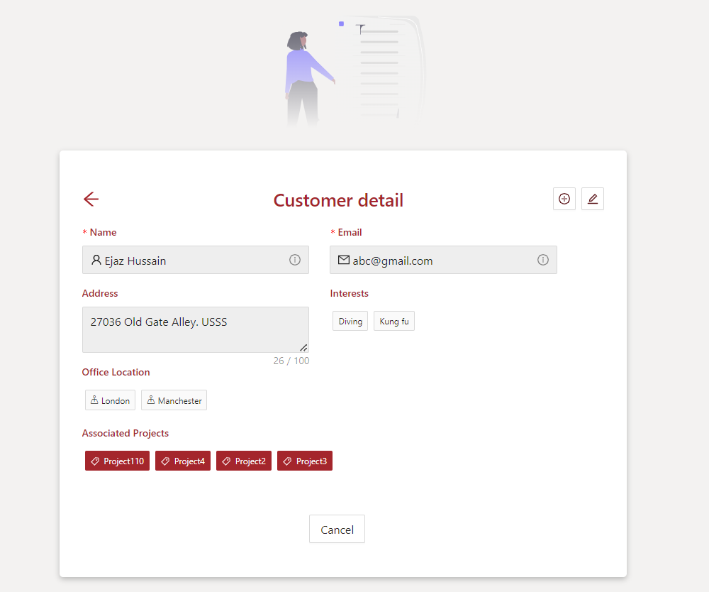
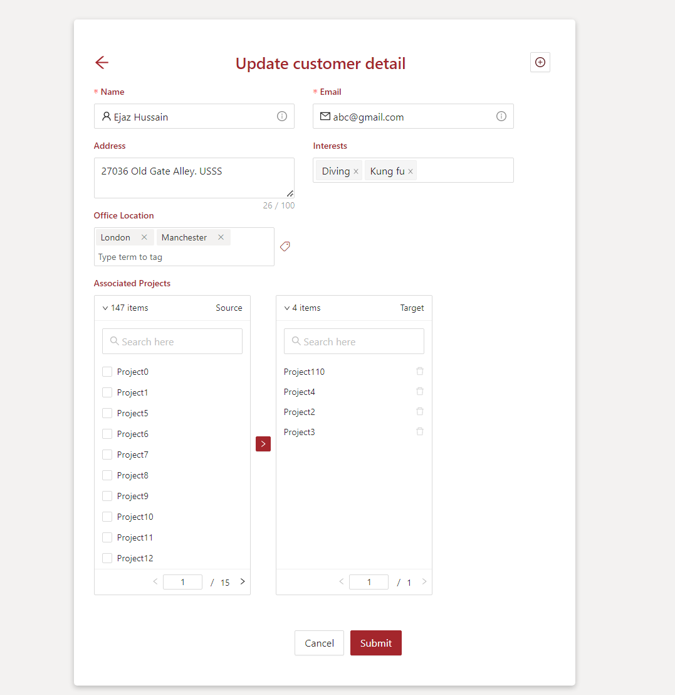
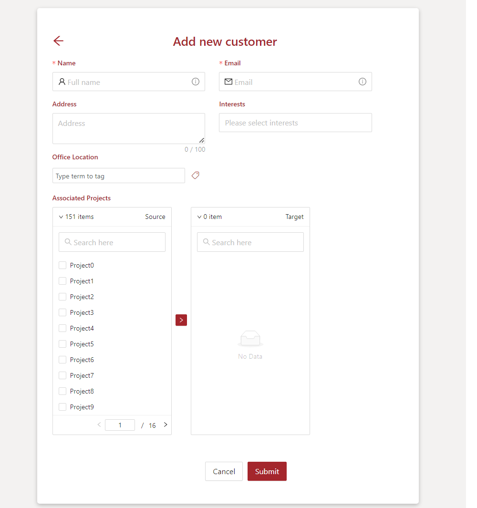

# SPFx form customizer to override the default list behaviour. 

## Summary
This SPFx form customizer build custom New, Edit and View list forms for a Customers List. This solution implements the following types of fields

1. Single line of text
2. Multiple lines of text
3. Managed Metadata
4. Choice
5. Lookup


> View List Form


> Edit List Form


> New List Form



## Compatibility


 


-Incompatible-red.svg "SharePoint Server 2016 Feature Pack 2 requires SPFx 1.1")


## Applies to

* [SharePoint Framework Extensions](https://dev.office.com/sharepoint/docs/spfx/extensions/overview-extensions)
* [Office 365 developer tenant](http://dev.office.com/sharepoint/docs/spfx/set-up-your-developer-tenant)

## Solution

Solution|Author(s)
--------|---------
react-formcustomizer-customers|Ejaz Hussain, [Content and Cloud](https://contentandcloud.com/), @EjazHussain_

## Version history

Version|Date|Comments
-------|----|--------
1.0.0|September 11, 2022|Initial release

## Prerequisites

* Office 365 tenant

## Minimal Path to Awesome

Provision the lists needed by the sample through the [SiteTemplate.xml](./provisioning/SiteTemplate.xml) PnP Provisioning template, using the following PnP PowerShell syntax executed from the *Provisioning* folder:

```PowerShell
Connect-PnPOnline https://[your tenant].sharepoint.com/sites/[your site colleciton]
Invoke-PnPSiteTemplate -Path .\SiteTemplate.xml
```

The provisioning will create a list with name **Projects** with the following fields:
 
   | Name | Type | Settings |
   |------------|---------------------|-----------------------------------------|
   | Title | Single Line of text | |
   | Status | Choices | In Progress, Completed, On Hold |
   | Members | Person or Group | |
   | StartDate | DateTime | |

and it will populate it with 3 sample items.
The script wil also create a list with name **Customers** based on a custom content type defined with the following site columns:

 | Name | Type | Settings |
 |-----------|-----------------------|------------------------------------------------------|
 | Title | Single Line of text | |
 | Email | Single Line of text | |
 | Address | Multiple lines of text | Native WorkAddress field |
 | Projects | Lookup Multi | Lookup to Projects list |
 | Customer Locations | Metadata Multivalue | Mapped to Locations term set |
 | Interests | Multi-Choices | Decorating, Diving, Livestreaming, Drawing, Kung fu |

Update pageUrl and Rootfolder properties under the serve.json file 

1. pageUrl : https://[your tenant].sharepoint.com/_layouts/15/SPListForm.aspx

2. RootFolder : /sites/[your site collection]/Lists/Customers

* clone this repo
* update file "./config/serve.json pointing to your tenant and site collection
* in the command line run
  * `npm i`
  * `gulp serve`

## Features

This sample illustrates the following concepts on top of the SharePoint Framework:

* SPFx customizer to update the list view, edit and new forms
* Usage of Modern Taxonomy Picker control from @pnp/spfx-controls-react
* Ant Design UI


## Disclaimer
**THIS CODE IS PROVIDED *AS IS* WITHOUT WARRANTY OF ANY KIND, EITHER EXPRESS OR IMPLIED, INCLUDING ANY IMPLIED WARRANTIES OF FITNESS FOR A PARTICULAR PURPOSE, MERCHANTABILITY, OR NON-INFRINGEMENT.**

## Help

We do not support samples, but we this community is always willing to help, and we want to improve these samples. We use GitHub to track issues, which makes it easy for  community members to volunteer their time and help resolve issues.

You can try looking at [issues related to this sample](https://github.com/pnp/sp-dev-fx-extensions/issues?q=label%3Areact-command-singlepartapppage) to see if anybody else is having the same issues.

You can also try looking at [discussions related to this sample](https://github.com/pnp/sp-dev-fx-extensions/discussions?discussions_q=label%3Areact-command-singlepartapppage) and see what the community is saying.

If you encounter any issues while using this sample, [create a new issue](https://github.com/pnp/sp-dev-fx-extensions/issues/new?assignees=&labels=Needs%3A+Triage+%3Amag%3A%2Ctype%3Abug-suspected&template=bug-report.yml&sample=react-command-singlepartapppage&authors=@luismanez&title=react-command-singlepartapppage%20-%20).

For questions regarding this sample, [create a new question](https://github.com/pnp/sp-dev-fx-extensions/issues/new?assignees=&labels=Needs%3A+Triage+%3Amag%3A%2Ctype%3Abug-suspected&template=question.yml&sample=react-command-singlepartapppage&authors=@luismanez&title=react-command-singlepartapppage%20-%20).

Finally, if you have an idea for improvement, [make a suggestion](https://github.com/pnp/sp-dev-fx-extensions/issues/new?assignees=&labels=Needs%3A+Triage+%3Amag%3A%2Ctype%3Abug-suspected&template=suggestion.yml&sample=react-command-singlepartapppage&authors=@luismanez&title=react-command-singlepartapppage%20-%20).


