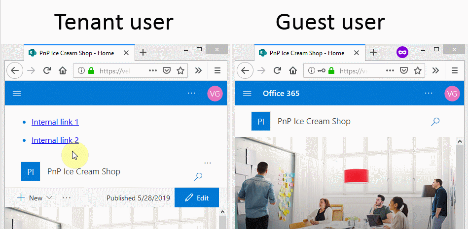

# React Application Customizer Extension that is hidden from tenant guest users #

## Summary

This sample shows how Application Customizer can be hidden from tenant external users. This is often the ask from the business when a SharePoint Framework App customizer or a web part has internal links that would be broken if a guest user attempts to access any or them. 



### Microsoft Graph to detect if the user is guest in the Office 365 tenant Azue Active Directory

The Microsoft Graph is used along with the SharePoint Framework graph client to detect if user is guest in the Office 365 tenant Azure AD. Tenant admin will have to grant permissions to read user details from the Microsoft Graph through the SharePoint admin center -> API Management after the solution package is being deployed to SharePoint app catalog.

```javascript
// package-solution.json
"webApiPermissionRequests": [
      {
        "resource": "Microsoft Graph",
        "scope": "User.Read"
      }
    ]
```

Additional information on how to call Microsoft Graph from SPFx solution is listed on the official Microsoft documents:
[https://docs.microsoft.com/en-us/sharepoint/dev/spfx/use-aadhttpclient](https://docs.microsoft.com/en-us/sharepoint/dev/spfx/use-aadhttpclient).

## Used SharePoint Framework Version 


## Applies to

* [SharePoint Framework](http://dev.office.com/sharepoint/docs/spfx/sharepoint-framework-overview)
* [Office 365 Enterprise E3](http://dev.office.com/sharepoint/docs/spfx/set-up-your-developer-tenant)

## Prerequisites

- Office 365 subscription with SharePoint Online.
- SharePoint Framework [development environment](https://dev.office.com/sharepoint/docs/spfx/set-up-your-development-environment) already set up.
- Tenant admin permissions to grant permissions to the Microsoft Graph

## Solution

Solution|Author(s)
--------|---------
react-hidefrom-externalusers | Velin Georgiev ([@VelinGeorgiev](https://twitter.com/velingeorgiev)), Joon du Randt ([@joon_net](https://twitter.com/joon_net))

## Version history

Version|Date|Comments
-------|----|--------
0.0.1|June 21, 2019 | Initial commit

## Disclaimer
**THIS CODE IS PROVIDED *AS IS* WITHOUT WARRANTY OF ANY KIND, EITHER EXPRESS OR IMPLIED, INCLUDING ANY IMPLIED WARRANTIES OF FITNESS FOR A PARTICULAR PURPOSE, MERCHANTABILITY, OR NON-INFRINGEMENT.**

---

## Minimal Path to Awesome

- Clone this repository.
- Open the command line, navigate to the web part folder and execute:
    - `npm i`
    - `gulp serve --nobrowser`

## Features

This Web Part illustrates the following concepts on top of the SharePoint Framework:

- Using React for building SharePoint Framework client-side solutions.
- Using the Microsoft Graph client, a built in feature of the SharePoint Framework.
- How to hide web part or extension from guest users

