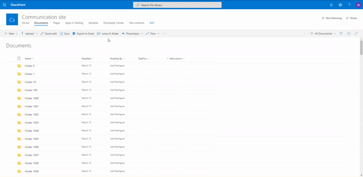

# React Jump to folder extension

## Summary

Sample solution that facilitates navigation between large collections of SharePoint library folders.

The solution uses the [FolderExplorer](https://sharepoint.github.io/sp-dev-fx-controls-react/controls/FolderExplorer/) PnP reusable control to load and display the folders.



## Used SharePoint Framework Version


## Applies to

- [SharePoint Framework](https://dev.office.com/sharepoint)

## Solution

| Solution             | Author(s)                                                        |
| -------------------- | ---------------------------------------------------------------- |
| react-jump-to-folder | Joel Rodrigues ([@JoelFMRodrigues](https://twitter.com/giuleon)) |

## Version history

| Version | Date           | Comments        |
| ------- | -------------- | --------------- |
| 1.0     | March 24, 2020 | Initial release |

## Disclaimer

**THIS CODE IS PROVIDED _AS IS_ WITHOUT WARRANTY OF ANY KIND, EITHER EXPRESS OR IMPLIED, INCLUDING ANY IMPLIED WARRANTIES OF FITNESS FOR A PARTICULAR PURPOSE, MERCHANTABILITY, OR NON-INFRINGEMENT.**

---

## Minimal Path to Awesome

- Clone this repository
- In the command line navigate to **samples/react-jump-to-folder** and run:
  - `npm install`
  - `gulp serve`

## Features

This sample illustrates how to leverage the SharePoint Modern UI and extending the capabilities through the SharePoint Framework List View Command Set Extensions

## Debug URL for testing

Here's a debug URL for testing around this sample. Notice that this sample is designed to be used with **Boolean** field type. In below debug URL sample we define the field internal name as **SPFxActive**.

```
?debugManifestsFile=https://localhost:4321/temp/manifests.js&loadSPFX=true&customActions={"44f1a0de-5fe4-4e8f-85fb-0c451b4b30ca":{"location":"ClientSideExtension.ListViewCommandSet.CommandBar","properties":{}}}
```


