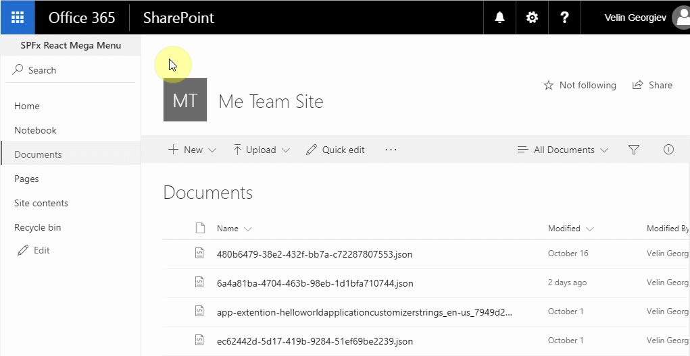
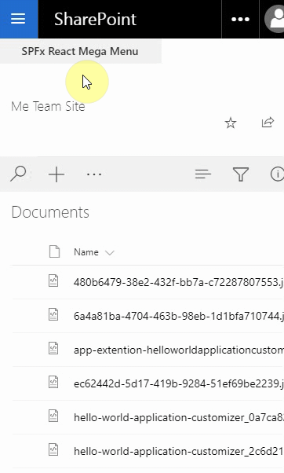

# React Mega Menu Application Customizer Extension #

## Summary

This sample shows site mega menu. Application customizer is used along with SharePoint List to store the menu items. 



The React Fabric UI Framework and SharePoint theme classes are also used to bring the responsiveness and Office 365 look and feel.



### Can be used as centralized site collection mega menu as well as standalone   per sub web

The sample has two modes. Can be used as site collection mega menu meaning one menu for all the subsites managed centrally from the root web of the site collection, but can also be used as standalone SharePoint web mega menu where separate sites have and manage their own mega menus.
Note: By default, second option is enabled. To set it up as a centralized mega menu for a site collection, two parameters in the `sharepoint/assets/elements.xml` should be changed. First change is on the custom action element where the rootWebOnly parameter should be changed to `true`, e.g:
```xml
    <CustomAction
        Title="ReactMegaMenu"
        Location="ClientSideExtension.ApplicationCustomizer"
        ClientSideComponentId="6a4a81ba-4704-463b-98eb-1d1bfa710744"
        ClientSideComponentProperties="{&quot;isDebug&quot;:false, &quot;rootWebOnly&quot;:true, &quot;enableSessionStorageCache&quot;:true }">
    </CustomAction>
```

and also the list instance RootWebOnly should be changed to `RootWebOnly="TRUE"` e.g.

```xml
    <!-- Mega Menu List (TemplateType 100) -->
    <ListInstance 
            CustomSchema="listSchema.xml"
            FeatureId="00bfea71-de22-43b2-a848-c05709900100"
            Title="Mega Menu List" 
            Description=""
            TemplateType="100"
            Url="Lists/MegaMenu"
            Hidden="FALSE"
            RootWebOnly="TRUE">
    </ListInstance>
```
This should create list in the root web only and all the mega menus in sub sites should load menu items from the root site list.

### Basic local caching implemented through the browser session storage

The sample has basic session caching to improve the performance of the React mega menu client side extension. Property called `enableSessionStorageCache` identifies whether the mega menu should cache menu items data for the session of the opened browser window and store the data in the browser session storage.

### Power User can change mega menu url very easy

Since SharePoint list is used to store the menu items is relatively easy to change or add a menu item or change or add new menu category.

## Used SharePoint Framework Version 


## Applies to

* [SharePoint Framework](http://dev.office.com/sharepoint/docs/spfx/sharepoint-framework-overview)
* [Office 365 Enterprise E3](http://dev.office.com/sharepoint/docs/spfx/set-up-your-developer-tenant)

## Prerequisites

- Office 365 subscription with SharePoint Online.
- SharePoint Framework [development environment](https://dev.office.com/sharepoint/docs/spfx/set-up-your-development-environment) already set up.
- Account permissions to publish to the SharePoint app catalog.

## Solution

Solution|Author(s)
--------|---------
react-mega-menu | Velin Georgiev ([@VelinGeorgiev](https://twitter.com/velingeorgiev))

## Version history

Version|Date|Comments
-------|----|--------
0.0.1|October 24, 2017 | Initial commit
0.1.0|August 3, 2018  | Updated to SPFx 1.5.1 and @pnp 5.6.0
0.1.1|October 10, 2018  | Updated to SPFx 1.6.0 and @pnp 1.2.2
0.1.2|December 10, 2018  | Updated to SPFx 1.7.0 and @pnp 1.2.7


## Disclaimer
**THIS CODE IS PROVIDED *AS IS* WITHOUT WARRANTY OF ANY KIND, EITHER EXPRESS OR IMPLIED, INCLUDING ANY IMPLIED WARRANTIES OF FITNESS FOR A PARTICULAR PURPOSE, MERCHANTABILITY, OR NON-INFRINGEMENT.**

---

## Minimal Path to Awesome

- Clone this repository.
- Open the command line, navigate to the web part folder and execute:
    - `npm i`
    - `gulp serve --nobrowser`
- Navigate to SharePoint Online modern document library or list and add the following additional parameters in the query string.
```bash 
?debugManifestsFile=https://localhost:4321/temp/manifests.js&loadSPFX=true&customActions={%226a4a81ba-4704-463b-98eb-1d1bfa710744%22:{%22location%22:%22ClientSideExtension.ApplicationCustomizer%22,%22properties%22:{%22isDebug%22:true,%22rootWebOnly%22:false,%22enableSessionStorageCache%22:true}}}
```
Full URL to request would be something like following:
```bash 
https://tenant.sharepoint.com/Shared%20Documents/Forms/AllItems.aspx?debugManifestsFile=https://localhost:4321/temp/manifests.js&loadSPFX=true&customActions={%226a4a81ba-4704-463b-98eb-1d1bfa710744%22:{%22location%22:%22ClientSideExtension.ApplicationCustomizer%22,%22properties%22:{%22isDebug%22:true,%22rootWebOnly%22:false,%22enableSessionStorageCache%22:true}}}
```
- Select `Load debug scripts` on the **Allow debug scripts?** popup window.

## Features

This Web Part illustrates the following concepts on top of the SharePoint Framework:

- Using React for building SharePoint Framework client-side solutions.
- Using Office UI Fabric React styles for building user experience consistent with SharePoint and Office.
- Passing SPFx extension properties to React components.
- Unit tests including spies, mocks and faking class methods and properties with stubs.


