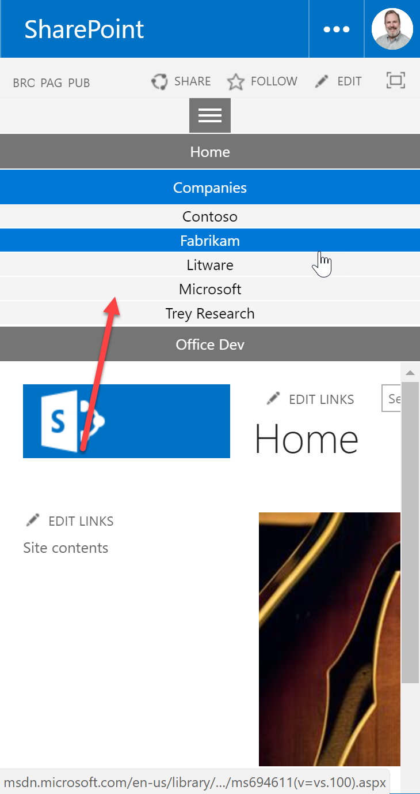
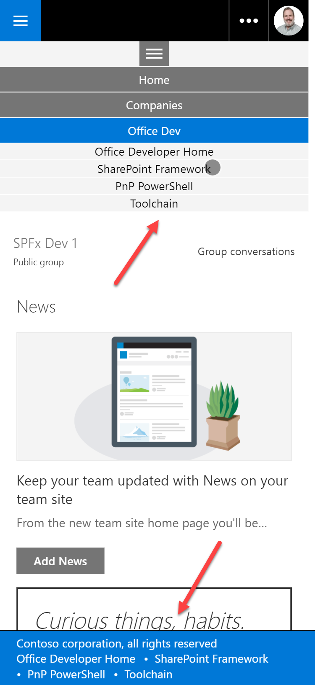
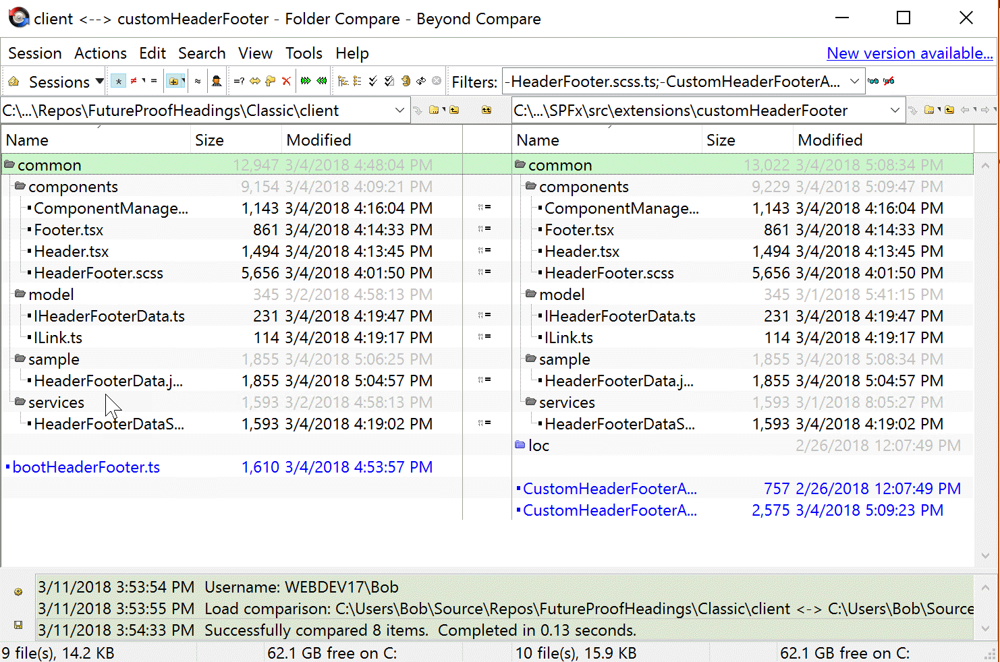

# Building Headers and Footers that work on Classic and Modern sites

(Cross-posted at [Bob German's Vantage Point](https://bob1german.com/2018/03/11/building-headers-and-footers-that-work-on-classic-and-modern-sites/))

One of the partners I consult for is migrating a Fortune 500 financial services company to SharePoint Online. The company wants to take advantage of modern team and communications sites, yet where they need features that aren't yet available in modern sites, they've decided to stick with classic Publishing sites.

The challenge is: how to build global navigation and footers that will work on both classic and modern sites. There are a few reasons this is important:

* It provides common navigation across all kinds of sites, making the Intranet easier to use
* It provides a common footer across all kinds of sites, ensuring compliance messages are delivered consistently
* It reduces coding and maintenance, because one set of code is used across old and new sites

So I undertook a little Proof of Concept, and here are the results. The solution is usable as-is if your needs are simple. The real intent, however is to prove out a pattern for developing any header and footer that will work on both modern and classic sites.

Figure 1 shows how it looks on a classic publishing site. A simple navigation menu is added on the top of the page, and a footer containing a message and a set of links appears at the bottom.


<br /><small style="font-style: italic">Figure 1</small>

The menu and footer look the same in a modern team site, as shown in Figure 2. It also works on modern list pages in classic Publishing sites, making the experience less jarring when users browse between modern and classic pages. This could also be used in hybrid environments, as the classic solution should work the same on premises as online (though you will probably need a separate set of files to avoid cross-site scripting issues.)


<br /><small style="font-style: italic">Figure 2</small>

When the screen becomes narrow, the top menu switches to a hamburger style menu that pushes the screen down with a hierarchy of options. Figure 3 shows this on the classic publishing page, which is clearly not responsive.


<br /><small style="font-style: italic">Figure 3</small>

The hamburger menu looks right at home on the modern site, viewed here in an iPhone emulator.


<br /><small style="font-style: italic">Figure 4</small>

The menu and footer content are stored in a simple JSON file in SharePoint. While this doesn't provide for security trimming, it is fast, and if there's someone who understands JSON, they can easily keep it up-to-date. (The partner I'm working with has already developed a much cooler and more advanced solution for SPFx using the Term Store).

> NOTE: This sample uses features (fetch and ES6 Promises) which are not available in Internet Explorer. If you want to use it in IE, you need to add polyfills for these features. As it happens, these are the same as the ones needed by PnP JS Core; [their documentation does a good job of explaining](https://github.com/SharePoint/PnP-JS-Core/wiki/Getting-Started:-Install-&-Use#polyfill).

# Approach

My friend and colleague [Julie Turner](https://twitter.com/jfj1997) recently published a series of articles called [Conquer your dev toolchain in ‘Classic’ SharePoint](http://julieturner.net/2018/01/conquer-your-dev-toolchain-in-classic-sharepoint-part-1/). She shows how to use SharePoint Framework style tooling such as typescript and webpack on classic sites. This was the starting point for the project, and I recommend anyone who hasn't got this working to go through these articles. This was key to having common code between the classic solution and SharePoint Framework.

From there, the approach was to push as much logic as possible into common code (in the "common" directory in both Classic and Modern folders). A quick run of [Beyond Compare](http://scootersoftware.com/) confirms they are identical. (The common files could be shared if the projects were structured differently, but I chose to stay consistent with the established SPFx folder structure.)


<br /><small style="font-style: italic">Figure 5</small>

On the SharePoint Framework side, I generated an Application Customizer extension using React. I developed the header and footer there, then ported them over to a project based on Julie's article. A few tweaks to the configuration files were necessary; they're all in the git repo.

## Bootstrapping

In the SharePoint Framework version of the solution, the UI is "bootstrapped" in the CustomHeaderFooterApplicationCustomizer.ts file, which was initially generated by the Yeoman generator. All references to React have been removed from there, however; all it needs to do is find the DOM elements that for header and footer, use a (common) service to read in the data, and common rendering code takes care of the rest.

```Typescript
@override
public onInit(): Promise<void> {

  const promise = new Promise<void>((resolve, reject) => {

    HeaderFooterDataService.get(url)
    .then ((data: IHeaderFooterData) => {

        const header: PlaceholderContent = this.context.placeholderProvider.tryCreateContent(
        PlaceholderName.Top,
        { onDispose : this._onDispose }
        );
        const footer: PlaceholderContent = this.context.placeholderProvider.tryCreateContent(
        PlaceholderName.Bottom,
        { onDispose : this._onDispose }
        );

        if (header || footer) {
        ComponentManager.render(header ? header.domElement : null,
            footer ? footer.domElement : null, data);
        }

        resolve();
    })
    // (exception handling removed for brevity)
  });

  return promise;
}

```

In the Classic version of the solution, the UI is "bootstrapped" in bootHeaderFooter.ts. It generates its own DOM elements for the header and footer, and connects them above and below a well-known HTML element, s4-workspace. While there's no guarantee Microsoft will always provide an element with that ID, it's a lot less likely to break than a custom master page. 

```Typescript
export class bootstrapper {

  public onInit(): void {

    const header = document.createElement("div");
    const footer = document.createElement("div");

    const workspace = document.getElementById('s4-workspace');

    if (workspace) {

      workspace.parentElement.insertBefore(header,workspace);
      workspace.appendChild(footer);

      const url = // (your JSON file URL)  '
      HeaderFooterDataService.get(url)
        .then ((data: IHeaderFooterData) => {
          ComponentManager.render(header, footer, data);
        })
        .catch ((error: string) => {
          // (omitted for brevity)
        });
    }
  }
}

```

Then some inline code uses the old Scripting On Demand library to run the bootstrapper.

```Typescript
(<any>window).ExecuteOrDelayUntilBodyLoaded(() => {
  if (window.location.search.indexOf('IsDlg=1') < 0) {
    let b = new bootstrapper();
    b.onInit();  
  }
})
```

Everything else in the solution is common.

## Installation

Installation on the SharePoint Framework side is pretty standard ... package the solution, upload it to the app catalog, and add it to a site. On the Classic side, I used PnP PowerShell with JavaScript injection.

```PowerShell
Write-Output "`n`nAdding script links"
Add-PnPJavaScriptLink -Name React -Url "https://cdnjs.cloudflare.com/ajax/libs/react/15.6.2/react.js" -Sequence 100
Add-PnPJavaScriptLink -Name ReactDom -Url "https://cdnjs.cloudflare.com/ajax/libs/react-dom/15.6.2/react-dom.js" -Sequence 200
Add-PnPJavaScriptLink -Name HeaderFooter -Url "https://<tenant>.sharepoint.com/sites/scripts/scripts/bundleClassic.js" -Sequence 300

```

Detailed build and installation instructions are in the [installation document on Github](./Install.md).


## User Interface

The UI is in React and 100% common to the Classic and SPFx versions. There's a component each for the header and footer, plus a small class called ComponentManager that renders them into two DOM elements provided by the bootstrapper.

```JavaScript
public static render(headerDomElement: HTMLElement, footerDomElement: HTMLElement, data: IHeaderFooterData): void {

    if (headerDomElement) {
        const reactElt: React.ReactElement<IHeaderProps> = React.createElement(Header, {
            links: data.headerLinks
        });
        ReactDOM.render(reactElt, headerDomElement);
    }

    if (footerDomElement) {
        const reactElt: React.ReactElement<IFooterProps> = React.createElement(Footer, {
            message: data.footerMessage,
            links: data.footerLinks
        });
        ReactDOM.render(reactElt, footerDomElement);
    }
}
```

You can check the code to see  the menus and footer components in React. I think the coolest part is the top menu, which is implemented entirely in CSS based on [this brilliant example from Tony Thomas](https://medialoot.com/blog/how-to-create-a-responsive-navigation-menu-using-only-css).

## Getting the data

Both header and footer data are stored in a single JSON file; there's a sample in the common/sample folder. Here's an excerpt to give you the idea:

```JSON
{
	"headerLinks": [
		{
			"name": "Home",
			"url": "/sites/pubsite",
			"children": []
		},
		{
			"name": "Companies",
			"url": "#",
			"children": [
				{
					"name": "Contoso",
					"url": "#"
				},
				{
					"name": "Fabrikam",
					"url": "#"
                }
            ]
		}
	],
	"footerMessage": "Contoso corporation, all rights reserved",
	"footerLinks": [
		{
			"name": "Office Developer Home",
			"url": "#"
		}
	]
}
```

This approach is very simple and fast. The JSON is described by two interfaces in the common/model directory, ILink.ts and IHeaderFooter.ts.

```Typescript
export interface ILink {
    name: string;
    url: string;
    children: ILink[];
}

export interface IHeaderFooterData {
    headerLinks: ILink[];
    footerMessage: string;
    footerLinks: ILink[];
}
```

A simple service, common/services/HeaderFooterDataService.ts, reads in the JSON using Fetch.

It's worth noticing how the Promise returned by this service interacts with the SPFx application customer's promise. SPFx expects a promise to be returned by the `onInit` method; this is used to tell SPFx that the extension is done rendering. `onInit` creates this promise and hangs onto it, then it gets a new promise from the HeaderFooterDataService.

If the HeaderFooterDataService succeeds, it resolves its promise, and `onInit` renders the UI and resolves the promise it gave to SPFx. If the service fails, it rejects its promise, and a `catch` block in `onInit` logs the error and rejects the promise it gave to SPFx. Here's an excerpt that just shows the promise interaction.

```TypeScript
@override
public onInit(): Promise<void> {

  const promise = new Promise<void>((resolve, reject) => {

  HeaderFooterDataService.get(url)
    .then ((data: IHeaderFooterData) => {
        // (render the UI)
        resolve();
    })
    .catch ((error: string) => {
        // (log the error)
        reject();
    });
  });

  return promise;
}

```

## Multi-Lingual Support

In a 2nd round of the POC, my partner asked how to add multi-lingual support to the solution. I had kind of dodged the issue in the first version by simply not using any text in the UI, apart from the contents of the JSON file.

In a real implementation, you might want to add localized text for all the hyperlinks and menu choices, or perhaps even have a completely different JSON file for each supported language. But that seemed too easy; instead I really wanted to show how to use the SPFx localization files in a non-SPFx solution. So I removed the footer message from my own JSON file and instead made it a localized string called `footerMessage`.

SPFx stores localized text in a folder called `loc`. The first thing I did was move this folder into the `common` folder so the strings would be shared by both the classic and modern implementations. I also had to change the `localizedResources` property in `config.json` in my SharePoint Framework implementation, so it could find the folder.

Within `loc`, a file called myStrings.d.ts declares an interface for the strings, (with a property for each string to be localized), and a module that the SPFx code can consume. Here's the myStrings.d.ts file for my solution.

```JSON
declare interface ICustomHeaderFooterApplicationCustomizerStrings {
  FooterMessage: string;
}

declare module 'CustomHeaderFooterApplicationCustomizerStrings' {
  const strings: ICustomHeaderFooterApplicationCustomizerStrings;
  export = strings;
}

```

Then you need to provide a JavaScript file for each supported language, which contains a module with the strings for that language and is named after the [language tag](https://en.wikipedia.org/wiki/Language_localisation#Language_tags_and_codes), such as `en-us.js`. (Note this is _not_ a TypeScript file!) 

Here is the English language file in my project; I also included a French version.

```JavaScript
define([], function() {
  return {
    "FooterMessage": "Contoso Corporation, all rights reserved"
  }
});
```

Now the SharePoint Framework is smart enough to generate a separate bundle for each language, and it dynamically loads only the language needed. I wasn't feeling so ambitious, and was content to put all the translations into the main bundle. So my approach was to make a shim called `languageManager.ts` that wraps around the SPFx language management, and introduces simpler language management for the Classic bundle. Code that wants to use localized strings will get them from the language manager rather than directly from SPFx. (You can see this in the component `Footer.tsx`.)

The SPFx version of `languageManager.ts` just reads the strings the usual way and provides them to its caller.

```TypeScript
import * as strings from 'CustomHeaderFooterApplicationCustomizerStrings';

export class languageManager {

    public static GetStrings(): ICustomHeaderFooterApplicationCustomizerStrings {
        return strings;
    }

}
```

The classic version checks the current language and then loads the corresponding module. Since this code will run on classic pages, it can use the old _spPageContextInfo.currentUICultureName variable that classic SharePoint sets up on every page. This will keep the language in sync with the rest of SharePoint, which generally takes its cue from the user profile rather than the browser setting.

Here's the classic language manager:

```TypeScript
export class languageManager {

    public static GetStrings(): ICustomHeaderFooterApplicationCustomizerStrings {

        var localizedStrings: ICustomHeaderFooterApplicationCustomizerStrings = null;

        const pageContext: any = (<any>window)._spPageContextInfo;

        if (pageContext) {
            const uiCulture: string = pageContext.currentUICultureName;
            if (uiCulture) {
                switch (uiCulture.toLowerCase()) {
                    case 'en-us': {
                        localizedStrings = require('./common/loc/en-us');
                        break;
                    }
                    case 'fr-fr': {
                        localizedStrings = require('./common/loc/fr-fr');
                        break;
                    }
                }
            }

        }
        
        if (localizedStrings === null) {
            localizedStrings = require('./common/loc/en-us');
        }

        return localizedStrings;    
    }

}
```

# Conclusion

SPFx is based on open source technology which can be used to target any web site, even a classic SharePoint site. By leveraging these same tools outside of SharePoint Framework, developers can reuse their work and provide consistency between classic and modern SharePoint pages.

Thanks for reading, and please let me know if you use this approach in your project, or if you have any feedback or suggestions!