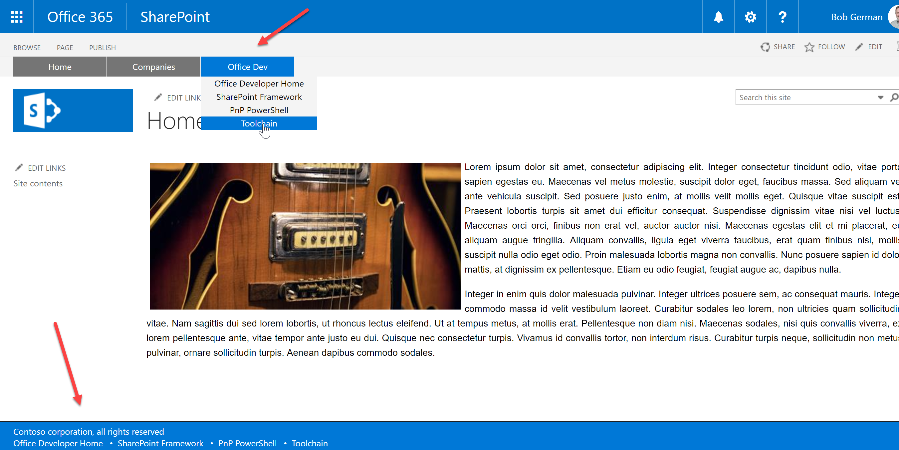
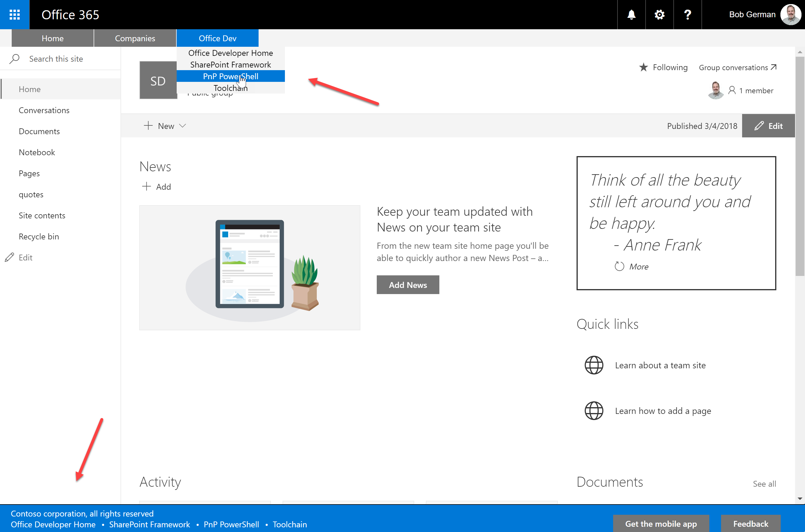

# React Menu Footer Classic Modern

## Summary
This is a sample showing how to create custom headers and footers that work on classic pages using JavaScript injection, and on modern pages using a SharePoint Framework Application Customizer extension. 

 <small style="font-style: italic">Figure 1</small>

Figure 1 shows how it looks on a classic publishing site. A simple navigation menu is added on the top of the page, and a footer containing a message and a set of links appears at the bottom.
The menu and footer look the same in a modern team site, as shown in Figure 2. 

 <small style="font-style: italic">Figure 2</small>

## Used SharePoint Framework Version 

## Applies to

* [SharePoint Framework](https://dev.office.com/sharepoint)
* [Office 365 tenant](https://dev.office.com/sharepoint/docs/spfx/set-up-your-development-environment)
* Classic SharePoint pages on SharePoint 2013, 2016, or Online

## Prerequisites
 
* SharePoint 2013 or later for Classic sites
* SharePoint Online for Modern sites

## Solution

Solution|Author(s)
--------|---------
react-menu-footer-classic-modern | Bob German, Microsoft [@Bob1German](https://twitter.com/bob1german)

## Version history

Version|Date|Comments
-------|----|--------
1.0|April 4, 2018|Initial release

## Disclaimer
**THIS CODE IS PROVIDED *AS IS* WITHOUT WARRANTY OF ANY KIND, EITHER EXPRESS OR IMPLIED, INCLUDING ANY IMPLIED WARRANTIES OF FITNESS FOR A PARTICULAR PURPOSE, MERCHANTABILITY, OR NON-INFRINGEMENT.**

---

## Minimal Path to Awesome

* Complete installation instructions for both modern and classic SharePoint are [here](./Documentation/Install.md)
* If you want to learn how it works so you can write your own "future-proof" headers and footers, please read the write-up [here](./Documentation/Article.md)

## Features

This sample provides:

* A top navigation menu with links specified in a shared JSON file in SharePoint, which can easily be updated without a new software release
* A footer with a localized message and additional links from the JSON file
* The classic and modern solutions can be applied to the same site in SharePoint Online, where they will work on classic pages and modern list and library pages

This sample demonstrates:

 * How to write custom headers and footers that work on both modern and classic SharePoint pages with nearly all code in common
 * How to use SharePoint Framework tooling to build solutions for classic SharePoint, based on [this article series](http://julieturner.net/2018/01/conquer-your-dev-toolchain-in-classic-sharepoint-part-1/) by [Julie Turner](https://twitter.com/jfj1997)
 * How to implement React components and localized text on classic SharePoint pages in the style of SharePoint Framework
 * How to build a menu using only CSS based on [this sample](https://medialoot.com/blog/how-to-create-a-responsive-navigation-menu-using-only-css) by Tony Thomas
 * How to use JavaScript injection with PnP PowerShell to create headers and footers on Classic pages without modifying the master page

