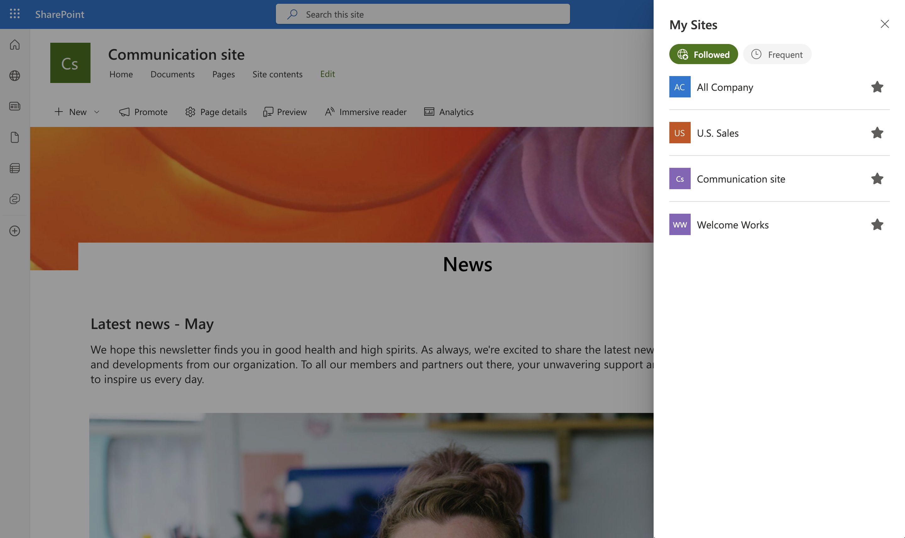
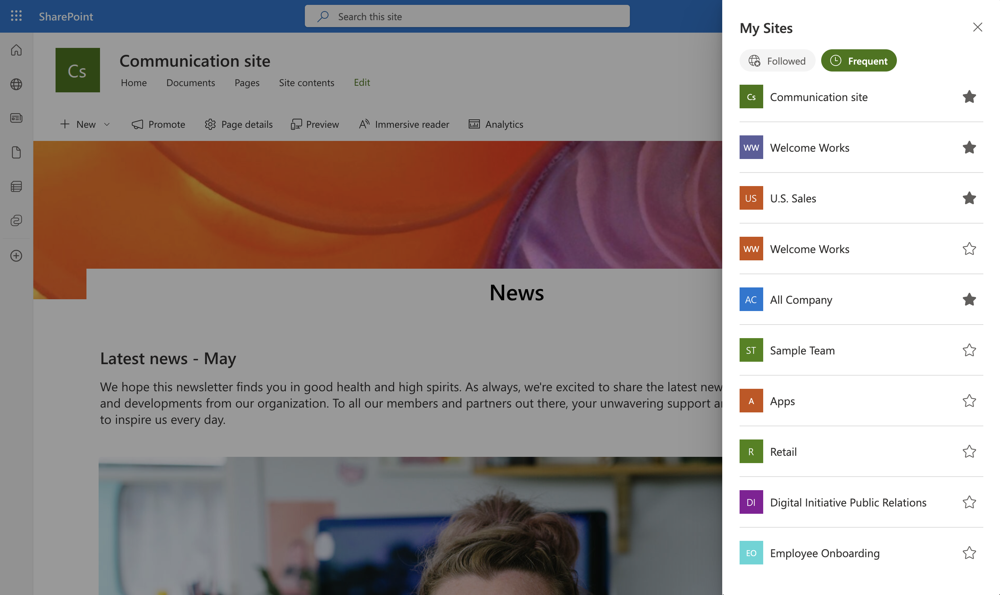

# My Sites Hub

## Summary

My Sites Hub is a SharePoint Framework (SPFx) Application Customizer Extension that provides users with a centralized “My Sites” dashboard accessible directly from any SharePoint site.

It helps users discover, manage, and quickly navigate to their Followed, Frequent, and Recently Visited SharePoint sites — without needing to open the SharePoint start page or search manually.

This extension offers a modern, responsive, and fluid experience, seamlessly blending into SharePoint’s native design language.




## Compatibility

| :warning: Important          |
|:---------------------------|
| Every SPFx version is optimally compatible with specific versions of Node.js. In order to be able to build this sample, you need to ensure that the version of Node on your workstation matches one of the versions listed in this section. This sample will not work on a different version of Node.|
|Refer to <https://aka.ms/spfx-matrix> for more information on SPFx compatibility.   |

## Used SharePoint Framework Version

This sample is optimally compatible with the following environment configuration:


-Incompatible-red.svg "SharePoint Server 2016 Feature Pack 2 requires SPFx 1.1")


Tested using Node.js v22.18.0

## Applies to

- [SharePoint Framework](https://aka.ms/spfx)
- [Microsoft 365 tenant](https://docs.microsoft.com/sharepoint/dev/spfx/set-up-your-developer-tenant)

> Get your own free development tenant by subscribing to [Microsoft 365 developer program](https://aka.ms/m365devprogram)

## Prerequisites

No special setup required — the extension works across any SharePoint Online environment.

## Contributors🧑‍💻

- [Sandeep P S](https://github.com/Sandeep-FED)

## Version history

| Version | Date             | Comments        |
| ------- | ---------------- | --------------- |
| 1.0     | October 30, 2025   | Initial release  |

## Minimal Path to Awesome

- Clone this repository
- Ensure that you are at the solution folder
- in the command-line run:
  - `npm install`
  - `gulp serve`

## Debug URL for Testing

```javascript
debugManifestsFile=https%3A%2F%2Flocalhost%3A4321%2Ftemp%2Fbuild%2Fmanifests.js&loadSPFX=true&customActions=%7B%2201ec7cba-7bc2-4ae6-8f69-0a577999cad1%22%3A%7B%22location%22%3A%22ClientSideExtension.ApplicationCustomizer%22%2C%22properties%22%3A%7B%22testMessage%22%3A%22Test+message%22%7D%7D%7D
```

## Deploy Package Solution
- Ensure that you are at the solution folder
- in the command-line run:
  - `gulp build --ship`
  - `gulp bundle --ship`
  - `gulp package-solution --ship`
- Upload package to AppCatalog & add it to the SharePoint site.

## Features💡

Key capabilities of My Sites Hub:
- Displays Followed, Frequent sites
- Uses SP native APIs for followed/frequent API calls
- Allows users to Follow / Unfollow sites directly
- Built with React, Fluent UI v9

## References

- [Microsoft 365 Patterns and Practices](https://aka.ms/m365pnp) - Guidance, tooling, samples and open-source controls for your Microsoft 365 development.
- [SharePoint Framework](https://docs.microsoft.com/sharepoint/dev/spfx/set-up-your-developer-tenant)
- [React Docs](https://react.dev/learn)

## Help

We do not support samples, but we this community is always willing to help, and we want to improve these samples. We use GitHub to track issues, which makes it easy for  community members to volunteer their time and help resolve issues.

If you're having issues building the solution, please run [spfx doctor](https://pnp.github.io/cli-microsoft365/cmd/spfx/spfx-doctor/) from within the solution folder to diagnose incompatibility issues with your environment.

If you encounter any issues while using this sample, [create a new issue](https://github.com/pnp/sp-dev-fx-extensions/issues/new?assignees=&labels=Needs%3A+Triage+%3Amag%3A%2Ctype%3Abug-suspected%2Csample%3A%20react-my-sites-hub&template=bug-report.yml&sample=react-my-sites-hub&authors=@Sandeep-FED&title=react-my-sites-hub%20-%20).

For questions regarding this sample, [create a new question](https://github.com/pnp/sp-dev-fx-extensions/issues/new?assignees=&labels=Needs%3A+Triage+%3Amag%3A%2Ctype%3Aquestion%2Csample%3A%20react-my-sites-hub&template=question.yml&sample=react-my-sites-hub&authors=@Sandeep-FED&title=react-my-sites-hub%20-%20).

Finally, if you have an idea for improvement, [make a suggestion](https://github.com/pnp/sp-dev-fx-extensions/issues/new?assignees=&labels=Needs%3A+Triage+%3Amag%3A%2Ctype%3Aenhancement%2Csample%3A%20react-my-sites-hub&template=question.yml&sample=react-my-sites-hub&authors=@Sandeep-FED&title=react-my-sites-hub%20-%20).

## Disclaimer

**THIS CODE IS PROVIDED _AS IS_ WITHOUT WARRANTY OF ANY KIND, EITHER EXPRESS OR IMPLIED, INCLUDING ANY IMPLIED WARRANTIES OF FITNESS FOR A PARTICULAR PURPOSE, MERCHANTABILITY, OR NON-INFRINGEMENT.**


