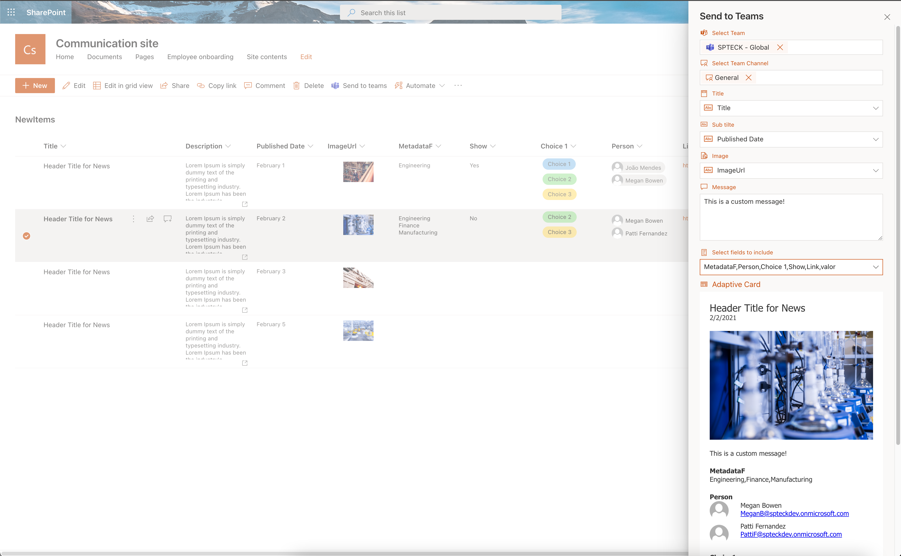
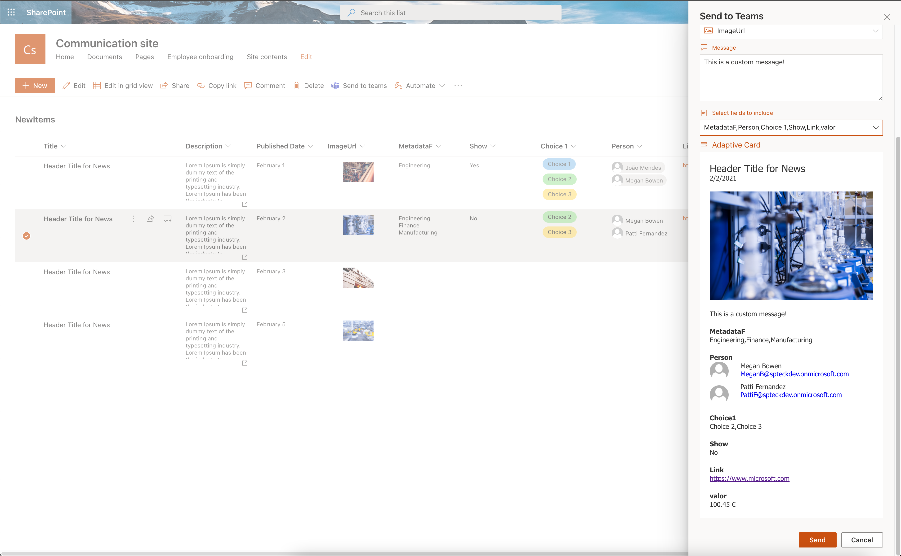
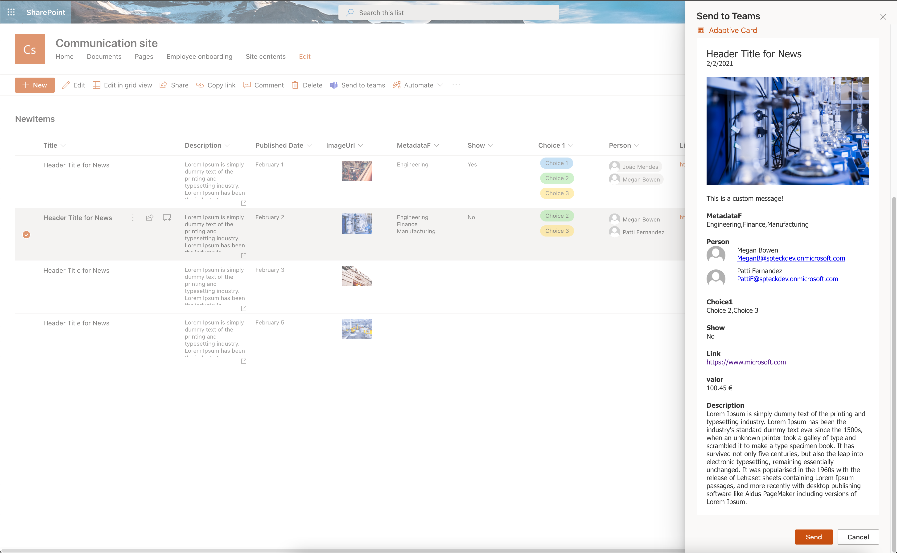
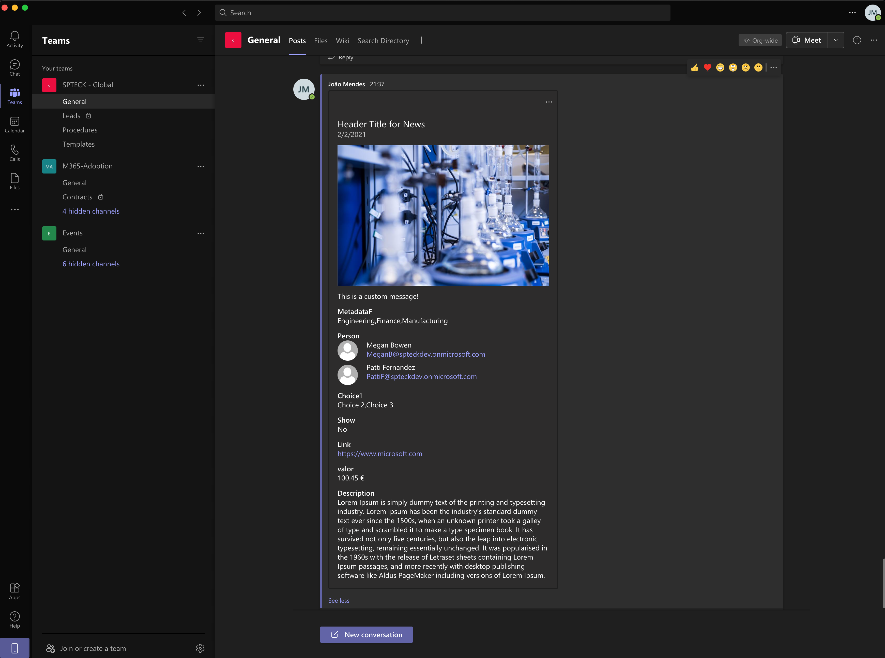

# Send-To-Teams - Command Set

## Summary

This Command Set allows to create an adaptive card based on list data and send to microsoft teams chanel,
The user can select the list fields that will show on the card.








## Compatibility


## Applies to

* [SharePoint Framework](https://docs.microsoft.com/sharepoint/dev/spfx/sharepoint-framework-overview)
* [Microsoft 365 tenant](https://docs.microsoft.com/sharepoint/dev/spfx/set-up-your-developer-tenant)

## Prerequisites
 
 Microsoft Graph permissions required:

        "resource": "Microsoft Graph", "scope": "Team.ReadBasic.All"
        "resource": "Microsoft Graph", "scope": "Channel.ReadBasic.All" 
        "resource": "Microsoft Graph", "scope": "ChannelMessage.Send"

After deployed to the AppCatalog this permissions need to be approved in SharePoint Central Admin.
      

## Solution

Solution|Author(s)
--------|---------
react-send-to-teams | [João Mendes](https://github.com/joaojmendes) ([@joaojmendes](https://twitter.com/joaojmendes))

## Version history

Version|Date|Comments
-------|----|--------
1.0|April 5, 2021|Initial release

## Disclaimer
**THIS CODE IS PROVIDED *AS IS* WITHOUT WARRANTY OF ANY KIND, EITHER EXPRESS OR IMPLIED, INCLUDING ANY IMPLIED WARRANTIES OF FITNESS FOR A PARTICULAR PURPOSE, MERCHANTABILITY, OR NON-INFRINGEMENT.**

---

## Minimal Path to Awesome

- Clone this repository
- in the command line run:
  - `npm install`
  - `gulp serve`

Please see the pre-requisites

## Features

SHow how to create an adaptive card using the adaptive card library and how to send to use Microsoft Graph API to send it

- Create Adaptive Card using adaptivecard jscript library
- Use Microsoft Graph API to send Adaptive Card

## Debug URL for testing
Here's a debug URL for testing around this sample. 

```
?debugManifestsFile=https://localhost:4321/temp/manifests.js&loadSPFX=true&customActions={"4146ff27-c464-43d7-8848-14ca7820bf3f":{"location":"ClientSideExtension.ListViewCommandSet.CommandBar"}
```


