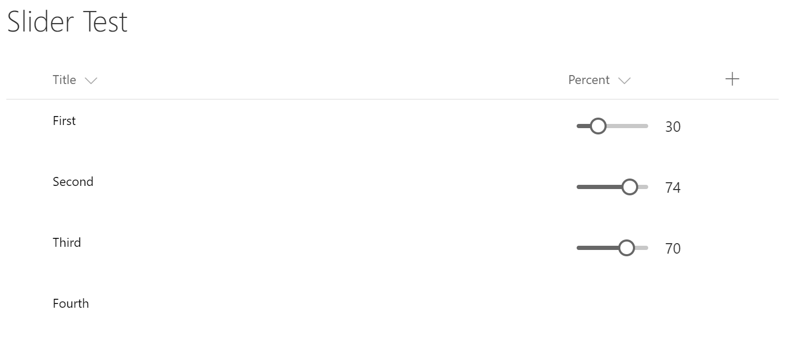

# React Slider Field Customizer

## Summary
The sample illustrates how to use Office UI Fabric React Slider in Field Customizer



## Used SharePoint Framework Version 
SPFx Extensions Dev Preview

## Applies to

* [SharePoint Framework](http://dev.office.com/sharepoint/docs/spfx/sharepoint-framework-overview)

Solution|Author(s)
--------|---------
react-slider-field-customizer | Alex Terentiev ([Sharepointalist Inc.](http://www.sharepointalist.com), [AJIXuMuK](https://github.com/AJIXuMuK))

## Version history

Version|Date|Comments
-------|----|--------
1.0|June 6, 2017|Initial release

## Disclaimer
**THIS CODE IS PROVIDED *AS IS* WITHOUT WARRANTY OF ANY KIND, EITHER EXPRESS OR IMPLIED, INCLUDING ANY IMPLIED WARRANTIES OF FITNESS FOR A PARTICULAR PURPOSE, MERCHANTABILITY, OR NON-INFRINGEMENT.**

## Features
This project contains SharePoint Framework extensions that illustrates next features:
* field customizer
* usage of Office UI Fabric React
* usage of PnP JS
* inline editing of list items

**NOTE:** this customizer should be applied to a column with type Number. For the simplicity author assumes that the values of the column are between 0 and 100.
To use with Percentage column the code should be modified to multiply `value` by 100

### Building the code

```bash
git clone the repo
npm i
npm i -g gulp
gulp
```

This package produces the following:

* lib/* - intermediate-stage commonjs build artifacts
* dist/* - the bundled script, along with other resources
* deploy/* - all resources which should be uploaded to a CDN.
