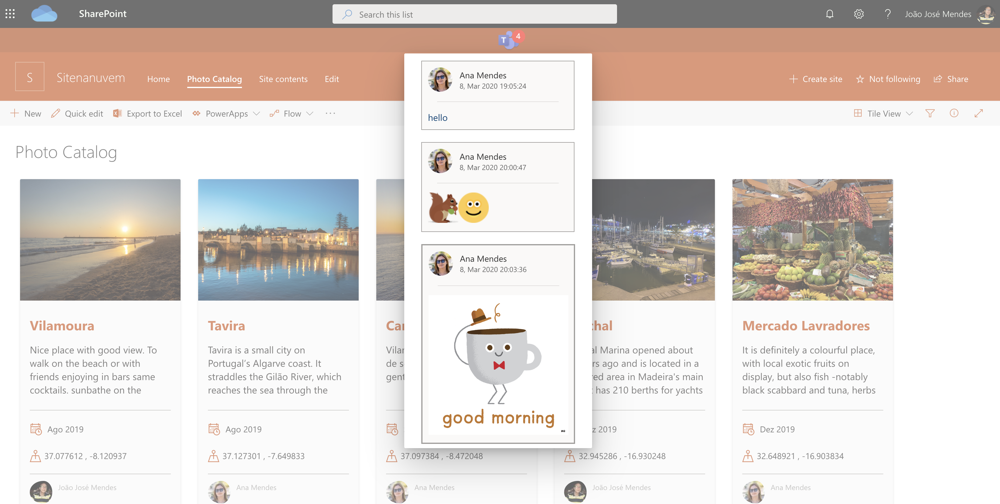
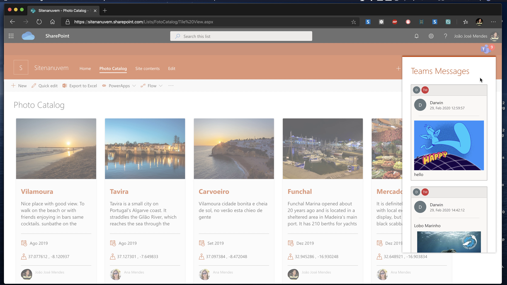

# Teams Chat Notifications.




This Application Customizer shows teams chat notification messages in SharePoint.

The messages are showed in a badge with number of unread messages, the user can click on the badge to show the list of messages received.
On a message can click to open teams and see all conversation.


### High-level schema how it works


 

### The SPFx Teams Notifications Application Customizer use the folowing services:

#### MSGraph

This use MSGraph REST API to get user chats, messages and create/update a subscription (Webhook)


### Azure Services 

Azure SignalR - to receive new messages from chat message Webhook and send it to connected clients.

Azure Table Storage - To save information about subscriptions expiration date and time 

Azure Key Vault  - to save secrects used on Azure Functions

### Azure Functions 
    
- http trigger to create a chat message subscriptions
- http trigger to chat message notification (Webhook),
- http timer trigger to renew chat message subscriptions expiration date and time
- http trigger to connect clients to SignalR 

There is a Github Repo  with all Azure Functions used by Application Customizer, [TeamsChatFunctions]( [react-teamschatnotifications-functions](/samples/react-teamschatnotifications-functions), please see the README.md to know how to configure each service .





## Global dependencies

Requires Gulp globally installed:

```shell
npm install --global gulp
```

## Building the code

Download & install all dependencies, build, bundle & package the project

```shell
# download & install dependencies
npm install

# transpile all TypeScript & SCSS => JavaScript & CSS
gulp build

# create component bundle & manifest
gulp bundle

# create SharePoint package
gulp package-solution
```

These commands produce the following:

- **./lib**: intermediate-stage commonjs build artifacts
- **./dist**: bundled script, along with other resources
- **./temp/deploy**: all resources required by component(s) to deploy to a CDN (when `--ship` argument present)

## Build options

- `gulp clean`: Deletes all build output (**/dist**, **/lib**, **/temp**, etc.).
- `gulp build`: Transpiles all TypeScript & SCSS to JavaScript & CSS, generates source map files & TypeScript type declaration files
- `gulp bundle [--ship|-p|--production]`: Runs gulp task **build**, then uses webpack to create the JavaScript bundle(s) and component manifest(s) as defined in **./config/config.json**. The `--ship`, `-p` or `--production` argument specifies a production build that will generate minified bundles.
- `gulp serve [--ship|-p|--production]`: Runs gulp tasks **build**, **bundle** & starts the local webserver. Depending on the project type, it opens the browser and navigates to the local workbench or specified URL (in the case of extension components). The `--ship`, `-p` or `--production` argument specifies a production build that modifies the resulting package for production hosting rather than local hosting of assets.
- `gulp package-solution`: Creates the SharePoint Package (**.sppkg**) file.
- `gulp dist`: Creates a production-ready SharePoint Package (**.sppkg**) file. The following gulp task gets executed in this specific order `gulp clean`, `gulp bundle`, `gulp package-solution.`
- `gulp dev`: Creates a development-ready SharePoint Package (**.sppkg**) file. The following gulp task will be executed in this specific order `gulp clean`, `gulp bundle`, `gulp package-solution.`

> View all available gulp tasks by running `gulp --tasks`

##  Deploy to App Catalog

Add the packahe to Tenant App Catalog and global Deploy de Solution.  After goto SharePoint Admin Center and approve the required permisstions. 

The Application Customizer is installed globally (tenant-wide), and an entry was added in the list "Tenant Wide Extensions" located in Tenant App Catalog Site. 

The Application Customizer has a required parameter called "functionAppUrl", this parameter must have the function Apps URL where the Azure Function are located and must be defined after deployed.

example :

{"functionAppUrl":"https://xxxxxxx.azurewebsites.net"}
