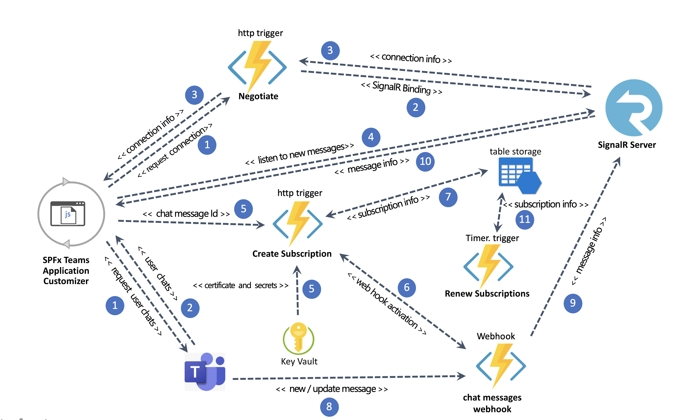
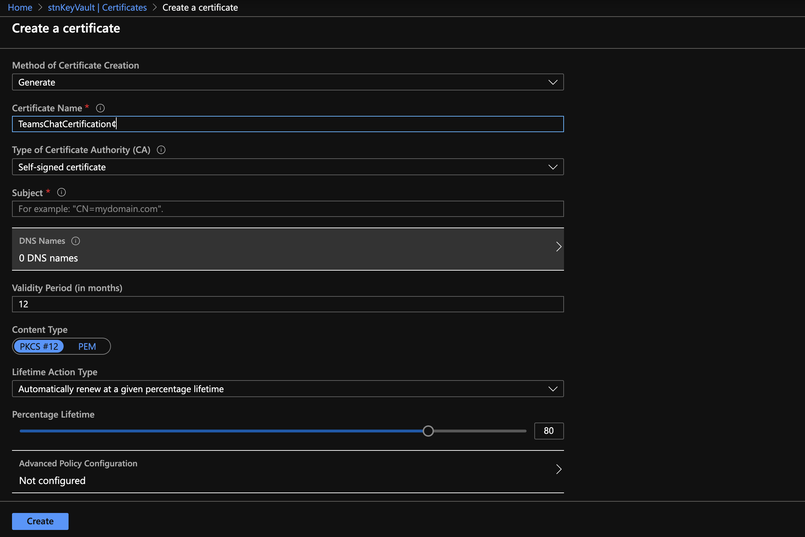
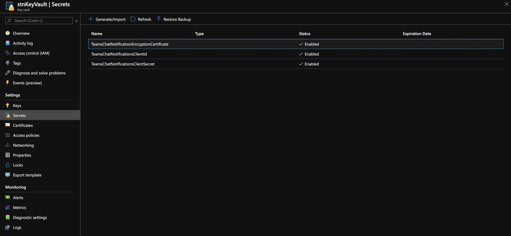
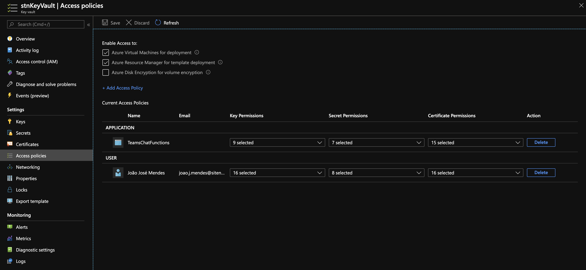

# SPFx Teams Notifications Application Customizer  - Azure Functions

## Summary
This Project is part of SPFx Teams Notifications Application Customizer 
and has details of what services must have to be defined in Azure and the Azure Functions to deploy.

## High-level schema how it works

## Azure Services need to be configured 

### Azure SignalR 

To send notification to SPFx Teams Notification Application Customizer.
The SignalR Service must be create as ServerLess.

  

### Azure Storage 

We use table storage to save information about chat subscriptions, the Functions use Azure Storage Table REST API to read and write data, the Connection String that is used is SAS - Shared Access Assignature and must be generated.

     

     
    

 ### Azure Functions App 

In the CORS options you have to enable "Enable Access-Control-Allow-Credentials"  that is need by SignalR

In the Plataform Features Tab select Identity in System Assigned Tab on Status Click Enable this will create a Service Principal on AAD that will use to connect Azure Key Vault.

### Register a new App Principal 

Create a APP Princippal on AAD and add the API Permissions SCOPES - Chat.Read.All and User.Read

### Azure Key Vault 

Create Self-Signed Certificate,  Export Certificate CER, create secrets to Client Id , Client Secret and Certifricate Exported ( content of CER file).

Create Self-Signed Certificate,

Export Certificate CER

Create Secrets

Add Access Police to Allow the Microsoft Identity created on Azure Function App to access Key Vault.

## Configuration local.setting.json 

Environment Variable | Required Value
--------------------|------------------------------------ 
AzureSignalRConnectionString:|  < AzureSignalRConnectionString >
Azure_Storage_URI | < Azure Table Storage URI >
Azure_Storage_SAS | < Table Storage SAS connection String >
TableName|  TeamsChatSubsScriptions 
TenantId| < Tenant Id > 
KeyVaultUrl | < https://xxxxxxxx.vault.azure.net/ >
KeyVault_ClientId_Secret_Name | TeamsChatNotificationsClientId 
KeyVault_ClientSecret_Secret_Name | TeamsChatNotificationsClientSecret 
KeyVault_EncriptionCertificate_Secret_Name |  TeamsChatNotificationEncryptionCertificate 
ChatMessageNotificationURL| < https://xxxxxxxxxx.azurewebsites.net/api/TeamsChatWebhook >

## Solution

Solution|Author(s)
--------|---------
SPFx - Teams Notifications Application Customizer Azure Functions 

## Version history

Version|Date|Comments
-------|----|--------
1.0.0|Mars 12, 2020 | Initial Version

## Disclaimer
**THIS CODE IS PROVIDED *AS IS* WITHOUT WARRANTY OF ANY KIND, EITHER EXPRESS OR IMPLIED, INCLUDING ANY IMPLIED WARRANTIES OF FITNESS FOR A PARTICULAR PURPOSE, MERCHANTABILITY, OR NON-INFRINGEMENT.**

---

